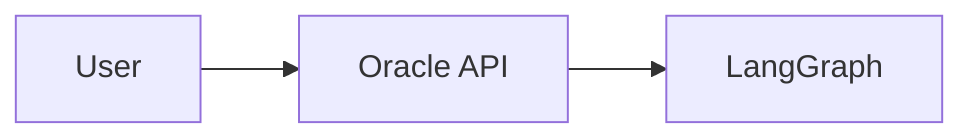

# CLAUDE.md

This file provides guidance to Claude Code (claude.ai/code) when working with code in this repository.

## Project Overview

QiForge - a monorepo for building Agentic Oracles on the IXO network. Combines LangGraph (AI conversation flows), Matrix (E2E encrypted communication), NestJS (API layer), and IXO blockchain integration.

## Build & Development Commands

```bash
# From root - workspace operations
pnpm install          # Install all dependencies
pnpm build            # Build all packages (dependencies resolved by turbo)
pnpm dev              # Start NestJS app in watch mode
pnpm test             # Run all tests
pnpm lint             # Lint all packages
pnpm format           # Prettier format

# From apps/app - app-specific commands
pnpm start:dev        # NestJS watch mode
pnpm db:up            # Start Docker services (Redis, nginx)
pnpm db:down          # Stop Docker services
pnpm db:clean         # Remove Docker volumes
pnpm test:cov         # Test with coverage

# Run tests for a single package
pnpm test --filter @ixo/events
```

## Architecture

### Monorepo Structure

- **apps/app/** - Main NestJS oracle application
- **packages/** - Shared packages with `@ixo/` scope

### Core Packages

| Package                     | Purpose                                                                                         |
| --------------------------- | ----------------------------------------------------------------------------------------------- |
| `@ixo/common`               | AI services, session management, room management, checkpointer interfaces                       |
| `@ixo/matrix`               | Matrix client wrapper, encrypted room management                                                |
| `@ixo/events`               | SSE/WebSocket event streaming (`ToolCallEvent`, `RenderComponentEvent`, `BrowserToolCallEvent`) |
| `@ixo/oracles-chain-client` | Blockchain operations, claims, payments, ECIES encryption                                       |
| `@ixo/oracles-client-sdk`   | React client SDK (`useChat()` hook)                                                             |
| `@ixo/slack`                | Slack bot integration                                                                           |

### LangGraph Architecture

The AI system is built on LangGraph with state-based conversation flows:

**State (`apps/app/src/graph/state.ts`):**

- `MainAgentGraphState` - Annotation-based state with `messages[]`, `userContext`, `config`, `client`, `browserTools`, `agActions`, `mcpUcanContext`

**Agents (`apps/app/src/graph/agents/`):**

- `main-agent.ts` - Orchestrator, creates the graph
- `memory-agent.ts` - Contextual memory retrieval
- `portal-agent.ts` - Web portal logic
- `firecrawl-agent.ts` - Web crawling
- `domain-indexer-agent.ts` - Domain analysis
- `editor/editor-agent.ts` - Content editing with BlockNote

**Tools (`apps/app/src/graph/nodes/tools-node/`):**

- Server-side LangGraph tools
- Browser tools (reverse calls for DOM/UI operations)
- Middlewares: `tool-validation-middleware.ts`, `safety-guardrail-middleware.ts`, `token-limiter-middleware.ts`

**Entry points (`apps/app/src/graph/index.ts`):**

- `MainAgentGraph.sendMessage()` - Invoke mode
- `MainAgentGraph.streamMessage()` - Stream mode with SSE
- `MainAgentGraph.getGraphState()` - Retrieve current state

### Communication Flow

```
User → Client SDK → Oracle API → LangGraph Engine → Matrix Storage
         ↑                                              ↓
         └──────────────── Response ───────────────────┘
```

- Each oracle has a Matrix account registered on blockchain
- Each user gets a private encrypted Matrix room
- First interaction must be through web portal (grants AuthZ permissions)
- Matrix/Slack clients connect after portal setup

### Data Persistence

1. **Checkpoints** - LangGraph state snapshots in SQLite, synced to Matrix on shutdown
2. **Knowledge** - Memory Engine MCP for persistent knowledge and memory
3. **Sessions** - Per-user chat sessions with Matrix room history

### Security Layers

- Matrix access token validation (`x-matrix-access-token` header)
- DID verification (`x-did` header)
- Subscription checking middleware
- UCAN-based MCP tool authorization
- Rate limiting (Throttler)

## Configuration

Environment variables are validated via Zod schema in `apps/app/src/config.ts`. Key categories:

- Matrix (base URL, tokens, recovery phrases)
- Database (SQLite paths)
- LLM (OpenAI, OpenRouter APIs)
- Blockchain (RPC URL, mnemonics, network)

## Key Patterns

- **Singleton MatrixManager** - Single Matrix connection per oracle
- **Graceful shutdown** - Uploads checkpoints to Matrix before exit
- **Annotation-based state** - LangGraph best practice with reducers
- **Multi-client support** - Portal, Matrix, Slack with unified message processing

## Playbook Documentation Work

**START HERE for any playbook session:** Read `specs/playbook-progress.md` first. It has the full task list, approach notes for each task, and writing rules. Then read `specs/playbook-spec-v2.md` for the master spec.

### Rules (binding contract)

1. **Track progress:** After completing any playbook task, update `specs/playbook-progress.md` with status → Done, date, and notes. Context resets between sessions — this file is how you know what's done.
2. **No under-the-hood details:** Never explain how underlying technology works in depth. Only *what it does* and *how to use it*. Max 1-2 sentences or a simple diagram for "how it works". No implementation internals, no protocol specs, no deep architecture.
3. **Skills-first:** Skills (ai-skills registry + ai-sandbox) are the primary extension mechanism. Frame everything around skills, not raw tools/agents.
4. **Non-technical tone:** Plain language, analogies, no jargon. Copy-paste ready code blocks.
5. **Don't duplicate:** Link to existing complete docs instead of rewriting content.

### Diagrams (Mermaid — renders natively on GitHub)

All diagrams in playbook docs use **Mermaid** syntax. GitHub renders Mermaid blocks natively in markdown — no images, no export steps, no external tools.

**Usage in markdown:**
````markdown

````

**Supported diagram types (use what fits):**
- `graph LR` / `graph TD` — flowcharts (most common)
- `sequenceDiagram` — request/response flows
- `stateDiagram-v2` — state machines

**Tips:**
- Keep diagrams simple — playbook is for non-technical readers
- Use short labels, avoid cramming too much into one diagram
- Test rendering by previewing the markdown on GitHub
- No images or assets needed — the diagram lives in the markdown itself

### Related repos

- Skills registry: `https://github.com/ixoworld/ai-skills`
- AI Sandbox: `/Users/yousef/ai-sandbox/` (read `ARCHITECTURE.md` for context, but don't put internals in playbook)
- CLI: `qiforge-cli` (separate repo, scaffolds oracle projects)
