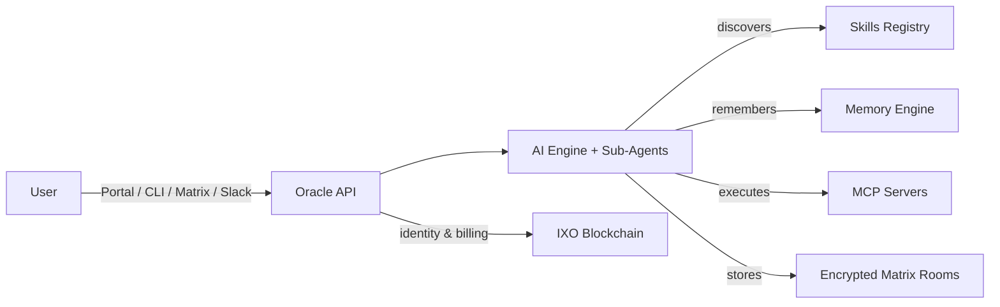

# QiForge


**Build verified AI agents with blockchain identity, encrypted communication, and a growing library of skills — deploy once, live instantly.**

QiForge is a full-stack framework for building **Agentic Oracles** on the [IXO network](https://www.ixo.world/). Each oracle is an autonomous AI agent with a verified on-chain identity, private encrypted channels for every user, and the ability to discover and execute new skills at runtime — without redeployment.

[](./LICENSE.txt)

---

## Why QiForge?

Most AI frameworks give you a chatbot. QiForge gives you a **verified, autonomous agent** that can reason, remember, learn new skills, charge for its work, and prove its identity — all out of the box.

| | QiForge | Typical AI Framework |
|---|---|---|
| **Verified identity** | Blockchain DID — users can verify who your agent is | None |
| **Encrypted comms** | Every conversation in a private Matrix room | Plain text / logs |
| **Skills at runtime** | 40+ community skills, no redeployment needed | Hardcoded tools |
| **Multi-LLM** | GPT-4, Claude, Gemini, Llama via OpenRouter | Vendor lock-in |
| **Built-in billing** | Token billing + service claims, automatic | DIY |
| **Multi-client** | Portal, CLI, Matrix, Slack — one oracle, every interface | Single client |
| **Persistent memory** | Cross-session memory with knowledge scopes | External DB required |
| **Sub-agents** | 6 specialist agents pre-wired, add your own | Roll your own |

---

## Get Started in Minutes

```bash
# Install the CLI
npm install -g qiforge-cli

# Scaffold a new oracle project
qiforge --init

# Install, build, run
pnpm install && pnpm build && pnpm dev

# Chat with your oracle instantly
qiforge chat
```

Your first oracle is live. Customize the name, personality, and skills — then deploy.

> **Full walkthrough:** [Quickstart Guide →](./docs/playbook/01-quickstart.md)

---

## How It Works


```mermaid
graph LR
    U[User] -->|Portal / CLI / Matrix / Slack| API[Oracle API]
    API --> AI[AI Engine + Sub-Agents]
    AI -->|discovers| SK[Skills Registry]
    AI -->|remembers| ME[Memory Engine]
    AI -->|executes| MCP[MCP Servers]
    AI -->|stores| MX[Encrypted Matrix Rooms]
    API -->|identity & billing| BC[IXO Blockchain]
```

**Users** send messages through any client. The **AI Engine** reasons, delegates to sub-agents, discovers skills, and streams responses back. Conversations persist in encrypted Matrix rooms. Identity and billing live on the blockchain.

---

## Core Capabilities

### Skills — Apps for Your Oracle

Skills are like apps on a phone. Your oracle discovers and loads them from a [shared registry](https://github.com/ixoworld/ai-skills) at runtime — presentations, PDFs, data analysis, web search, invoices, and more.

```
User: "Create a slide deck about renewable energy"
→ Oracle finds presentation skill in registry
→ Reads instructions, executes in sandbox
→ Returns finished slides
```

No code changes. No redeployment. Publish your own skills with a markdown file and a PR.

> [Working with Skills →](./docs/playbook/04-working-with-skills.md) · [Build & Publish Skills →](./docs/playbook/guides/building-and-publishing-skills.md)

### Sub-Agents — Specialist Teammates

Delegate complex tasks to purpose-built agents that ship out of the box:

| Agent | What It Does |
|-------|-------------|
| **Memory Agent** | Retrieves user context, preferences, and history |
| **Skills Agent** | Searches the skill registry and loads capabilities |
| **Portal Agent** | Handles browser/UI interactions from the client SDK |
| **Firecrawl Agent** | Web search and scraping |
| **Editor Agent** | Real-time document editing with BlockNote |
| **Domain Indexer** | Searches and analyzes IXO blockchain entities |

Need a specialist that doesn't exist? Define a name, description, tools, and prompt — wire it in.

> [Sub-Agents →](./docs/playbook/05-sub-agents.md)

### Middlewares — Safety, Billing, and Guardrails

Every tool call passes through middleware checkpoints:

- **Token Limiter** — checks credits before each call, deducts after
- **Safety Guardrail** — blocks leaked secrets, PII, and harmful content
- **Tool Validation** — catches bad inputs with helpful error messages
- **Tool Retry** — handles network blips automatically

Write custom middlewares with `beforeModel`, `afterModel`, `afterAgent`, and `wrapToolCall` hooks.

> [Middlewares →](./docs/playbook/06-middlewares.md)

### MCP Servers — Plug In Anything

Connect external services via the [Model Context Protocol](https://modelcontextprotocol.io/):

```typescript
// mcp.ts — add a new server in one line
{ name: 'github', url: 'https://mcp.github.com/sse' }
```

Built-in servers: Memory Engine, Firecrawl, Sandbox, Subscription. Tools are auto-discovered — no hardcoding.

> [MCP Servers →](./docs/playbook/07-mcp-servers.md)

### Memory Engine — Your Oracle Remembers

Persistent memory across conversations with three knowledge scopes:

- **User memories** — private preferences and context per user
- **Org public** — customer-facing FAQs and docs
- **Org private** — internal processes and policies

Your oracle starts every conversation with relevant context already loaded.

> [Memory Engine Guide →](./docs/playbook/guides/memory-engine.md)

### Payments & Claims — Built-In Monetization

Two revenue streams, zero custom code:

1. **Token billing** — automatic per-token charges with escrow
2. **Service claims** — explicit charges for deliverables (PDFs, images, reports)

Users approve claims through the Portal. Funds release from escrow. Disable during development with `DISABLE_CREDITS=true`.

> [Payments & Claims →](./docs/playbook/guides/payments-and-claims.md)

---

## Architecture

```
apps/app/               → Main NestJS oracle application
packages/
  @ixo/common           → AI services, session management, checkpointer
  @ixo/matrix           → Matrix client, encrypted room management
  @ixo/events           → SSE/WebSocket event streaming
  @ixo/oracles-chain-client → Blockchain ops, claims, payments, ECIES
  @ixo/oracles-client-sdk  → React SDK (useChat() hook)
  @ixo/slack            → Slack bot integration
```

> [Full project structure →](./docs/playbook/02-project-structure.md) · [State schema reference →](./docs/playbook/reference/state-schema.md)

---

## The Playbook

A step-by-step guide from zero to production oracle — written for humans and AI alike.

| Chapter | What You'll Achieve |
|---------|-------------------|
| [00 — Overview](./docs/playbook/00-overview.md) | Understand what an oracle is |
| [01 — Quickstart](./docs/playbook/01-quickstart.md) | A running oracle in minutes |
| [02 — Project Structure](./docs/playbook/02-project-structure.md) | Know your codebase |
| [03 — Customize](./docs/playbook/03-customize-your-oracle.md) | Name, personality, and purpose |
| [04 — Skills](./docs/playbook/04-working-with-skills.md) | Use and build skills |
| [05 — Sub-Agents](./docs/playbook/05-sub-agents.md) | Add specialist agents |
| [06 — Middlewares](./docs/playbook/06-middlewares.md) | Safety, billing, guardrails |
| [07 — MCP Servers](./docs/playbook/07-mcp-servers.md) | Connect external tools |
| [08 — Deployment](./docs/playbook/08-deployment.md) | Ship to production |

**Standalone guides:** [Publish Your First Oracle](./docs/playbook/guides/publish-your-first-oracle.md) · [Memory Engine](./docs/playbook/guides/memory-engine.md) · [Payments & Claims](./docs/playbook/guides/payments-and-claims.md) · [Building Skills](./docs/playbook/guides/building-and-publishing-skills.md)

**Reference:** [CLI Commands](./docs/playbook/reference/cli-reference.md) · [Environment Variables](./docs/playbook/reference/environment-variables.md) · [API Endpoints](./docs/playbook/reference/api-endpoints.md) · [State Schema](./docs/playbook/reference/state-schema.md) · [Troubleshooting](./docs/playbook/reference/troubleshooting.md)

---

## Deployment

Deploy with Docker or Fly.io. The included Dockerfile and `fly.toml` handle everything.

```bash
# Fly.io (recommended)
flyctl launch
flyctl secrets set $(cat .env | xargs)
flyctl deploy

# Docker
docker build -t my-oracle .
docker compose up -d
```

Graceful shutdown saves all state to Matrix before restart — zero data loss.

> [Deployment Guide →](./docs/playbook/08-deployment.md)

---

## Development

```bash
pnpm install          # Install all dependencies
pnpm build            # Build all packages
pnpm dev              # Start in watch mode
pnpm test             # Run tests
pnpm lint             # Lint (must pass before commit)
pnpm format           # Format code
```

**Prerequisites:** Node.js 22+, pnpm 10+, [IXO Mobile App](https://apps.apple.com/app/ixo/id1560307060), [OpenRouter API key](https://openrouter.ai/keys)

---

## What's Next

QiForge is under active development. New skills, agents, and capabilities ship regularly. Here's what's coming:

- **More skills in the registry** — the community grows every week
- **Voice & video calls** — LiveAgent integration with double encryption
- **Enhanced sandbox** — richer execution environment for skills
- **More deployment targets** — one-click deploy to Railway, Render, and more

Star this repo to stay updated.

---

## Contributing

1. Fork the repository
2. Create a feature branch (`git checkout -b feature/amazing-feature`)
3. Run `pnpm lint && pnpm format` before committing
4. Push and open a Pull Request

**Publish a skill:** Fork [ai-skills](https://github.com/ixoworld/ai-skills), add your skill folder, open a PR. Every oracle benefits immediately.

---

## Support

- [GitHub Issues](https://github.com/ixoworld/qiforge/issues)
- [GitHub Discussions](https://github.com/ixoworld/qiforge/discussions)
- [Full Documentation](./docs/)

## License

Apache License 2.0 — see [LICENSE](./LICENSE.txt)
