# IXO Oracles Framework


A powerful framework for building and deploying **Agentic Oracles** on the IXO network. Built on **LangGraph**, **Matrix**, and **NestJS**, this framework enables developers to create intelligent oracles with secure communication, complex conversation flows, and automatic marketplace integration.

## What Makes This Special?

- **🔐 Secure by Design**: Every user-oracle interaction happens in private, end-to-end encrypted Matrix rooms
- **🧠 LangGraph Native**: Pure LangGraph implementation for building complex AI conversation flows
- **⚡ Zero-Config Deployment**: Deploy once, instantly available in the IXO marketplace with full SDK support
- **🔗 Blockchain Native**: Each oracle is a registered entity on the IXO blockchain with configurable parameters

## Prerequisites

- **IXO Account**: You must have a IXO account on the IXO mobile app
- **Node.js**: Version 22+ (see `.nvmrc` for exact version)
- **Package Manager**: pnpm 10+ (required for workspace management)

## 🚀 Quick Start

**🚨 IMPORTANT**: You **MUST** use the [IXO Oracles CLI](https://github.com/ixoworld/ixo-oracles-cli) to create oracles. The CLI handles all the complex setup including environment variables, and publishing to the IXO marketplace.

You can start with the IXO Oracles CLI:

```bash
npm install -g ixo-oracles-cli
```

Then create a new project:

```bash
oracles-cli --init
```

**⚠️ Note**: Manual setup is only for advanced users who want to understand the framework internals. For production oracles, always use the CLI.

```bash
# Clone the repository
git clone https://github.com/ixoworld/ixo-oracles-boilerplate
cd ixo-oracles-boilerplate

# Install dependencies
pnpm install

# Build the project
pnpm build

# Start development
cd apps/app
pnpm start:dev
```

## 🏗️ Architecture Overview

This framework creates a seamless bridge between **React applications**, **AI conversation flows**, and the **IXO blockchain**. Each oracle becomes a verified, living entity with its own **Matrix account** and **IXO account** that are registered on the blockchain entity. This allows users to verify oracle authenticity while maintaining complete **data ownership** - all conversation data belongs to the user, stored in their private, encrypted Matrix rooms.

**Optional Memory Engine Integration**: Agentic oracles can optionally integrate with the **IXO Memory Engine** (Neo4j-based) to provide personalized AI experiences by analyzing user patterns, storing key moments, and adapting response styles based on user preferences and conversation history.

**Knowledge Management**: The framework includes a comprehensive knowledge management system that provides AI oracles with access to structured and unstructured data sources. This enables context-aware conversations through semantic search, document storage, and dynamic knowledge retrieval. See [Knowledge Management Architecture](./docs/architecture/knowledge.md) for detailed information.

### 1. Runtime Message Processing Flow

> **⚠️ Important**: First interaction must be through the **web portal** where users grant required **AuthZ permissions** to the oracle and ensure they have an active **subscription**.

> **📱 Matrix/Slack Access**: Matrix clients (Element, etc.) and Slack bots can only connect **after** the user has completed their first interaction through the web portal.


### 2. Oracle Setup & Configuration Flow

```mermaid
sequenceDiagram
    participant Dev as Developer
    participant CLI as IXO CLI
    participant BC as IXO Blockchain
    participant Portal as Web Portal
    participant SDK as Client SDK
    participant AS as IXO App Service
    participant MX as Matrix Server

    Note over Dev,MX: 🚀 Oracle Deployment Phase
    Dev->>CLI: Deploy oracle with config
    CLI->>BC: Register oracle entity + accounts
    BC->>BC: Store Matrix & IXO accounts

    Note over Dev,MX: 👤 User Authorization Phase
    Portal->>SDK: User grants AuthZ permissions
    Portal->>SDK: Verify user subscription
    SDK->>BC: Validate oracle permissions

    Note over Dev,MX: 🔗 Room Creation Phase
    SDK->>AS: Request Matrix room creation
    AS->>MX: Create E2E encrypted room
    MX->>AS: Return room credentials
    AS->>SDK: Provide room access
    SDK->>Portal: Ready for communication

    Note over Dev,MX: ✅ System Ready
```



### The Magic: Zero-Config Integration

When you deploy an oracle built with this framework:

1. **Blockchain Registration**: Oracle entity registered on IXO with configs (via CLI)
2. **Oracle Identity**: Each oracle gets **Matrix account** + **IXO account** linked to blockchain entity
3. **Verifiable Agentic Oracles**: Users can verify oracle authenticity through blockchain records
4. **Instant SDK Access**: Any React app can connect using `@ixo/oracles-client-sdk`
5. **User Data Ownership**: Private Matrix rooms belong to users - **you own your data**
6. **LangGraph Ready**: Your conversation flows run immediately
7. **Complete Privacy**: All interactions stored in user's encrypted Matrix rooms

### Core Technologies Stack

#### **Matrix: Your Data Foundation**

- **Private room per user-oracle pair** - complete isolation
- **End-to-end encrypted** - messages, history, everything
- **Complete conversation persistence** - nothing is lost
- **Session management** - handle complex multi-turn conversations
- **Real-time sync** - works across all devices

#### **LangGraph: Your AI Brain**

- **Pure LangGraph** - use any nodes, edges, patterns from LangGraph docs
- **Custom conversation flows** - build complex AI interactions
- **Tool integration** - connect to external APIs, databases, services
- **State management** - context preserved across conversations
- **Extensible** - add new nodes and behaviors easily

#### **NestJS: Your API Layer**

- **REST & WebSocket APIs** - flexible integration options
- **Built-in authentication** - secure by default
- **Type-safe** - full TypeScript support
- **Modular** - easy to extend and customize

#### **IXO SDK: The Bridge**

- **One-line React integration** - `useChat()` hook and done
- **Zero configuration** - connects automatically to deployed oracles
- **Type-safe API** - generated from your oracle's schema
- **Real-time updates** - live conversation sync

#### **IXO Chain Client: Blockchain Operations**

- **Complete Oracle Toolkit** - Authorization, claims, payments, and entities
- **Smart Fee Management** - Automatic gas estimation with intelligent fallbacks
- **Payment Workflows** - Escrow-based payment system for oracle services
- **React Ready** - Built-in hooks and components for frontend integration
- **Production Tested** - Battle-tested blockchain client for oracle operations

#### **IXO Memory Engine: Personalized Intelligence**

- **Neo4j Graph Database** - Built on top of Neo4j for complex relationship mapping
- **Key Moments Storage** - Captures and stores important conversation highlights
- **Deep Analysis** - Runs comprehensive analysis on user chat patterns
- **User Preferences** - Learns and remembers user preferences over time
- **Response Styling** - Adapts AI response style based on user interaction patterns
- **Recent Context** - Maintains awareness of recent memories and events
- **Optional Integration** - Can be enabled/disabled from IXO portal
- **Enhanced LLM Context** - Provides rich user insights to improve AI responses

## 📦 Packages

### Core Packages

| Package           | Purpose                                                                               |
| ----------------- | ------------------------------------------------------------------------------------- |
| `@ixo/common`     | The core package for the framework including AI services and session service          |
| `@ixo/data-store` | The package for the data store it handled your knowledge base for the AI to use       |
| `@ixo/matrix`     | Matrix client for the framework                                                       |
| `@ixo/events`     | The package for the events for the framework between client and server and vice versa |

### Supporting Packages

| Package                     | Purpose                                                                       |
| --------------------------- | ----------------------------------------------------------------------------- |
| `@ixo/slack`                | Slack client for the framework                                                |
| `@ixo/oracles-chain-client` | **IXO blockchain client** - Complete toolkit for oracle blockchain operations |
| `@ixo/api-keys-manager`     | Api keys manager for the framework                                            |
| `@ixo/logger`               | Logger for the framework                                                      |

### External IXO Components

| Component             | Purpose                                                                          |
| --------------------- | -------------------------------------------------------------------------------- |
| **IXO Memory Engine** | Neo4j-based graph knowledge system for user personalization and context analysis |

## Running Tests

> **⚠️ Warning:** Not all tests are currently working. We are actively fixing existing tests and adding more as we continue developing the framework.

```bash
# All tests
pnpm test

# Single package
pnpm test --filter @ixo/events

# With coverage
pnpm test:coverage
```

### Development Commands

Make sure you are in `apps/app` directory

```bash
# Build all packages
pnpm build

# Watch mode
pnpm dev

# Lint code
pnpm lint

# Format code
pnpm format
```

## 🔧 Environment Setup

When using the IXO Oracles CLI, all required environment variables and database configurations are automatically generated. The CLI creates:

- **Environment Files**: `.env` with all necessary configuration
- **Matrix Server**: Connection details for secure communication
- **IXO Integration**: Blockchain connection and authentication setup

For manual setup (advanced users only), refer to the [Knowledge Management Architecture](./docs/architecture/knowledge.md) for database requirements and configuration details.

## 📚 Documentation

- [Getting Started Guide](./docs/getting-started.md)
- [SDK Integration Guide](./docs/sdk-integration.md) - React client integration
- [Architecture Deep Dive](./docs/architecture/README.md)
- [Examples](./apps/app)

1. Fork the repository
2. Create a feature branch (`git checkout -b feature/amazing-feature`)
3. Commit your changes (`git commit -m 'Add amazing feature'`)
4. Push to the branch (`git push origin feature/amazing-feature`)
5. Open a Pull Request

## 🆘 Support

- **Issues**: [GitHub Issues](https://github.com/ixoworld/ixo-oracles-boilerplate/issues)
- **Discussions**: [GitHub Discussions](https://github.com/ixoworld/ixo-oracles-boilerplate/discussions)
- **Documentation**: [Full docs](./docs/)

## License

This project is licensed under the Apache License 2.0 - see the [LICENSE](./LICENSE.txt) file for details.
