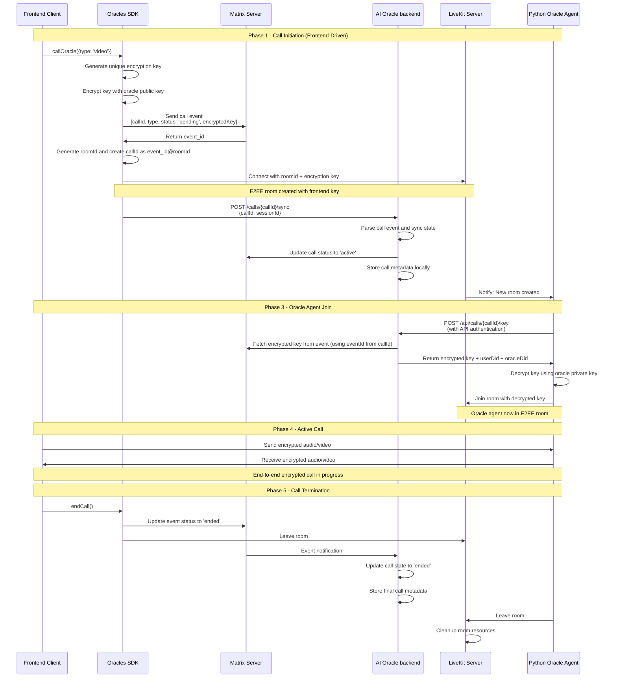

# Oracle Calls Architecture

End-to-end encrypted voice and video calls between users and AI oracles using Matrix, LiveKit, and secure key distribution.

## Overview

The Oracle Calls system enables ultra-secure, encrypted voice and video communication between users and AI oracles. The architecture implements **double encryption** for maximum security:

1. **Asymmetric Key Encryption**: Call encryption keys are encrypted using oracle public keys before storage
2. **Matrix E2EE**: All Matrix events use Matrix's native end-to-end encryption for transport layer security

This dual-layer encryption approach ensures **super secure** communication where:

- Call content is encrypted with unique per-call keys
- Key distribution happens through encrypted Matrix events
- Even compromised backend services cannot decrypt calls without proper authorization
- True end-to-end encryption is maintained throughout the entire call lifecycle

## Key Components

- **Frontend SDK**: Initiates calls and manages encryption keys
- **Matrix Server**: Stores encrypted call events and metadata
- **AI Oracle backend**: Listens to Matrix events and manages call state
- **LiveKit**: Provides real-time communication infrastructure
- **Live Agent**: AI oracle that joins calls securely

## Security Model

### Encryption Key Flow

1. **Frontend generates** unique encryption key per call
2. **Key encrypted** with oracle's public key before Matrix storage
3. **Frontend creates** callId as `eventId@roomId` for unique identification
4. **Live Agent** requests encrypted key from AI Oracle backend using callId
5. **AI Oracle backend** extracts eventId from callId and fetches encrypted key from Matrix event
6. **Live Agent** decrypts key using oracle's private key and joins E2EE LiveKit room using roomId

### Trust Boundaries

- Frontend controls encryption keys (true E2EE)
- Matrix stores encrypted metadata only
- Backend facilitates but cannot decrypt calls
- Live Agent authenticated via API keys

## Call Flow Architecture

### Complete Call Sequence



## API Endpoints

### Frontend SDK Endpoints

| Method             | Endpoint | Description                    |
| ------------------ | -------- | ------------------------------ |
| `callOracle(type)` | N/A      | Initiates call with encryption |
| `endCall()`        | N/A      | Terminates active call         |

### Backend API Endpoints

| Method | Endpoint                | Description                                   |
| ------ | ----------------------- | --------------------------------------------- |
| `POST` | `/calls/:callId/sync`   | Syncs call state from Matrix event            |
| `GET`  | `/calls/:callId/key`    | Returns encrypted key, userDid, and oracleDid |
| `POST` | `/calls/:callId/update` | Updates call status                           |
| `GET`  | `/calls`                | Lists user's calls                            |

**Note**: `callId` format is `eventId@roomId` where:

- `eventId`: Matrix event ID from the call creation event
- `roomId`: LiveKit room identifier for the call session

**Key Endpoint Response**:

```typescript
{
  "encryptionKey": "encrypted_key_data...",
  "userDid": "did:ixo:user123",
  "oracleDid": "did:ixo:oracle456"
}
```

### Matrix Events

| Event Type           | Description                         |
| -------------------- | ----------------------------------- |
| `m.ixo.oracles_call` | Call creation, updates, termination |

```typescript
{
  "type": "m.ixo.oracles_call",
  "content": {
    "callId": "$eventId@roomId",  // Combined identifier
    "callType": "video",
    "callStatus": "pending",
    "callStartedAt": "2024-01-01T10:00:00.000Z",
    "callEndedAt": "2024-01-01T10:30:00.000Z",
    "encryptionKey": "a1b2c3d4e5f6789012345678901234567890abcdef...",
    "sessionId": "550e8400-e29b-41d4-a716-446655440000",
    "roomId": "lk-room-12345",  // LiveKit room identifier
    "userDid": "did:ixo:user123",    // User's DID
    "oracleDid": "did:ixo:oracle456"  // Oracle's DID
  }
}
```

## Security Considerations

### Encryption Key Management

- **Generation**: Frontend generates cryptographically secure random keys
- **Storage**: Keys encrypted with oracle public key in Matrix
- **Distribution**: Encrypted keys provided to authenticated Live Agent
- **Rotation**: New key per call, no key reuse

### Authentication & Authorization

- **Live Agent**: API key authentication for key requests
- **Frontend**: Matrix authentication for event sending
- **Live Agent**: Oracle private key for decryption

### Attack Surface Mitigation

- **Man-in-the-middle**: E2EE prevents interception
- **Backend compromise**: Encrypted keys useless without private key
- **Key leakage**: Per-call keys limit exposure scope
- **Replay attacks**: Timestamp validation and unique call IDs

## Error Handling

### Common Failure Scenarios

| Scenario                     | Handling                           |
| ---------------------------- | ---------------------------------- |
| Matrix event send fails      | Retry with exponential backoff     |
| LiveKit connection fails     | Show user error, cleanup state     |
| Live Agent key request fails | Log error, agent stays offline     |
| Key decryption fails         | Return 403, invalid authentication |
