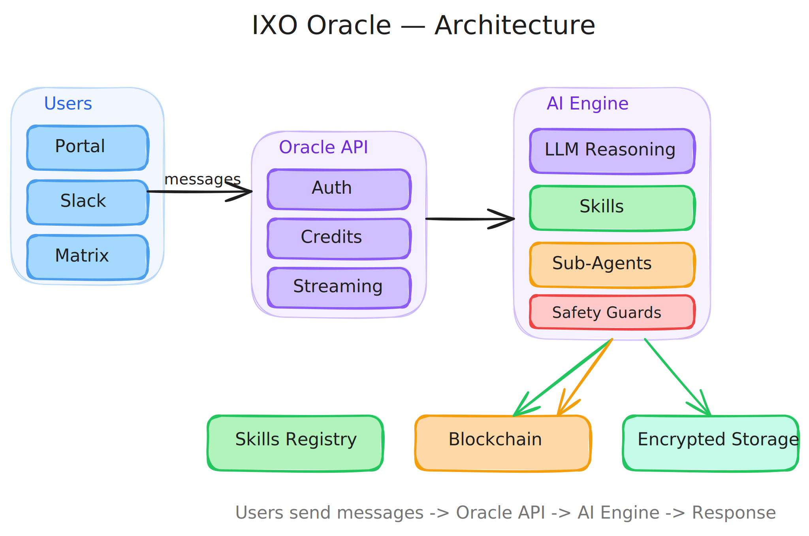

# 00 — What is an IXO Oracle?

> **Purpose:** Understand what an oracle is, what it can do, and what you'll build in this playbook.

---

## The 30-Second Pitch

An IXO Oracle is an AI assistant that lives on the internet with its own identity, its own encrypted communication channels, and a growing library of **skills** it can use to get things done.

Think of it like hiring a team member who:
- Has a verified identity on the blockchain (so people know it's legit)
- Talks to every user through a private, encrypted channel (so conversations stay confidential)
- Can learn new skills from a shared registry (so it gets more capable over time)
- Runs 24/7 on your server (so it's always available)

You're about to build one.

---

## The Four Pillars

Every IXO Oracle is built on four pillars:

### Blockchain Identity
Your oracle gets a DID (Decentralized Identifier) — like a digital passport registered on the IXO blockchain. This lets anyone verify who your oracle is and what it's authorized to do.

### E2E Encrypted Communication
Every conversation between a user and your oracle happens in a private, encrypted room. Nobody else can read those messages — not even you.

### AI Reasoning
Your oracle uses a large language model (like GPT or Claude) to understand messages, think step by step, and respond intelligently. It can also use **skills** and **sub-agents** to handle complex tasks.

### API Layer
A server that ties everything together — receives messages, routes them through the AI, and streams responses back to the user.

---

## Architecture at a Glance

> 

**Users** send messages through the Portal, Slack, or Matrix. The **Oracle API** receives them and passes them to the **AI Engine**, which reasons about the message, uses skills if needed, and streams a response back. Behind the scenes, conversations are stored in encrypted Matrix rooms and the oracle's identity lives on the blockchain.

---

## What are Skills?

Skills are like apps on a phone — they give your oracle new abilities.

A skill is just a set of instructions (a `SKILL.md` file) that tells your oracle how to do something specific. There's a shared registry of skills that your oracle can browse and use on the fly — things like creating presentations, generating PDFs, analyzing data, or searching the web.

You can use skills that already exist, or publish your own for others to use.

> **Example:** A user asks your oracle to "create a slide deck about climate change." Your oracle finds a presentation skill in the registry, reads its instructions, and produces the slides — all without you writing any code.

---

## What You'll Build

This playbook takes you from zero to a fully deployed oracle, step by step:

| Chapter | What You'll Achieve |
|---|---|
| [01 — Quickstart](./01-quickstart.md) | A running oracle that responds to messages |
| [02 — Project Structure](./02-project-structure.md) | Understand your codebase and know where to find things |
| [03 — Customize Your Oracle](./03-customize-your-oracle.md) | Give your oracle a unique personality and purpose |
| [04 — Working with Skills](./04-working-with-skills.md) | Use existing skills and build your own |
| [05 — Sub-Agents](./05-sub-agents.md) | Add specialist agents for complex workflows |
| [06 — Middlewares](./06-middlewares.md) | Add safety checks and billing |
| [07 — MCP Servers](./07-mcp-servers.md) | Connect external services and tools |
| [08 — Deployment](./08-deployment.md) | Ship your oracle to production |

**Guides** are standalone — pick any after completing the Quickstart:

| Guide | What It Covers |
|---|---|
| [Publish Your First Oracle](./guides/publish-your-first-oracle.md) | End-to-end: scaffold, customize, deploy, share |
| [Memory Engine](./guides/memory-engine.md) | Give your oracle persistent memory across conversations |
| [Payments & Claims](./guides/payments-and-claims.md) | Set up pricing and billing for your oracle |
| [Building & Publishing Skills](./guides/building-and-publishing-skills.md) | Create and publish your own skills |

---

## Prerequisites

Before starting, make sure you have:

- **Node.js 22+** — check with `node --version`
- **pnpm 10+** — install with `npm install -g pnpm`
- **Docker** — for Redis and other services ([install Docker](https://docs.docker.com/get-docker/))
- **IXO Mobile App** — for blockchain authentication ([iOS](https://apps.apple.com/app/ixo/id1560307060) / [Android](https://play.google.com/store/apps/details?id=com.ixo.mobile))
- **OpenRouter API key** — for LLM access ([get one here](https://openrouter.ai/keys))

---

## How to Read This Playbook

**Chapters 00–08** are meant to be read in order. Each builds on the previous.

**Guides** are standalone — pick whichever you need after completing [01 — Quickstart](./01-quickstart.md).

**Reference** pages are lookup material — [environment variables](./reference/environment-variables.md), [CLI commands](./reference/cli-reference.md), [API endpoints](./reference/api-endpoints.md), [state schema](./reference/state-schema.md), [skills & sandbox API](./reference/skills-and-sandbox-api.md).

---

**Ready?** Head to [01 — Quickstart](./01-quickstart.md) to build your first oracle.
