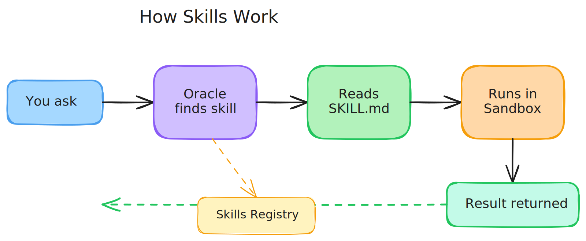

# 04 — Working with Skills

> **What you'll learn:** How to use existing skills, browse the skills registry, and build your own skills.

---

## What are Skills?

Skills are like apps on a phone — each one gives your oracle a new ability.

A skill is a folder containing a `SKILL.md` instruction file and optional supporting files (scripts, templates, examples). When your oracle needs to do something — like create a presentation or generate a PDF — it finds the right skill, reads the instructions, and follows them.

**You ask** → **Oracle finds the skill** → **Reads instructions** → **Executes in a sandbox** → **Returns the result**



Skills live in a shared registry at [github.com/ixoworld/ai-skills](https://github.com/ixoworld/ai-skills). Your oracle can browse and search this registry on the fly.

---

## Browsing & Searching Skills

Your oracle has two built-in tools for discovering skills:

- **`list_skills`** — browse all available skills (paginated)
- **`search_skills`** — search by keyword (e.g., "pptx", "invoice", "pdf")

You don't need to call these yourself. Just ask your oracle naturally:

```
You: "What skills do you have?"
Oracle: Lists available skills with names and descriptions.

You: "Can you create presentations?"
Oracle: Searches for presentation-related skills and shows what it finds.
```

Your oracle reads the skill's description to decide if it's the right fit, then loads and follows the instructions automatically.

---

## The AI Sandbox

Skills run in a secure, isolated sandbox. Your oracle writes code, executes it in the sandbox, and returns output files (like a generated PDF or spreadsheet) back to you. You never need to worry about what happens inside — just ask and get results.

---

## Using Existing Skills — Walkthrough

Here's a real example of asking your oracle to use a skill:

### 1. Ask for something

```
You: "Create a presentation about renewable energy with 5 slides"
```

### 2. Oracle discovers the skill

Your oracle automatically searches the registry, finds the `pptx` skill, and loads it.

### 3. Oracle reads the instructions

It reads the skill's `SKILL.md` file to learn the best way to create presentations — which libraries to use, how to structure slides, and what pitfalls to avoid.

### 4. Oracle executes in the sandbox

It writes and runs code in the sandbox, following the skill's instructions step by step.

### 5. You get the result

Your oracle returns the finished file. You can preview it in the chat or download it directly.

That's it. No configuration, no code — just ask.

### Combining Multiple Skills

Your oracle can use more than one skill at a time. For example:

```
You: "Take the data from this spreadsheet and create a presentation with charts"
```

The oracle finds the `xlsx` skill (to read the data) and the `pptx` skill (to create slides), reads both, and combines them.

---

## Building Your First Skill

Want your oracle to do something new? Create a skill.

### What's in a Skill

At minimum, a skill is a folder with one file:

```
my-skill/
├── SKILL.md          # Instructions your oracle follows
├── scripts/          # (optional) Helper scripts
├── templates/        # (optional) Template files
└── examples/         # (optional) Example inputs/outputs
```

The `SKILL.md` is the most important part. It tells your oracle **what** the skill does, **when** to use it, and **how** to execute it.

### Write Your SKILL.md

Here's a template to get started:

```markdown
# Skill Name

## Description

One sentence: what this skill does.

## When to Use

- Trigger phrase 1 (e.g., "create an invoice")
- Trigger phrase 2 (e.g., "generate a billing document")

## Requirements

- python3
- any pip packages needed (e.g., `reportlab`)

## Instructions

### Step 1: Gather inputs

Describe what information the oracle needs from the user.

### Step 2: Create the output

Describe the exact steps — which script to run, what arguments to pass.

### Step 3: Deliver

Copy the final file to `/workspace/output/` and use
`artifact_get_presigned_url` to share it with the user.

## Common Pitfalls

- List things to watch out for
- e.g., "Always use absolute paths"

## Example

Show a sample input → output so the oracle knows what "good" looks like.
```

### Add Supporting Files (Optional)

If your skill needs helper scripts or templates, add them to the folder:

```
invoice-creator/
├── SKILL.md
├── scripts/
│   └── create_invoice.py    # Script the oracle runs
└── templates/
    └── invoice_template.html # Template for the invoice
```

Your `SKILL.md` should reference these files so the oracle knows to use them.

### Publish to the Registry

Skills are published to the [ai-skills registry](https://github.com/ixoworld/ai-skills):

1. Fork the repository
2. Add your skill folder
3. Open a pull request
4. Once merged, your skill appears in the registry for all oracles to use

---

## Custom Tools — When Skills Aren't Enough

Skills cover most use cases, but sometimes you need a **custom tool** — a function wired directly into your oracle's code. Use a custom tool when:

- You need to call a private API that only your oracle should access
- You need real-time data that changes every second (e.g., live stock prices)
- The logic is tightly coupled to your oracle's specific business rules

Here's a quick example of a custom tool:

```typescript
import { tool } from '@langchain/core/tools';
import { z } from 'zod';

export const weatherTool = tool(
  async ({ city }) => {
    const res = await fetch(`https://api.weather.com/v1/${city}`);
    const data = await res.json();
    return `${city}: ${data.temperature}°C, ${data.condition}`;
  },
  {
    name: 'get_weather',
    description:
      'Get current weather for a city. Use when the user asks about weather.',
    schema: z.object({
      city: z.string().describe('City name, e.g. "London"'),
    }),
  },
);
```

Add it to the `tools` array in `apps/app/src/graph/agents/main-agent.ts` and your oracle can use it immediately.

For more on building complex tools and sub-agents, see [05 — Sub-Agents](./05-sub-agents.md).

---

## Next Steps

- **[05 — Sub-Agents](./05-sub-agents.md)** — delegate complex tasks to specialist agents
- **[Building & Publishing Skills](./guides/building-and-publishing-skills.md)** — deep dive into creating professional skills
- **[03 — Customize Your Oracle](./03-customize-your-oracle.md)** — change your oracle's personality and purpose
