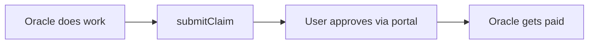

# Guide: Payments & Claims

> **What you'll learn:** How your oracle gets paid — automatic token billing and explicit service claims.

---

## Two Ways to Get Paid

Your oracle has two independent revenue streams:

1. **Token usage billing** — automatic. Every message costs credits based on how much AI processing it uses. The framework handles this for you.
2. **Service claims** — explicit. When your oracle delivers something tangible (a document, image, report), it can submit a claim for that work. The user approves and pays.

You can use one or both. Token billing works out of the box. Service claims require a bit of code.

---

## Token Usage (Automatic)

When you create your oracle entity via the CLI, you set a price in IXO Credits. Users subscribe and get a credit balance. From there, everything is automatic:

1. User sends a message
2. The oracle checks their credit balance before responding
3. After responding, the oracle deducts credits based on tokens used
4. Credits accumulate as a "held amount"
5. Every minute, held amounts are auto-submitted as claims
6. The user approves (via the portal) and funds are released from escrow

**You don't need to write any code for this.** It's built into the framework via the token limiter middleware (see [06 — Middlewares](../06-middlewares.md)).

---

## Service Claims (Charging for Work)

If your oracle generates an image, creates a document, or does any deliverable work — you can charge for it separately from token usage.

### How it works



Your oracle submits a claim describing the work and the amount. The user sees the claim in their portal, approves it, and funds are released from escrow to your oracle.

### Code Example

Here's a custom tool that generates an image and submits a claim for the work:

```typescript
import { tool } from '@langchain/core/tools';
import { z } from 'zod';
import { Claims, Client } from '@ixo/oracles-chain-client';

export const generateAndChargeTool = tool(
  async ({ prompt, collectionId }) => {
    // 1. Do the work (generate image, create document, etc.)
    const imageUrl = await generateImage(prompt);

    // 2. Submit a claim for the work
    const client = Client.getInstance();
    await client.init();
    const claimsClient = new Claims(client);

    // Save the signed claim to Matrix (returns a CID)
    const cid = await claimsClient.saveSignedClaimToMatrix({
      claim: {
        body: { description: 'Image generation', prompt },
        amount: [{ amount: '500', denom: 'uixo' }],
      },
      collectionId,
      // ... other required params from your config
    });

    // Submit the claim on-chain
    await claimsClient.submitClaim({
      claimId: cid,
      collectionId,
      useIntent: true,
      amount: [{ amount: '500', denom: 'uixo' }],
    });

    return `Image generated! A claim for 500 uixo has been submitted.`;
  },
  {
    name: 'generate_and_charge',
    description: 'Generate an image and charge for the work',
    schema: z.object({
      prompt: z.string().describe('Image prompt'),
      collectionId: z.string().describe('User claim collection ID'),
    }),
  },
);
```

The user approves the claim via the portal or client SDK (`payClaim()`).

---

## Disabling Billing

For development or free oracles, set this in your `.env`:

```env
DISABLE_CREDITS=true
```

This skips both token billing and claim processing. Your oracle still works — it just doesn't charge anyone.

---

## AuthZ Permissions

The first time a user visits your oracle's portal, they grant your oracle permission to submit claims and act on their behalf. This is a one-time authorization — after that, your oracle can submit claims without further prompts.

---

## Configuration

| Variable            | Description                                         |
|---------------------|-----------------------------------------------------|
| `DISABLE_CREDITS`   | Set to `true` to disable all billing (default: off) |
| `SECP_MNEMONIC`     | Mnemonic for signing claims on-chain                |
| `ORACLE_ENTITY_DID` | Your oracle's entity DID on the blockchain          |
| `NETWORK`           | Which blockchain network (`devnet`, `testnet`, `mainnet`) |

See [Environment Variables](../reference/environment-variables.md) for the full list.

---

## Next Steps

- **[06 — Middlewares](../06-middlewares.md)** — how the token limiter middleware works
- **[08 — Deployment](../08-deployment.md)** — deploy your oracle to production
- **[Publish Your First Oracle](./publish-your-first-oracle.md)** — end-to-end guide
