# `@ixo/oracles-events`

Real-time event system for the IXO Oracles Framework. Handles streaming communication between your oracle (server) and client applications via **Server-Sent Events (SSE)** and **WebSocket (WS)** connections.

**Table of Contents**

- [Overview](#overview)
- [Communication Channels](#communication-channels)
- [Event Types](#event-types)
- [Installation](#installation)
- [Creating a New Event](#creating-a-new-event)
- [Advanced Usage](#advanced-usage)
- [Testing](#testing)
- [Contributing](#contributing)

---

## Overview

The `@ixo/oracles-events` package enables real-time communication between your oracle and client applications. While your LLM processes conversations using LangGraph, events stream live updates to clients showing tool execution, rendering custom UI components, and enabling browser-side interactions.

**Key Features:**

- **Dual Communication**: SSE for one-way streaming, WebSocket for bidirectional communication
- **Type-Safe Events**: Full TypeScript support with payload validation
- **Session Management**: Automatic session isolation and request tracking
- **Client Integration**: Seamless integration with `@ixo/oracles-client-sdk`
- **Browser Tools**: Reverse tool calls that execute in the user's browser

---

## Communication Channels

### Server-Sent Events (SSE)

**Use Case**: One-way streaming from server to client  
**Best For**: Tool call updates, component rendering, status notifications  
**Endpoint**: `/sse/events?sessionId={sessionId}`

### WebSocket (WS)

**Use Case**: Bidirectional real-time communication  
**Best For**: Browser tool calls, interactive features, immediate responses  
**Implementation**: Socket.IO with session-based rooms

---

## Event Types

### 1. ToolCallEvent

**Purpose**: Notifies clients when LLM executes tools on the server  
**Use Cases**: API calls, database queries, long-running operations

```typescript
// Start tool execution
new ToolCallEvent({
  sessionId: 'user-session-123',
  requestId: 'request-456',
  toolName: 'get_weather',
  args: { location: 'New York' },
  status: 'isRunning',
}).emit();

// Tool completes
new ToolCallEvent({
  sessionId: 'user-session-123',
  requestId: 'request-456',
  toolName: 'get_weather',
  status: 'done',
  output: 'Temperature: 72°F, Sunny',
}).emit();
```

### 2. RenderComponentEvent

**Purpose**: Instructs client to render custom UI components  
**Use Cases**: Dynamic lists, charts, forms, interactive elements

```typescript
new RenderComponentEvent({
  sessionId: 'user-session-123',
  requestId: 'request-456',
  componentName: 'ProductList',
  args: {
    products: [
      { name: 'Product A', price: 29.99 },
      { name: 'Product B', price: 39.99 },
    ],
  },
  status: 'done',
}).emit();
```

### 3. BrowserToolCallEvent

**Purpose**: Enables LLM to execute tools directly in user's browser  
**Use Cases**: UI navigation, DOM manipulation, browser-specific operations

```typescript
// Server-side: Call browser tool
import { callBrowserTool } from '@ixo/common';

const result = await callBrowserTool({
  sessionId: 'user-session-123',
  toolCallId: 'tool-call-789',
  toolName: 'navigateToPage',
  args: { url: '/products' },
});
```

### 4. MessageCacheInvalidationEvent

**Purpose**: Notifies clients to refresh message cache  
**Use Cases**: New messages, conversation state changes

### 5. RouterEvent

**Purpose**: Manages conversation flow and navigation state  
**Use Cases**: Multi-step conversations, wizard flows

---

## Installation

```bash
pnpm install @ixo/oracles-events
```

---

## Creating a New Event

### 1. Define Event Interface & Class

Create your event by extending `BaseEvent`:

```typescript
// src/events/my-custom-event/types.ts
export const EVENT_NAME = 'my_custom_event' as const;

export interface IMyCustomEvent {
  message: string;
  priority: 'high' | 'normal' | 'low';
  metadata?: Record<string, any>;
}
```

```typescript
// src/events/my-custom-event/my-custom-event.ts
import {
  BaseEvent,
  shouldHaveSessionId,
  WithRequiredEventProps,
} from '../base-event/base-event';
import { EVENT_NAME, IMyCustomEvent } from './types';

export class MyCustomEvent extends BaseEvent<IMyCustomEvent> {
  constructor(public payload: WithRequiredEventProps<IMyCustomEvent>) {
    super();
    shouldHaveSessionId(payload);
  }

  public eventName = EVENT_NAME;
  static eventName = EVENT_NAME;
}
```

### 2. Register Event in GraphEventEmitter

```typescript
// src/graph-event-emitter.ts
import { MyCustomEvent } from './events/my-custom-event/my-custom-event';

export class GraphEventEmitter {
  static registerEventHandlers(server: Server): void {
    MyCustomEvent.registerEventHandlers(server);
    // ... other events
  }
}
```

### 3. Export Event

```typescript
// src/events/index.ts
export { MyCustomEvent } from './my-custom-event/my-custom-event';
export type { IMyCustomEvent } from './my-custom-event/types';
```

### 4. Add to Types

```typescript
// src/types/index.ts
import type { MyCustomEvent } from '../events';

export type AllEvents =
  | ToolCallEvent
  | RenderComponentEvent
  | BrowserToolCallEvent
  | MessageCacheInvalidationEvent
  | RouterEvent
  | MyCustomEvent; // Add your event here

export type MyCustomEventPayload = WithRequiredEventProps<IMyCustomEvent>;
```

### 5. Emit Your Event

There are **two ways** to emit events depending on your use case:

#### Method 1: Standard Event Emission (Recommended)

**Use Case**: Standard event flow that automatically reaches clients via WebSocket  
**How it works**: `event.emit()` → `rootEventEmitter` → `GraphEventEmitter` (if registered) → WebSocket clients

```typescript
// In your LangGraph node or service
import { ToolCallEvent } from '@ixo/oracles-events';

const event = new ToolCallEvent({
  sessionId: 'user-session-123',
  requestId: 'request-456',
  toolName: 'get_weather',
  args: { location: 'New York' },
  status: 'isRunning',
});

// This follows the complete flow:
// 1. event.emit() → rootEventEmitter.emit(eventName, payload)
// 2. GraphEventEmitter (registered in ws.gateway.ts) listens to rootEventEmitter
// 3. Automatically broadcasts to WebSocket clients in the session
event.emit();
```

**Complete Event Flow**:

```
Your Code → event.emit() → rootEventEmitter → GraphEventEmitter → WebSocket Server → Client
```

**Registered Events**: `ToolCallEvent`, `RenderComponentEvent`, `BrowserToolCallEvent`, `MessageCacheInvalidationEvent`, `RouterEvent`

#### Method 2: Direct Service Emission

**Use Case**: Direct emission to specific communication channels  
**How it works**: Bypass event system and emit directly to SSE/WebSocket services

```typescript
// Direct SSE emission (like in messages.service.ts)
import { SseService } from 'src/sse/sse.service';

@Injectable()
export class MyService {
  constructor(private readonly sseService: SseService) {}

  sendEventToClient(sessionId: string) {
    const event = new MyCustomEvent({
      sessionId,
      requestId: 'request-456',
      message: 'Direct emission',
      priority: 'high',
    });

    // Direct emission to SSE clients
    this.sseService.publishToSession(sessionId, event);
  }
}
```

#### Method 3: Internal Communication

**Use Case**: Emit events back into the internal events system  
**How it works**: Direct `rootEventEmitter` usage for service-to-service communication

```typescript
// Internal emission (like in ws.gateway.ts)
import { rootEventEmitter } from '@ixo/oracles-events';

// Emit back into the events system for internal processing
rootEventEmitter.emit('browser_tool_result', {
  sessionId: 'user-session-123',
  toolCallId: 'tool-123',
  result: { success: true },
  timestamp: new Date().toISOString(),
});
```

**When to use each method:**

- **Method 1**: Standard registered events that automatically reach WebSocket clients (ToolCallEvent, RenderComponentEvent, etc.)
- **Method 2**: Real-time streaming scenarios, direct SSE client communication
- **Method 3**: Internal service communication, responding to WebSocket events and triggering internal workflows

---

## 📊 Event Flow Diagram

The following diagram shows the complete flow from your code to the client:

```mermaid
graph LR
    A["🧠 Your Code<br/>event.emit()"] --> B["📡 rootEventEmitter"]
    B --> C["🎯 GraphEventEmitter<br/>(listens to rootEventEmitter)"]
    C --> D["📱 WebSocket → Client"]

    style A fill:#e3f2fd,stroke:#1976d2,stroke-width:2px
    style B fill:#fff3e0,stroke:#f57c00,stroke-width:2px
    style C fill:#e8f5e8,stroke:#388e3c,stroke-width:2px
    style D fill:#fce4ec,stroke:#d81b60,stroke-width:2px
```



**How it works**:

1. You call `event.emit()` in your code
2. This triggers `rootEventEmitter` (internal event bus)
3. `GraphEventEmitter` listens to `rootEventEmitter` and forwards to WebSocket
4. Client receives the event automatically

**That's it!** Once `GraphEventEmitter` is registered in `ws.gateway.ts`, all events automatically reach clients.

### Event Status Management

Many events support status tracking:

```typescript
// Start long-running operation
new ToolCallEvent({
  sessionId,
  requestId,
  toolName: 'complex_analysis',
  status: 'isRunning',
}).emit();

// Update with progress (optional)
new ToolCallEvent({
  sessionId,
  requestId,
  toolName: 'complex_analysis',
  status: 'isRunning',
  output: 'Progress: 50% complete',
}).emit();

// Complete operation
new ToolCallEvent({
  sessionId,
  requestId,
  toolName: 'complex_analysis',
  status: 'done',
  output: 'Analysis complete: Found 25 insights',
}).emit();
```

### Event Chaining

Chain multiple events for complex workflows:

```typescript
// 1. Show tool execution
new ToolCallEvent({
  sessionId,
  requestId,
  toolName: 'data_analysis',
  status: 'isRunning',
}).emit();

// 2. Complete tool and render results
const data = await performAnalysis();
new ToolCallEvent({
  sessionId,
  requestId,
  toolName: 'data_analysis',
  status: 'done',
  output: `Analyzed ${data.length} records`,
}).emit();

// 3. Render custom component with results
new RenderComponentEvent({
  sessionId,
  requestId,
  componentName: 'AnalysisChart',
  args: { data, chartType: 'bar' },
  status: 'done',
}).emit();
```


### Required Payload Properties

Every event payload **must** include:

```typescript
interface RequiredEventProps {
  sessionId: string; // Chat session identifier
  requestId: string; // Request identifier (for tracking)
}
```

### Session and Request Management

```typescript
// Use consistent IDs for related events
const sessionId = 'user-session-123';
const requestId = 'message-request-456';

// Multiple events for the same request
new ToolCallEvent({ sessionId, requestId /* ... */ });
new RenderComponentEvent({ sessionId, requestId /* ... */ });
```

---

## Testing

### Basic Event Testing

```typescript
import { MyCustomEvent } from '../my-custom-event';
import { rootEventEmitter } from '../../root-event-emitter';

describe('MyCustomEvent', () => {
  it('should emit with correct payload', () => {
    const payload = {
      sessionId: 'test-session',
      requestId: 'test-request',
      message: 'test message',
      priority: 'high' as const,
    };

    const event = new MyCustomEvent(payload);
    const emitSpy = jest.spyOn(rootEventEmitter, 'emit');

    event.emit();

    expect(emitSpy).toHaveBeenCalledWith(MyCustomEvent.eventName, payload);
  });

  it('should require sessionId', () => {
    expect(() => {
      new MyCustomEvent({
        requestId: 'test-request',
        message: 'test',
        priority: 'normal',
      } as any);
    }).toThrow();
  });
});
```

### Integration Testing

```typescript
import { createTestEvent } from '../test-utils';

it('should register event handlers correctly', () => {
  const mockServer = {
    on: jest.fn(),
    emit: jest.fn(),
  };

  MyCustomEvent.registerEventHandlers(mockServer as any);

  expect(mockServer.on).toHaveBeenCalledWith(
    MyCustomEvent.eventName,
    expect.any(Function),
  );
});
```

---

## Contributing

### Event Naming Conventions

- Use snake_case: `tool_call`, `render_component`, `my_custom_event`
- Be descriptive: `user_preferences_updated` not `update`
- Include domain if needed: `payment_status_changed`

### TypeScript Best Practices

- Always define interfaces for payload types
- Use `WithRequiredEventProps<T>` for constructor parameters
- Export both the event class and interface
- Add proper JSDoc comments

### Performance Considerations

- **Batch events** when possible instead of emitting many small events
- **Use appropriate channels**: SSE for notifications, WS for interactions
- **Validate payloads** before emission to catch errors early
- **Avoid large payloads**: Keep event data focused and minimal

### Security Guidelines

- **Validate all inputs** in event payloads
- **Sanitize user data** before including in events
- **Ensure session isolation** - events only go to correct sessions
- **Never include sensitive data** in event payloads

---

## Architecture Documentation

For comprehensive system architecture, event flows, and integration patterns, see [Events System Architecture](../../docs/architecture/events.md).

---

**Thank you for using `@ixo/oracles-events`!**
