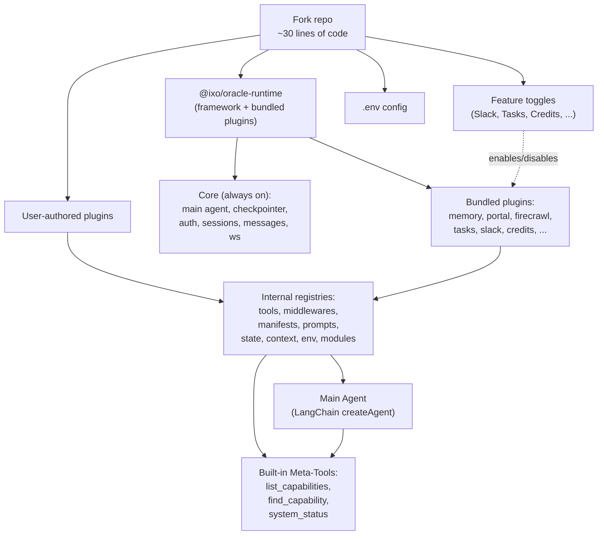
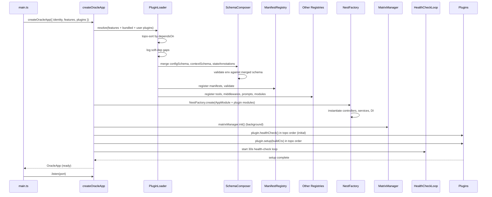

# QiForge Plugin-Based Runtime — Technical Specification

**Ticket:** ORA-219
**Branch:** `feature/ora-219-qiforge-transform-how-we-use-qi-forge-to-be-plugin-based`
**Author:** Yousef / QiForge
**Date:** 2026-04-30
**Stack:** NestJS · LangGraph/LangChain 1.x · Matrix · Zod · TypeScript
**Supersedes:** `specs/oracle-runtime-extensibility-spec.md` (v1.0)
**Status:** Spec-ready — single-phase transformation, no migration path required

---

## Table of Contents

1. [Executive Summary](#1-executive-summary)
2. [The Three North-Star Goals](#2-the-three-north-star-goals)
3. [Non-Goals](#3-non-goals)
4. [Mental Model — Three Levers](#4-mental-model--three-levers)
5. [The Plugin Manifest — How the AI Agent Sees Plugins](#5-the-plugin-manifest)
6. [How the Agent Discovers and Uses Plugins](#6-how-the-agent-discovers-and-uses-plugins)
7. [PluginContext and RuntimeContext](#7-plugincontext-and-runtimecontext)
8. [The Plugin API](#8-the-plugin-api)
9. [Plugin SDK — Builder Form](#9-plugin-sdk--builder-form)
10. [Soft Dependencies and Graceful Degradation](#10-soft-dependencies-and-graceful-degradation)
11. [Health Checks and Status Reporting](#11-health-checks-and-status-reporting)
12. [Feature Toggles](#12-feature-toggles)
13. [Internal Registries](#13-internal-registries)
14. [LangGraph Composition](#14-langgraph-composition)
15. [Boot Sequence](#15-boot-sequence)
16. [Bundled Plugins — Catalog](#16-bundled-plugins--catalog)
17. [Environment Variables by Plugin](#17-environment-variables-by-plugin)
18. [The Starter App](#18-the-starter-app)
19. [Testing Harness](#19-testing-harness)
20. [Worked Examples](#20-worked-examples)
21. [Package Layout](#21-package-layout)
22. [Implementation Checklist](#22-implementation-checklist)
23. [Open Decisions](#23-open-decisions)
24. [Glossary](#24-glossary)

---

## 1. Executive Summary

QiForge becomes a **plugin-based runtime**. The entire framework — bootstrap, graph engine, agents, controllers, Matrix wiring, sub-agents, system prompt, middlewares, checkpointer — moves into a single published package, **`@ixo/oracle-runtime`**. A fork's `apps/app/` shrinks to a ~30-line starter that wires identity, feature toggles, and plugins.

Three things make this transformation different from a generic plugin system:

1. **Every plugin ships a structured `manifest`** that the AI agent reads to discover what it can do — not just a system-prompt string blob.
2. **Plugins can be added or removed independently** via `softDependsOn` + an `availablePlugins` set, so the app boots and runs cleanly with any subset of plugins enabled.
3. **The agent has built-in meta-tools** — `list_capabilities`, `find_capability`, `list_capability_details`, `system_status` — that let it introspect, search, and adapt to the currently loaded plugins at runtime.

There is **no migration path**. This is a transformation: the previous `apps/app/` shape is replaced wholesale. There is no v0/v1 dual-mode, no deprecation window, no compatibility shim. One PR, one big phase, one new shape.

The Matrix-backed SQLite checkpointer remains the default and is not pluggable. NestJS, LangGraph, LangChain 1.x stay. Every feature shipping today (Slack, Tasks, Credits, Composio, Firecrawl, Memory, Portal, Editor, AG-UI, Sandbox, Skills, Domain Indexer, Langfuse, Calls) becomes a **bundled plugin** built against the same public API that fork authors use.

---

## 2. The Three North-Star Goals

Every design decision in this spec is justified against one of these three goals. If a decision doesn't serve one of them, it should be cut.

### Goal A — Easy for developers

A fork developer writes a complete, useful plugin in **under 30 minutes** with no prior framework knowledge.

This means:
- One file, one default export, one mental model.
- A builder SDK that reads top-down (no nested closures for the common case).
- Strong types — `ctx.config.MY_API_KEY` autocompletes inside the plugin's own handlers.
- A testing entrypoint (`@ixo/oracle-runtime/testing`) so the author never has to boot the full app to verify behavior.
- A CLI scaffold (`qiforge plugin new climate`) that produces a working hello-world plugin.
- Clear, actionable error messages at boot when something is wrong.

### Goal B — Easy for AI agents

The AI agent learns about plugins through **structured, machine-readable manifests** — not by parsing free-form prompt blobs.

This means:
- Every plugin has a required `manifest` field (title, summary, whenToUse, whenNotToUse, examples, tags, category).
- The system prompt only contains a compact one-line-per-plugin "available capabilities" summary by default.
- The agent calls `list_capability_details(name)` to pull full info on demand.
- The agent can search by intent: `find_capability("the user wants to do X")`.
- Tools have rich descriptions with examples; manifests provide the surrounding context.
- Plugin status is part of the agent's awareness: a degraded plugin shows as such, and the agent picks alternatives.

### Goal C — Plug/unplug freely

A fork can add or remove a plugin and the app **boots, runs, and does not regress** other plugins' behavior.

This means:
- Hard dependencies (`dependsOn`) fail fast at boot with a clear error.
- Soft dependencies (`softDependsOn`) make a plugin *aware* of another, but it must function without it.
- An `availablePlugins: Set<string>` is exposed to every plugin builder — code branches on what's loaded.
- State annotations are isolated by plugin name — removing a plugin doesn't corrupt other state.
- Health checks let a degraded plugin (e.g., Slack disconnected) coexist with healthy ones.
- The system prompt regenerates on plugin status change so the agent stays accurate.

### Implicit Goal D — Preserve current functionality

Nothing currently shipping disappears. Every feature in `apps/app/` today becomes a bundled plugin. Behavior parity is the bar.

---

## 3. Non-Goals

Locked. The plugin API does **not**:

1. **Swap the main agent.** Forks needing a radically different agent build their own app, not a plugin.
2. **Swap the checkpointer.** Matrix + SQLite is the contract. Plugins read history via `ctx.history`; they cannot persist state elsewhere.
3. **Swap the LLM executor.** LangChain 1.x `createAgent`. Not raw `StateGraph`, not LCEL, not other frameworks.
4. **Rewrite the base system prompt.** Plugins append/contribute manifest sections; the skeleton is fixed.
5. **Replace primary auth.** DID + Matrix OpenID + UCAN is the contract. A plugin can add *additional* auth (e.g. API-key guard for webhooks); it cannot replace the primary middleware.
6. **Disable core modules.** Sessions, Messages, WebSocket, Auth — always on.
7. **Cross-oracle plugin sharing at runtime.** Plugins are npm packages in the fork's `package.json`. No dynamic discovery, no marketplace, no plugin registry endpoint.
8. **Hot-load / hot-unload at runtime.** Plugins resolve at boot, period. A fork wanting different plugins restarts the app.
9. **Backwards compatibility with the old structure.** This is a transformation. The old `apps/app/` shape is replaced wholesale.

---

## 4. Mental Model — Three Levers

There are three orthogonal levers a fork operator works with. Confusing them has been the single biggest source of design churn in prior threads. Lock them in.

| Lever | Owner | Purpose | Shape |
|---|---|---|---|
| **Feature toggle** | Fork operator | Turn bundled framework features on/off per deployment | `features: { slack: true, composio: false, ... }` |
| **Plugin** | Fork developer | Add new behavior on top of the framework | `plugins: [climatePlugin, webhookPlugin]` |
| **Config** | Fork operator | Standard 12-factor env vars, merged from framework + plugins | `.env` + Zod schema |

A fork turning Slack on does not require writing a plugin. A fork adding a custom tool does not require flipping a feature. A plugin that ships a new MCP server adds a config schema entry that the fork populates in `.env`.



---

## 5. The Plugin Manifest

This section is **the centerpiece of agent-side DX**. The manifest is the agent's interface to the plugin. It is structured, machine-readable, and LLM-friendly.

### 5.1 Schema

```ts
export interface PluginManifest {
  /** Human-readable name, shown to the agent and in the UI */
  title: string;

  /** One-line description (≤ 120 chars). Always shown in Tier-1 prompt. */
  summary: string;

  /**
   * Triggers — when the agent should consider this plugin.
   * Bullet points, ≤ 8 entries, each ≤ 80 chars.
   * Used by `find_capability` for semantic search.
   */
  whenToUse: string[];

  /** Anti-patterns — when the agent should NOT use this plugin */
  whenNotToUse?: string[];

  /** Few-shot examples that teach the agent how to invoke the plugin */
  examples?: ManifestExample[];

  /** Categorization for grouping and filtering */
  tags?: string[];
  category?:
    | 'data'
    | 'communication'
    | 'automation'
    | 'memory'
    | 'integration'
    | 'ui'
    | 'auth'
    | 'observability'
    | 'core';

  /**
   * How prominent this plugin should be in the agent's prompt.
   * - 'always'    → in Tier-1 summary always (default for user-facing plugins)
   * - 'on-demand' → only via `list_capabilities` / `find_capability`
   * - 'silent'    → never shown to agent (e.g. middleware-only plugins like langfuse)
   */
  visibility?: 'always' | 'on-demand' | 'silent';

  /** Stability hint for the agent: "experimental" plugins get a warning footnote */
  stability?: 'stable' | 'beta' | 'experimental';
}

export interface ManifestExample {
  /** A representative user message that should trigger this plugin */
  user: string;
  /** Agent's reasoning (optional, helps few-shot the decision) */
  thought?: string;
  /** The tool the agent should call */
  tool: string;
  /** Example arguments */
  args?: Record<string, unknown>;
}
```

### 5.2 Why structured beats string concat

The previous spec had `promptSection: () => string`. Each plugin contributed a paragraph; 15 plugins = 15 differently-toned paragraphs in one mega-prompt. Three concrete failures of that approach:

| Failure | Manifest fix |
|---|---|
| Token cost: ~200 tokens × 15 plugins = ~3000 tokens always paid | Tier-1 summary is one line per plugin; full detail only on demand |
| The agent can't "ask" — it just consumes the prompt | `find_capability(query)` lets the agent search by intent |
| Plugin authors write inconsistent prompt voice | Manifest fields are uniformly composed by the runtime |
| No way to mark "currently degraded" | Health status is auto-merged into Tier-1 line |

### 5.3 Manifest example (climate plugin)

```ts
const climateManifest: PluginManifest = {
  title: 'Climate Data',
  summary: 'Facility emissions and carbon footprint analysis.',
  whenToUse: [
    'User asks about CO2 emissions for a facility, plant, or organization',
    'User mentions carbon footprint, greenhouse gases, or sustainability metrics',
    'User wants to compare emissions across facilities',
    'User wants an emissions forecast or trend analysis',
  ],
  whenNotToUse: [
    'General weather questions — answer from knowledge, no tool needed',
    'Climate policy or regulation discussion — use web search instead',
    'Facility info that is not emissions-related (use the org plugin)',
  ],
  examples: [
    {
      user: 'How much CO2 did Plant 42 emit in Q1?',
      thought: 'User wants emissions for a specific facility and period.',
      tool: 'get_emissions',
      args: { facilityId: 'plant-42', period: 'Q1-2026' },
    },
    {
      user: 'Compare emissions for Plant 42 vs Plant 51',
      thought: 'User wants a multi-facility comparison.',
      tool: 'compare_facilities',
      args: { facilityIds: ['plant-42', 'plant-51'] },
    },
  ],
  tags: ['climate', 'emissions', 'sustainability', 'carbon', 'environmental-data'],
  category: 'data',
  visibility: 'always',
  stability: 'stable',
};
```

### 5.4 Visibility tiers explained

| Visibility | When used | Example |
|---|---|---|
| `always` | Plugins the agent is regularly expected to choose between | climate, memory, tasks, slack |
| `on-demand` | Plugins useful for specific situations the agent must recognize | claim-processing, calls, editor |
| `silent` | Plugins that operate transparently via middleware, not by agent invocation | langfuse, throttling, auth |

Default: `'always'`. Silent plugins still register tools and middleware; they just don't appear in the prompt.

### 5.5 Manifest validation

A separate Zod schema validates manifests at boot. Constraints:

- `summary` ≤ 120 characters
- `whenToUse` ≤ 8 bullets, each ≤ 80 characters
- `examples` ≤ 5 entries
- All `examples[].tool` must reference a tool actually registered by this plugin

Violation → boot error with the offending plugin name and field path. Keeps the prompt from drifting into bloat.

---

## 6. How the Agent Discovers and Uses Plugins

Three layers, each addressing a different part of the agent's reasoning loop.

### 6.1 Tier-1 — Always-on capability summary

The runtime composes a single block at the top of the system prompt from all loaded plugins with `visibility: 'always'` (and degraded `'on-demand'` plugins, so the agent knows to avoid them).

```
## Available Capabilities

- climate: Facility emissions and carbon footprint analysis. Triggers: emissions, CO2, carbon footprint.
- memory: Long-term memory of past conversations. Used automatically before responding.
- tasks: Schedule background work or recurring jobs. Triggers: "remind me", "every X", scheduled work.
- slack: (DEGRADED — Slack disconnected, retrying) Send messages to Slack channels.
- portal: Web portal sub-agent for portal-bound interactions.

For full details on any capability, call `list_capability_details(name)`.
For semantic search by intent, call `find_capability(query)`.
For overall plugin health, call `system_status()`.
```

Format: `- {name}: {summary} {optional-trigger-hint} {optional-status-tag}`

Per plugin: ~80–120 tokens. With 15 plugins: ~1500 tokens up front — vs ~3000+ for the old per-plugin paragraphs.

### 6.2 Tier-2 — On-demand details via meta-tools

Four built-in tools the agent always has, regardless of which plugins are loaded:

```ts
// Tool 1: list_capabilities
// Returns the same summary as Tier-1, but the agent can call this any time
// (useful after long contexts where it may have been compressed away).
{
  name: 'list_capabilities',
  description: 'List all available capabilities (plugins) and their summaries.',
  schema: z.object({}),
  // returns: Array<{ name, summary, status, category, tags }>
}

// Tool 2: list_capability_details
// Returns the full manifest of one plugin: whenToUse, whenNotToUse, examples,
// and the list of tools the plugin contributes.
{
  name: 'list_capability_details',
  description: 'Get full details on a specific capability, including examples and tool list.',
  schema: z.object({ name: z.string() }),
  // returns: PluginManifest & { tools: Array<{ name, description, schemaSummary }> }
}

// Tool 3: find_capability
// Semantic search across all manifests' whenToUse and tags.
// Returns ranked plugin names.
{
  name: 'find_capability',
  description: 'Search for a capability by user intent or topic. Returns ranked matches.',
  schema: z.object({ query: z.string(), limit: z.number().int().default(5) }),
  // returns: Array<{ name, score, matchReason }>
}

// Tool 4: system_status
// Health and availability of all loaded plugins, including degraded ones.
{
  name: 'system_status',
  description: 'Get current health status of all capabilities. Useful when something seems unavailable.',
  schema: z.object({}),
  // returns: Array<{ name, status: 'ready' | 'degraded' | 'disabled', reason?, lastChecked }>
}
```

These four tools are registered by the runtime, **not** by any plugin. They are part of the core contract.

### 6.3 Tier-3 — Tool-level descriptions

Standard LangChain tool descriptions and schemas. Already strong via Zod. No change here, except: each tool's description is auto-prefixed with the plugin's title for grounding.

```
[climate] Fetch emissions for a facility by ID. Returns CO2, NOx, particulates by period.
```

### 6.4 Token-budget enforcement

The runtime enforces a soft cap: total Tier-1 capability block ≤ ~2000 tokens. When over budget:

1. First demote `'always'` plugins with no recent invocations to `'on-demand'`.
2. If still over, log a warning naming the largest manifests.
3. Boot does not fail; the agent compensates via `find_capability` and `list_capability_details`.

This makes the system resilient to forks installing many plugins.

### 6.5 Intent-aware enrichment (optional middleware)

A built-in (off by default) middleware classifies the user's last message against plugin `tags` and `whenToUse`, then injects matched plugins' full manifests into the prompt for that turn only. Off by default because it costs an extra LLM call. On by default for forks with > 8 plugins.

```ts
features: {
  intentAwarePrompt: true, // default: auto (true if plugins.length > 8)
}
```

---

## 7. PluginContext and RuntimeContext

Two contexts, distinct lifecycles, distinct purposes. Confusing them is the single most common DX footgun in similar frameworks. The naming matters.

### 7.1 PluginContext — boot-time, no user

Passed to plugin **builder functions** (`tools: (ctx) => [...]`, `middlewares: (ctx) => [...]`, etc.). Available at app startup, before any user request.

```ts
export interface PluginContext<TConfig = MergedConfig> {
  /** Merged Zod-validated env vars (core + all loaded plugins) */
  config: TConfig;

  /** Identity of this oracle (set by the fork) */
  identity: { name: string; org: string; description: string };

  /** Set of plugin names currently loaded — drives soft-dep branching */
  availablePlugins: ReadonlySet<string>;

  /** Plugin-scoped logger (prefix = plugin name) */
  logger: Logger;

  /**
   * Reference to the runtime, for setup() to wire NestJS-side things.
   * NOT for tool handlers — tool handlers get RuntimeContext.
   */
  runtime: RuntimeRef;
}
```

**Key property:** has no user, no session, no request. Only things known at boot.

### 7.2 RuntimeContext — per-request, user-scoped

Passed to **tool handlers and middlewares at execution time**. Built fresh per graph invocation.

```ts
export interface RuntimeContext<TConfig = MergedConfig> {
  /** Authenticated user identity */
  user: {
    did: string;
    matrixRoomId: string;
    matrixOpenIdToken?: string;
    homeServer: string;
    ucanDelegation?: UcanDelegation;
    timezone?: string;
    currentTime?: string;
  };

  /** Session info from SessionsService */
  session: {
    id: string;
    client: 'portal' | 'matrix' | 'slack';
    wsId?: string;
  };

  /** Read-only view over the graph state's history */
  history: {
    messages: readonly BaseMessage[];
    recent: (n: number) => BaseMessage[];
    userContext: UserContextData; // memory-engine enrichment
  };

  /** Same merged Zod-validated env */
  config: TConfig;

  /** Set of plugin names currently loaded — same as PluginContext */
  availablePlugins: ReadonlySet<string>;

  /** Secrets scoped to current user + room */
  secrets: {
    getIndex: () => Promise<SecretIndex>;
    getValues: (keys: string[]) => Promise<Record<string, string>>;
  };

  /** Matrix client, scoped operations only (no raw client) */
  matrix: {
    postToRoom: (roomId: string, content: unknown) => Promise<string>;
    getRoomState: (roomId: string) => Promise<RoomStateSnapshot>;
    getEventById: (roomId: string, eventId: string) => Promise<MatrixEvent>;
  };

  /** UCAN authorization helpers */
  ucan: {
    requireCapability: (resource: string, action: string) => void;
    hasCapability: (resource: string, action: string) => boolean;
  };

  /** LLM provider */
  llm: {
    get: (role: ModelRole, params?: ChatOpenAIFields) => BaseChatModel;
  };

  /** Typed event emitter (replaces raw socket calls) */
  emit: {
    toolCall: (payload: ToolCallEventPayload) => void;
    renderComponent: (payload: RenderComponentEventPayload) => void;
    reasoning: (payload: ReasoningEventPayload) => void;
    browserToolCall: (payload: BrowserToolCallEventPayload) => void;
    // ... all AllEvents variants as typed methods
  };

  /** Plugin-scoped logger */
  logger: Logger;

  /** Propagates from the HTTP request / graph invocation */
  abortSignal: AbortSignal;
}
```

### 7.3 What `RuntimeContext` replaces

| Today (singleton reach) | Tomorrow (ctx field) |
|---|---|
| `SecretsService.getInstance().getSecretIndex(roomId)` | `ctx.secrets.getIndex()` |
| `SecretsService.getInstance().loadSecretValues(roomId, idx)` | `ctx.secrets.getValues(keys)` |
| `MatrixManager.getInstance().getClient()` | `ctx.matrix.*` (scoped methods) |
| `getProviderChatModel('main', {})` | `ctx.llm.get('main')` |
| `new Logger('MyTool')` | `ctx.logger` |
| `GraphEventEmitter.emit(...)` | `ctx.emit.toolCall(...)` |
| `getConfig().get('X')` | `ctx.config.X` (typed) |
| `req.authData.did` | `ctx.user.did` |
| `state.userContext` | `ctx.history.userContext` |
| `state.messages` | `ctx.history.messages` |
| `UserMatrixSqliteSyncService.getInstance()...` | (not exposed — internal only) |
| `UserSkillsService.getInstance()...` | (not exposed — `skillsPlugin` consumes it) |

### 7.4 Threading through LangGraph

`RuntimeContext` is built per-request from three LangGraph inputs:

1. **`runtime.context`** — LangGraph v1 per-run context channel. Holds `user`, `session`, plus per-plugin enrichment from `enrichRequestContext`. Immutable for the duration of a run.
2. **`state`** — `Annotation.Root` state, specifically `state.messages`, `state.userContext`, `state.client`. Read-only to plugin handlers (plugins write state via middleware updates).
3. **Ambient services** — `secrets`, `matrix`, `llm`, `emit`, `logger`, `ucan`, `config` come from a DI-resolved container captured at agent-build time.

Tool handlers signature (from LangChain) is `(args, runConfig)`. We wrap every plugin-contributed tool inside the runtime so it receives `(args, ctx: RuntimeContext)` directly:

```ts
// Inside the runtime registry, every plugin tool is wrapped:
function wrapPluginTool(toolDef: PluginToolDef, ambient: AmbientServices) {
  return tool(
    async (args, runConfig) => {
      const ctx = buildRuntimeContext(runConfig, ambient);
      return toolDef.handler(args, ctx);
    },
    {
      name: `[${toolDef.pluginName}] ${toolDef.name}`, // for telemetry
      description: prefixWithPluginTitle(toolDef.description, toolDef.pluginTitle),
      schema: toolDef.schema,
    },
  );
}
```

Middlewares receive `(state, runtime)` natively from LangChain; the same `buildRuntimeContext` wraps `runtime` into a `RuntimeContext` for plugin middlewares.

---

## 8. The Plugin API

### 8.1 The full `OraclePlugin` shape

```ts
import type { StructuredTool } from '@langchain/core/tools';
import type { AgentMiddleware } from 'langchain';
import type { Annotation } from '@langchain/langgraph';
import type { z } from 'zod';
import type { Type } from '@nestjs/common';

export interface OraclePlugin<TName extends string = string> {
  // ─── Identity ────────────────────────────────────────────────────
  /** Unique plugin name. Used in registries, logs, manifests. */
  name: TName;

  /** Semver version. Required for plugin authoring discipline. */
  version: string;

  // ─── Dependencies ────────────────────────────────────────────────
  /** Hard dependencies — boot fails if any is missing */
  dependsOn?: string[];

  /** Soft dependencies — plugin loads either way, branches on availability */
  softDependsOn?: string[];

  // ─── Agent-facing manifest (REQUIRED) ────────────────────────────
  /** Structured description the AI agent uses to discover this plugin */
  manifest: PluginManifest;

  // ─── Schema contributions ────────────────────────────────────────
  /** Merged into core env Zod schema at boot */
  configSchema?: z.ZodObject<any>;

  /** Merged into runtime.context schema (immutable per-run context) */
  contextSchema?: z.ZodObject<any>;

  /** Merged into Annotation.Root state. Field names MUST be prefixed with plugin name. */
  stateAnnotations?: Record<string, Annotation<any>>;

  // ─── Behavior contributions (lazy or eager) ──────────────────────
  /** Tools the main agent can call. Lazy form receives PluginContext. */
  tools?: PluginTool[] | ((ctx: PluginContext) => PluginTool[] | Promise<PluginTool[]>);

  /** LangChain middlewares. Lazy form receives PluginContext. */
  middlewares?: AgentMiddleware[] | ((ctx: PluginContext) => AgentMiddleware[]);

  /** Escape hatch for free-form prompt section. Prefer manifest. */
  promptSection?: (ctx: PluginContext) => string | null;

  // ─── Per-request hooks ───────────────────────────────────────────
  /** Enrich runtime.context at the start of every run. Output is typed by contextSchema. */
  enrichRequestContext?: (
    headers: Record<string, string>,
    base: BaseRequestContext,
  ) => Promise<Record<string, unknown>>;

  // ─── NestJS escape hatch ─────────────────────────────────────────
  /** Full NestJS modules — for workers, schedulers, custom DI */
  nestModules?: Type[];

  /** NestJS controllers — for custom HTTP endpoints */
  controllers?: Type[];

  // ─── Lifecycle ───────────────────────────────────────────────────
  /** One-shot setup (DB migrations, MCP handshakes, listener registration) */
  setup?: (ctx: PluginContext) => Promise<void>;

  /** One-shot teardown on SIGTERM */
  teardown?: (ctx: PluginContext) => Promise<void>;

  /** Periodic health check — used by Tier-1 prompt and system_status tool */
  healthCheck?: (ctx: PluginContext) => Promise<HealthStatus>;
}

export interface PluginTool {
  name: string;
  description: string;
  schema: z.ZodType;
  handler: (args: any, ctx: RuntimeContext) => Promise<unknown>;
  /** Override visibility — by default inherits from manifest.visibility */
  visibility?: 'always' | 'on-demand' | 'silent';
}

export interface HealthStatus {
  state: 'ready' | 'degraded' | 'disabled';
  reason?: string;
  /** Optional structured metadata, surfaced via system_status tool */
  details?: Record<string, unknown>;
}

export function defineOraclePlugin<T extends string>(
  plugin: OraclePlugin<T>,
): OraclePlugin<T> {
  return plugin;
}
```

### 8.2 Why `manifest` is required

In v1 of this spec, `manifest` was optional. Making it required is a forcing function: every plugin author thinks about the agent's experience before writing code. The manifest is also what `qiforge plugin new` scaffolds first, so the workflow naturally starts there.

### 8.3 No `subAgents` field

Sub-agents *become* tools via `createSubagentAsTool`. Two fields, same destination = two ways to do the same thing. Removed. A `subAgent()` helper produces a `PluginTool`:

```ts
import { subAgent } from '@ixo/oracle-runtime';

export const memoryPlugin = defineOraclePlugin({
  name: 'memory',
  version: '1.0.0',
  manifest: { /* ... */ },
  tools: [
    subAgent({
      name: 'call_memory_agent',
      description: 'Recall user memory deeply (facts, relationships, history).',
      tools: memoryAgentTools,
      systemPrompt: MEMORY_AGENT_PROMPT,
      model: 'subagent',
      middleware: [createSummarizationMiddleware()],
    }),
    // plus regular tools if needed
  ],
});
```

One field, one mental model. The runtime detects sub-agent tools and wraps them with `createSubagentAsTool` internally.

### 8.4 Object form vs builder form

Two equivalent forms. Object form for maximum control (used by bundled plugins). Builder form for low-ceremony fork plugins (Section 9).

### 8.5 Eager vs lazy contributions

`tools`, `middlewares`, and `promptSection` accept either:
- An array (eager) — when no build-time context is needed
- A function `(ctx: PluginContext) => Array` (lazy) — when contributions depend on `availablePlugins`, config, or identity

The runtime supports both forms uniformly via `normalizePluginContribution(field)`.

---

## 9. Plugin SDK — Builder Form

The fluent builder API for low-ceremony plugin authoring. Both forms produce the same `OraclePlugin` object.

### 9.1 Hello-world plugin

```ts
// my-fork/src/plugins/hello.plugin.ts
import { plugin } from '@ixo/oracle-runtime';
import { z } from 'zod';

export default plugin('hello')
  .version('0.1.0')
  .manifest({
    title: 'Hello',
    summary: 'A trivial demo plugin that says hi.',
    whenToUse: ['User says "hello"', 'User asks for a greeting'],
  })
  .tool('say_hello')
    .describe('Returns a friendly greeting.')
    .schema({ name: z.string().optional() })
    .handle(async ({ name }, ctx) => {
      return `Hi ${name ?? ctx.user.did}, from the hello plugin.`;
    })
  .build();
```

That's a complete plugin. Eight imports, ~15 lines, no nested closures.

### 9.2 Realistic plugin (climate)

```ts
// my-fork/src/plugins/climate.plugin.ts
import { plugin } from '@ixo/oracle-runtime';
import { z } from 'zod';

export default plugin('climate')
  .version('1.0.0')
  .softDependsOn('memory') // climate works without memory but uses it if present
  .config({
    CLIMATE_API_KEY: z.string(),
    CLIMATE_API_BASE_URL: z.url().default('https://api.climatesvc.example'),
  })
  .manifest({
    title: 'Climate Data',
    summary: 'Facility emissions and carbon footprint analysis.',
    whenToUse: [
      'User asks about CO2 emissions for a facility',
      'User mentions carbon footprint or greenhouse gases',
      'User wants to compare emissions across facilities',
    ],
    examples: [
      {
        user: 'How much CO2 did Plant 42 emit in Q1?',
        tool: 'get_emissions',
        args: { facilityId: 'plant-42', period: 'Q1-2026' },
      },
    ],
    category: 'data',
    tags: ['climate', 'emissions', 'sustainability'],
  })
  .tool('get_emissions')
    .describe('Fetch emissions (CO2, NOx, particulates) for a facility by ID and period.')
    .schema({
      facilityId: z.string(),
      period: z.string().describe('e.g. Q1-2026, 2025, 2026-04'),
    })
    .example({
      user: 'Emissions for plant-42 in Q1',
      args: { facilityId: 'plant-42', period: 'Q1-2026' },
    })
    .handle(async ({ facilityId, period }, ctx) => {
      ctx.logger.info({ facilityId, period }, 'fetching emissions');
      const res = await fetch(
        `${ctx.config.CLIMATE_API_BASE_URL}/facilities/${facilityId}/emissions?period=${period}`,
        { headers: { Authorization: `Bearer ${ctx.config.CLIMATE_API_KEY}` } },
      );
      if (!res.ok) throw new Error(`Climate API error ${res.status}`);
      return res.json();
    })
  .tool('compare_facilities')
    .describe('Compare emissions across multiple facilities.')
    .schema({ facilityIds: z.array(z.string()).min(2).max(10) })
    .handle(async ({ facilityIds }, ctx) => {
      const results = await Promise.all(
        facilityIds.map((id) => /* ... */ ({ id, total: 0 })),
      );
      return { comparison: results };
    })
  .healthCheck(async ({ config }) => {
    const res = await fetch(`${config.CLIMATE_API_BASE_URL}/health`).catch(() => null);
    if (!res?.ok) return { state: 'degraded', reason: 'Climate API unreachable' };
    return { state: 'ready' };
  })
  .build();
```

### 9.3 The builder API

```ts
plugin(name: string)                     // start
  .version(version: string)              // semver
  .dependsOn(...names: string[])         // hard deps
  .softDependsOn(...names: string[])     // soft deps
  .config(shape: ZodRawShape)            // env vars (no z.object wrapper needed)
  .context(shape: ZodRawShape)           // per-request context fields
  .state(name: string, annotation: ...)  // state field (one at a time, prefixed)
  .manifest(m: PluginManifest)           // agent-facing description
  .tool(name: string)                    // start a tool
    .describe(desc: string)              //   description
    .schema(shape: ZodRawShape)          //   zod shape
    .example(ex: { user, args, tool? }) //   manifest example (auto-added)
    .visibility(v: ...)                  //   override
    .handle(fn: handler)                 //   handler closes the tool
  .middleware(mw: AgentMiddleware)       // add a middleware (eager or factory)
  .nestModule(mod: Type)                 // NestJS escape hatch
  .controller(ctrl: Type)                // NestJS escape hatch
  .setup(fn: SetupFn)                    // lifecycle
  .teardown(fn: TeardownFn)              // lifecycle
  .healthCheck(fn: HealthCheckFn)        // health
  .enrichRequestContext(fn)              // per-request enrichment
  .promptSection(fn)                     // escape hatch for raw prompt
  .build();                              // → OraclePlugin
```

The builder is type-checked end-to-end via TypeScript. Calling `.config({ X: z.string() })` types `ctx.config.X` as `string` inside subsequent `.handle()` calls.

### 9.4 Escape to object form

`.build()` returns an `OraclePlugin`. A user can also call `.toObject()` to get the same object without finalization, then pass it through any custom transformation before passing to `defineOraclePlugin`. Most authors never need this.

---

## 10. Soft Dependencies and Graceful Degradation

This is what makes "plug/unplug freely" actually work.

### 10.1 The two dependency kinds

```ts
plugin('claim-processing')
  .dependsOn('credits')      // hard: boot error if missing
  .softDependsOn('memory')   // soft: optional, plugin checks at runtime
```

Hard deps (`dependsOn`) — used when the plugin literally cannot function without another. Boot-time topological sort errors if missing or cyclic.

Soft deps (`softDependsOn`) — used when the plugin works either way but is enhanced by another's presence. Drives the `availablePlugins` set.

### 10.2 The `availablePlugins` set

Both `PluginContext` and `RuntimeContext` expose:

```ts
availablePlugins: ReadonlySet<string>; // names of all currently-loaded plugins
```

Plugins branch on it:

```ts
plugin('tasks')
  .softDependsOn('memory')
  .tools(({ availablePlugins }) => {
    const tools = [createTask, listTasks];
    if (availablePlugins.has('memory')) {
      tools.push(rememberTaskContext); // uses memory plugin's enrichment
    }
    return tools;
  })
```

Inside a tool handler:

```ts
.handle(async (args, ctx) => {
  if (ctx.availablePlugins.has('memory')) {
    const context = ctx.history.userContext;
    // use enriched context
  }
  // do the work either way
})
```

### 10.3 Graceful state-field absence

Plugin state fields are namespaced with the plugin name (`stateAnnotations: { 'tasks_state': ... }`). When a plugin is removed:

- New checkpoints don't include the field — fine.
- Old checkpoints (created when the plugin was loaded) still have the field — the field persists in storage but is unreachable by code, no crash.

When a plugin is added later: missing state field defaults via the annotation's `default` factory. No migration step.

This is why **prefixing state fields with the plugin name is mandatory** (registry enforces it). Without prefixing, two plugins could share a name and one's removal would corrupt the other's state.

### 10.4 Manifest references to optional plugins

A plugin's manifest can mention soft deps:

```ts
.manifest({
  title: 'Tasks',
  summary: 'Schedule background work and recurring jobs.',
  whenToUse: [
    'User asks to schedule something for later',
    'User mentions a recurring job',
  ],
  // Note: when memory is loaded, also remembers task context across sessions.
  // No manifest field for this — kept implicit; agent doesn't need to know.
})
```

The manifest stays stable regardless of which soft deps are loaded. Only the *tools list* changes.

### 10.5 Build-time validation

At boot, the loader runs:

1. **Topo sort** by `dependsOn` — error on cycles or missing.
2. **`softDependsOn` resolution** — log a single line per soft dep that is *not* present (`tasks: soft dep 'memory' not loaded; some features unavailable`). Not an error.
3. **Schema collision check** — error if two plugins define the same env var, state field, or context field.
4. **Manifest validation** — error if any plugin's manifest violates schema constraints.

---

## 11. Health Checks and Status Reporting

### 11.1 The `healthCheck` contract

```ts
healthCheck?: (ctx: PluginContext) => Promise<HealthStatus>;

interface HealthStatus {
  state: 'ready' | 'degraded' | 'disabled';
  reason?: string;
  details?: Record<string, unknown>;
}
```

- `ready` — fully operational
- `degraded` — partially operational; tools may fail or be unavailable
- `disabled` — completely unavailable; tools should not be exposed to the agent

The runtime calls `healthCheck` at boot (right before `setup`), then on a 30-second interval (configurable). Long-running checks (> 5s) get a warning; > 10s gets killed and treated as `degraded`.

### 11.2 What status flows where

| Surface | Updated when |
|---|---|
| `app.plugins.status()` (programmatic) | Real-time |
| `GET /health/plugins` HTTP endpoint | Real-time (read on request) |
| `system_status` agent meta-tool | Real-time |
| Tier-1 prompt block | Re-rendered when any plugin's status changes |
| Plugin's tools | Filtered out of registry when `state: 'disabled'`; left in but flagged when `degraded` |

### 11.3 Status changes drive prompt updates

When plugin X transitions from `ready` → `degraded`:

1. Tier-1 prompt block regenerates: `slack: (DEGRADED — Slack disconnected, retrying) ...`
2. The next agent invocation sees the new prompt (graph rebuilds per-request, so this is automatic).
3. The agent picks alternatives or surfaces the issue to the user honestly.

### 11.4 Disabled plugins

When `healthCheck` returns `'disabled'`:

- The plugin's tools are removed from the agent's tool list for new runs.
- The plugin's middleware is left in place (no surgery on running middleware chains mid-flight).
- The Tier-1 line is omitted (not just flagged).
- `system_status` still lists the plugin so the agent knows it exists but is off.

This handles, e.g., "Slack token revoked" — slack plugin marks itself disabled, agent stops attempting Slack calls.

### 11.5 Default healthCheck

Plugins with no `healthCheck` are assumed `'ready'` permanently. This is fine for most plugins. Add `healthCheck` only when the plugin has external dependencies that can fail (Slack, Redis, MCP servers, third-party APIs).

---

## 12. Feature Toggles

Typed, first-class replacement for today's scattered `isRedisEnabled()`, `DISABLE_CREDITS`, `if (!process.env.X)` checks.

### 12.1 Shape

```ts
await createOracleApp({
  identity: { name: 'MyOracle', org: 'My DAO', description: '...' },
  features: {
    slack: true,           // default: auto-detect from SLACK_BOT_OAUTH_TOKEN
    tasks: true,           // default: auto-detect from REDIS_URL
    credits: true,         // default: true unless DISABLE_CREDITS=true
    composio: false,       // default: auto-detect from COMPOSIO_API_KEY
    firecrawl: true,
    domainIndexer: false,
    langfuse: 'auto',
    portal: true,
    memory: true,
    sandbox: true,
    skills: true,
    editor: true,
    agui: true,
    calls: true,
    intentAwarePrompt: 'auto', // built-in feature, not a plugin toggle
  },
  plugins: [climatePlugin, webhookPlugin],
}).listen(3000);
```

### 12.2 Resolution rules

1. **Explicit `false` always wins.** `features.slack: false` skips the plugin even if `SLACK_BOT_OAUTH_TOKEN` is set.
2. **Explicit `true` requires preconditions.** `features.slack: true` with no `SLACK_BOT_OAUTH_TOKEN` is a **boot error** (today this silently logs a warning and becomes a no-op — we tighten this).
3. **Default: auto-detect from env.** If a feature's required env var is present, on. Otherwise off.
4. **Cascades via `dependsOn`.** Disabling `credits` auto-disables `claim-processing`. Logged as a single line per cascade.
5. **Typed in one place.** `features` is a Zod-validated record. Unknown keys are a boot error. IDE autocompletes valid toggles.

### 12.3 Feature toggle vs plugin

A feature toggle controls **bundled** plugins shipping with `@ixo/oracle-runtime`. User plugins listed in `plugins: [...]` are always on (the fork explicitly chose to install them — adding a separate toggle is redundant). If a user plugin needs to be conditionally enabled, the fork wraps the import with an `if`.

### 12.4 Per-plugin user-config

User plugins (Tier 2) can themselves accept config when imported:

```ts
import { climatePlugin } from './plugins/climate';

await createOracleApp({
  plugins: [climatePlugin({ rateLimit: 100 })], // climate exports a factory
});
```

This is plain TypeScript — no framework support needed. The factory returns an `OraclePlugin`.

---

## 13. Internal Registries

The reduce-over-collections that replaces inlined arrays in today's `main-agent.ts:817-873`.

### 13.1 Registry list

| Registry | Collects from | Consumed by |
|---|---|---|
| `ToolRegistry` | `plugin.tools(buildCtx)` | `createAgent({ tools })` |
| `MiddlewareRegistry` | `plugin.middlewares(buildCtx)` | `createAgent({ middleware })` |
| `ManifestRegistry` | `plugin.manifest` | Tier-1 prompt block, `list_capabilities`, `find_capability` |
| `PromptSectionRegistry` | `plugin.promptSection` (escape hatch) | Appended to prompt after Tier-1 block |
| `StateAnnotationRegistry` | `plugin.stateAnnotations` | Spread into `Annotation.Root({...base, ...plugins})` |
| `ContextSchemaRegistry` | `plugin.contextSchema` | Merged into `contextSchema` for `createAgent` |
| `ConfigSchemaRegistry` | `plugin.configSchema` | Merged into `EnvSchema` at boot |
| `EnricherRegistry` | `plugin.enrichRequestContext` | Called at every request in topo order |
| `NestModuleRegistry` | `plugin.nestModules + plugin.controllers` | Spread into `AppModule.imports` |
| `LifecycleRegistry` | `plugin.setup + plugin.teardown` | Called in `bootstrap` / SIGTERM |
| `HealthRegistry` | `plugin.healthCheck` | Polled every 30s; drives status broadcasts |

### 13.2 Collision rules

- **Tools:** flat namespace; collision = boot error. Tool names are part of the LLM contract; auto-prefixing hurts prompt clarity. Authors rename.
- **State annotations:** plugins MUST prefix with their plugin name (`tasks_state`, not `state`). Registry errors on missing prefix or collision.
- **Context schema fields:** same prefixing convention; collision = boot error.
- **Manifest titles:** can collide (display only, not used as keys). Authors warned but not blocked.
- **Middlewares:** no names, order-based; plugins influence order via topo sort (`dependsOn`).
- **Env schema:** Zod's `.extend()` merges keys; collision = later definition wins, with a warning. Convention: each plugin prefixes (`CLIMATE_*`, `SLACK_*`).
- **NestJS controllers:** path collision = boot error unless plugin sets `replaceRoute: true` (escape hatch, voids upgrade contract).

### 13.3 Order rules

- **Topo sort** by `dependsOn` defines a deterministic order.
- **Tools** are emitted in topo order. Doesn't matter for correctness; matters for prompt determinism (LLM caches benefit from stable tool ordering).
- **Middlewares** run in topo order. Matters for behavior — `beforeModel` from earlier-registered plugins fires first.
- **Tier-1 prompt block** lists plugins alphabetically by name (not topo order). Predictable for LLM.

---

## 14. LangGraph Composition

How the new `createMainAgent` looks. Today's 904-line monolith becomes a pure reduce over registries.

### 14.1 The new `createMainAgent`

```ts
// @ixo/oracle-runtime/src/graph/main-agent.ts
import { createAgent } from 'langchain';
import { Annotation } from '@langchain/langgraph';

export async function createMainAgent({
  registries,
  identity,
  config,
  requestCtx,
  ambient,
  availablePlugins,
}: MainAgentArgs): Promise<CompiledAgent> {
  const buildCtx: PluginContext = {
    config,
    identity,
    availablePlugins,
    logger: ambient.logger.child({ component: 'main-agent' }),
    runtime: ambient.runtimeRef,
  };

  // Tools: built-in meta-tools + plugin tools (auto-wraps sub-agent helpers)
  const tools = [
    ...buildMetaTools(registries.manifests),
    ...(await registries.tools.collect(buildCtx)),
  ];

  // Middlewares: always-on base + plugin-contributed
  const middleware = [
    createToolValidationMiddleware(),
    toolRetryMiddleware(),
    createPageContextMiddleware(),
    ...(await registries.middlewares.collect(buildCtx)),
  ];

  // Prompt: Tier-1 capability block + base + escape-hatch sections
  const prompt = composePrompt({
    base: AI_ASSISTANT_PROMPT,
    oracleContext: buildOracleContext(identity),
    operationalMode: resolveOperationalMode(requestCtx),
    capabilityBlock: registries.manifests.renderTier1(registries.health.snapshot()),
    sections: registries.promptSections.collect(buildCtx), // escape hatch
    userContext: requestCtx.history.userContext,
    timeContext: formatTimeContext(requestCtx.user.timezone, requestCtx.user.currentTime),
  });

  // State: base annotations + plugin-contributed
  const stateSchema = Annotation.Root({
    ...BASE_ANNOTATIONS,
    ...registries.stateAnnotations.collect(),
  });

  // Per-run context schema
  const contextSchema = BASE_CONTEXT_SCHEMA.merge(registries.contextSchemas.merged());

  return createAgent({
    stateSchema,
    contextSchema,
    tools,
    middleware,
    prompt,
    model: ambient.llm.get('main', {}),
    checkpointer: await ambient.checkpointerFactory.forUser(requestCtx.user.did),
  });
}
```

That is the entire main-agent assembly. ~80 lines. No feature-specific branching. No sub-agent wiring inline. No prompt manipulation. Each bundled plugin lives in its own file under `src/plugins/bundled/<name>/`.

### 14.2 LangChain primitive mapping

| Plugin capability | LangChain primitive | How it plugs in |
|---|---|---|
| `plugin.tools` | `StructuredTool[]` | `createAgent({ tools })` |
| Sub-agents (via `subAgent()` helper) | Wrapped to tool | Same array as tools |
| `plugin.middlewares` | `AgentMiddleware[]` | `createAgent({ middleware })` |
| `plugin.manifest` | Composed into prompt | `createAgent({ prompt })` |
| `plugin.promptSection` (escape hatch) | String concat | `createAgent({ prompt })` |
| `plugin.stateAnnotations` | `Annotation<T>` | Spread into `Annotation.Root` |
| `plugin.contextSchema` | Zod object | Merged into `createAgent({ contextSchema })` |
| `plugin.enrichRequestContext` | Returns partial context | Written to `runtime.context` before invocation |
| Built-in meta-tools | `StructuredTool[]` | Always added by runtime |
| Checkpointer | `BaseCheckpointSaver` | Always Matrix-backed SQLite — not exposed |

### 14.3 Sub-agent integration

Today `main-agent.ts:760-797` hardcodes each `callXAgentTool = createSubagentAsTool(...)`. With plugins, sub-agents are produced by the `subAgent()` helper which returns a `PluginTool`:

```ts
// inside memoryPlugin (object form):
tools: [
  subAgent({
    name: 'call_memory_agent',
    description: 'Recall user memory deeply (facts, relationships, history).',
    tools: memoryAgentTools,
    systemPrompt: MEMORY_AGENT_PROMPT,
    model: 'subagent',
    middleware: [createSummarizationMiddleware()],
  }),
]
```

The runtime detects sub-agent tools (via a marker symbol on the returned object) and wraps them with `createSubagentAsTool` automatically.

---

## 15. Boot Sequence

Deterministic, observable, debuggable.



### 15.1 Phase detail

1. **Plugin resolution** — combine `features` toggles + bundled plugins + user plugins into a final list. Apply auto-detect rules.
2. **Topological sort** — order by `dependsOn`. Errors on cycles or unmet hard deps.
3. **Soft-dep logging** — single line per soft dep that is not present.
4. **Schema merge** — fold every plugin's `configSchema`, `contextSchema`, `stateAnnotations` into single Zod schemas. Errors on collisions.
5. **Env validation** — parse `process.env` against the merged schema. Errors list the plugin owning each missing var.
6. **Manifest registration** — validate each plugin's manifest. Errors on schema violations or examples referencing nonexistent tools.
7. **Registry population** — each plugin registers into tool/middleware/prompt/nest-module registries.
8. **NestJS bootstrap** — `AppModule` imports base modules + plugin nest modules. Controllers register. DI resolves.
9. **Matrix init** — non-blocking, existing behavior.
10. **Initial health checks** — every plugin's `healthCheck` runs once. Statuses populate the `HealthRegistry`.
11. **Plugin setup** — in topo order, `plugin.setup(buildCtx)` runs. Long-running work (BullMQ workers, MCP handshakes) happens here.
12. **Health-check loop** — interval polling starts (default 30s).
13. **Listen** — HTTP server starts accepting requests.

### 15.2 Shutdown (SIGTERM)

1. Stop accepting new requests.
2. Drain in-flight graph invocations (abort signal propagated via `ctx.abortSignal`).
3. Stop health-check loop.
4. `plugin.teardown(buildCtx)` in **reverse** topo order.
5. Upload pending checkpoints to Matrix (existing behavior).
6. Matrix disconnect.
7. Process exit.

### 15.3 Error modes

Every boot-time error includes the offending plugin name and a remediation hint:

```
[boot-error] Plugin 'tasks' requires REDIS_URL env var.
            Set REDIS_URL or disable: features: { tasks: false }

[boot-error] Plugin 'claim-processing' depends on 'credits', which is not loaded.
            Add credits to plugins, or disable: features: { claimProcessing: false }

[boot-error] State field 'taskRunnerState' must be prefixed with plugin name.
            Plugin 'tasks' should declare: stateAnnotations: { tasks_taskRunnerState: ... }

[boot-error] Manifest example for plugin 'climate' references unknown tool 'fetch_emissions'.
            Did you mean 'get_emissions'? Defined tools: get_emissions, compare_facilities.
```

---

## 16. Bundled Plugins — Catalog

Every feature currently in the framework becomes a bundled plugin. Each is implemented against the public plugin API — no internal-only shortcuts.

### 16.1 Catalog

| Plugin | Default | Toggle env / behavior | Notes |
|---|---|---|---|
| `memoryPlugin` | ON | `features.memory: false` | Memory sub-agent + userContext enrichment + Memory Engine MCP |
| `portalPlugin` | ON | `features.portal: false` | Portal sub-agent (web portal use) |
| `firecrawlPlugin` | ON | `features.firecrawl: false` | Firecrawl sub-agent + tools + MCP |
| `domainIndexerPlugin` | ON | `features.domainIndexer: false` | Domain indexer sub-agent + DOMAIN_INDEXER_URL |
| `composioPlugin` | auto (`COMPOSIO_API_KEY`) | `features.composio: false` | Composio tool catalog |
| `sandboxPlugin` | ON | `features.sandbox: false` | Sandbox MCP tools |
| `skillsPlugin` | ON | `features.skills: false`; `dependsOn: ['sandbox']` | Public capsule + user-skill discovery |
| `editorPlugin` | ON | `features.editor: false` | BlockNote editor sub-agent + tools |
| `aguiPlugin` | ON | `features.agui: false` | AG-UI agent (Portal copilot) |
| `slackPlugin` | auto (`SLACK_BOT_OAUTH_TOKEN`) | `features.slack: false` | Slack transport + formatting prompt |
| `tasksPlugin` | auto (`REDIS_URL`) | `features.tasks: false` | TasksModule + BullMQ + task-manager sub-agent |
| `creditsPlugin` | ON unless `DISABLE_CREDITS=true` | `features.credits: false` | Subscription middleware + token limiter |
| `claimProcessingPlugin` | follows `creditsPlugin` | `dependsOn: ['credits']` | Claim signing + BullMQ claim worker |
| `langfusePlugin` | auto (3 env vars) | `features.langfuse: false`; `visibility: 'silent'` | Tracing/observability |
| `callsPlugin` | ON | `features.calls: false` | LiveKit call state + endpoints |

### 16.2 Sample bundled-plugin manifest (memory)

```ts
const memoryManifest: PluginManifest = {
  title: 'Memory',
  summary: 'Long-term memory of user facts, preferences, and past conversations.',
  whenToUse: [
    'Before answering, recall relevant facts about the user',
    'When user references a past conversation',
    'When user asks "what do you know about me?"',
    'After learning something noteworthy about the user',
  ],
  whenNotToUse: [
    'Trivial small-talk where memory adds nothing',
    'When the user explicitly asks you to forget something (call forget_fact instead)',
  ],
  examples: [
    {
      user: 'Remember I like dark mode',
      tool: 'remember_fact',
      args: { fact: 'User prefers dark mode' },
    },
    {
      user: 'What do you know about me?',
      tool: 'call_memory_agent',
      args: { query: 'general user profile' },
    },
  ],
  tags: ['memory', 'personalization', 'context'],
  category: 'memory',
  visibility: 'always',
  stability: 'stable',
};
```

### 16.3 Sample bundled-plugin manifest (slack — silent visibility considered)

Slack is interesting because it's a *transport*, not something the agent decides to "use." Set `visibility: 'on-demand'`:

```ts
const slackManifest: PluginManifest = {
  title: 'Slack',
  summary: 'Send messages and notifications to Slack channels.',
  whenToUse: [
    'User explicitly asks to notify or post to Slack',
    'User wants to share a result with their team',
  ],
  whenNotToUse: [
    'Default replies — those go via the active client, not Slack',
    'When Slack is degraded (check system_status)',
  ],
  examples: [
    {
      user: 'Post that summary to #engineering',
      tool: 'slack_send_message',
      args: { channel: '#engineering', text: '<summary>' },
    },
  ],
  tags: ['slack', 'notification', 'team'],
  category: 'communication',
  visibility: 'on-demand',
  stability: 'stable',
};
```

The agent doesn't see Slack in Tier-1 unless it's degraded. Saves tokens.

### 16.4 Sample bundled-plugin manifest (langfuse — silent)

```ts
const langfuseManifest: PluginManifest = {
  title: 'Langfuse',
  summary: 'Tracing and observability (no agent-visible tools).',
  whenToUse: [], // never agent-decided
  visibility: 'silent',
  category: 'observability',
};
```

`visibility: 'silent'` plugins do not appear in Tier-1, do not appear in `list_capabilities`, do not get matched by `find_capability`. They run their middleware quietly. The agent never knows they exist.

---

## 17. Environment Variables by Plugin

Every env var in today's `config.ts` gets reassigned to exactly one owner. The runtime's core schema shrinks to Tier-0 only; each bundled plugin ships its own `configSchema`.

| Plugin | Env vars |
|---|---|
| **Tier 0 (core)** | `NODE_ENV`, `PORT`, `ORACLE_NAME`, `CORS_ORIGIN`, `NETWORK`, `MATRIX_*`, `SQLITE_DATABASE_PATH`, `BLOCKSYNC_GRAPHQL_URL`, `MATRIX_ACCOUNT_ROOM_ID`, `MATRIX_VALUE_PIN`, `ORACLE_ENTITY_DID`, `ORACLE_SECRETS`, `SECP_MNEMONIC`, `RPC_URL`, `LLM_PROVIDER`, `OPENAI_API_KEY`, `OPEN_ROUTER_API_KEY`, `NEBIUS_API_KEY`, `LIVE_AGENT_AUTH_API_KEY` |
| `composioPlugin` | `COMPOSIO_BASE_URL`, `COMPOSIO_API_KEY` |
| `langfusePlugin` | `LANGFUSE_SECRET_KEY`, `LANGFUSE_PUBLIC_KEY`, `LANGFUSE_HOST` |
| `slackPlugin` | `SLACK_BOT_OAUTH_TOKEN`, `SLACK_APP_TOKEN`, `SLACK_USE_SOCKET_MODE`, `SLACK_MAX_RECONNECT_ATTEMPTS`, `SLACK_RECONNECT_DELAY_MS` |
| `memoryPlugin` | `MEMORY_MCP_URL`, `MEMORY_ENGINE_URL` |
| `firecrawlPlugin` | `FIRECRAWL_MCP_URL` |
| `domainIndexerPlugin` | `DOMAIN_INDEXER_URL` |
| `sandboxPlugin` | `SANDBOX_MCP_URL`, `SKIP_LOGGING_CHAT_HISTORY_TO_MATRIX` |
| `skillsPlugin` | `SKILLS_CAPSULES_BASE_URL` |
| `creditsPlugin` | `DISABLE_CREDITS`, `SUBSCRIPTION_URL`, `SUBSCRIPTION_ORACLE_MCP_URL` |
| `tasksPlugin` (also used by `creditsPlugin` for token limiter) | `REDIS_URL` |

The CLI (`qiforge env`) prints all required vars from currently-installed plugins, so a fork operator never has to grep across files to discover what to put in `.env`.

---

## 18. The Starter App

What a fork's `apps/app/` looks like.

### 18.1 Directory structure

```
my-climate-oracle/
├── src/
│   ├── main.ts                   # ~30 lines
│   ├── plugins/
│   │   ├── climate.plugin.ts
│   │   └── webhook.plugin.ts
│   ├── tools/
│   │   └── emissions-helpers.ts  # helper code used by plugins (optional)
│   └── controllers/              # only if using nestModules escape hatch
├── .env
├── package.json                  # depends on @ixo/oracle-runtime + plugin deps
└── README.md
```

### 18.2 `main.ts` in full

```ts
// my-climate-oracle/src/main.ts
import { createOracleApp } from '@ixo/oracle-runtime';
import climatePlugin from './plugins/climate.plugin';
import webhookPlugin from './plugins/webhook.plugin';

async function bootstrap() {
  const app = await createOracleApp({
    identity: {
      name: 'ClimateOracle',
      org: 'Carbon DAO',
      description: 'Oracle that analyzes facility emissions and helps manage carbon credits.',
    },
    features: {
      slack: false,         // fork doesn't use Slack
      composio: false,      // fork doesn't use Composio
      domainIndexer: false, // fork doesn't need domain indexing
      // others: defaults (memory, portal, firecrawl, tasks, credits all on)
    },
    plugins: [climatePlugin, webhookPlugin],
  });

  await app.listen(parseInt(process.env.PORT ?? '3000', 10));
}

bootstrap().catch((err) => {
  console.error('Failed to start oracle:', err);
  process.exit(1);
});
```

### 18.3 `OracleApp` lifecycle hooks

For escape-hatch needs, `createOracleApp` returns an `OracleApp` with extension points:

```ts
const app = await createOracleApp({ /* ... */ });

// Programmatic plugin status
console.log(app.plugins.status());

// Pre-listen hook (before HTTP starts accepting)
app.beforeListen(async (nestApp) => {
  // Run custom DB migrations, warm caches, etc.
});

// Custom global error handler
app.onError((err, req) => {
  // Send to Sentry, etc.
});

await app.listen(3000);
```

These cover ~90% of "I want one custom thing in the bootstrap" cases without forcing the fork into the `nestModules` escape hatch.

### 18.4 What the fork never touches

- Agent construction
- Graph state (unless adding a field via `stateAnnotations`)
- System prompt skeleton
- Checkpointer config
- Matrix wiring
- Auth middleware
- Sessions / Messages / WebSocket controllers
- Bundled sub-agents (unless adding a new one via a custom plugin)

Framework syncing = `pnpm up @ixo/oracle-runtime`. Done.

---

## 19. Testing Harness

A public testing entrypoint so plugin authors verify behavior without booting the full app.

### 19.1 The API

```ts
// @ixo/oracle-runtime/testing
import { createTestRuntime } from '@ixo/oracle-runtime/testing';
import climatePlugin from './climate.plugin';

describe('climate plugin', () => {
  it('fetches emissions for a facility', async () => {
    const rt = await createTestRuntime({
      plugins: [climatePlugin],
      config: {
        CLIMATE_API_KEY: 'fake-key',
        CLIMATE_API_BASE_URL: 'http://mock.climate',
      },
      user: { did: 'did:ixo:test', matrixRoomId: '!test:matrix.org' },
      mocks: {
        fetch: (url) =>
          url.includes('plant-42') &&
          mockResponse({ co2: 1234, period: 'Q1-2026' }),
      },
    });

    const result = await rt.invokeTool('get_emissions', {
      facilityId: 'plant-42',
      period: 'Q1-2026',
    });

    expect(result.co2).toBe(1234);
  });

  it('reports degraded when API is down', async () => {
    const rt = await createTestRuntime({
      plugins: [climatePlugin],
      config: { CLIMATE_API_KEY: 'fake', CLIMATE_API_BASE_URL: 'http://nope' },
      mocks: { fetch: () => { throw new Error('ECONNREFUSED'); } },
    });

    const status = await rt.runHealthCheck('climate');
    expect(status.state).toBe('degraded');
  });

  it('tools branch on availablePlugins', async () => {
    const rtWithoutMemory = await createTestRuntime({
      plugins: [tasksPlugin], // memory not loaded
    });
    const tools = await rtWithoutMemory.listTools('tasks');
    expect(tools.map((t) => t.name)).not.toContain('rememberTaskContext');

    const rtWithMemory = await createTestRuntime({
      plugins: [memoryPlugin, tasksPlugin],
    });
    const tools2 = await rtWithMemory.listTools('tasks');
    expect(tools2.map((t) => t.name)).toContain('rememberTaskContext');
  });
});
```

### 19.2 What `createTestRuntime` provides

| Helper | Purpose |
|---|---|
| `rt.invokeTool(name, args)` | Run a single tool with a stub `RuntimeContext` |
| `rt.invokeMiddleware(name, state, runtime)` | Run a single middleware in isolation |
| `rt.runHealthCheck(pluginName)` | Trigger health check for one plugin |
| `rt.listTools(pluginName?)` | List tools (filtered by plugin or all) |
| `rt.getManifest(pluginName)` | Read a plugin's manifest |
| `rt.listCapabilities()` | Same shape as the agent's `list_capabilities` tool |
| `rt.findCapability(query)` | Same as agent's `find_capability` |
| `rt.invokeAgent(messages)` | Run the full graph against test mocks (heavier, integration test) |
| `rt.mocks.matrix(...)` | Mock Matrix client |
| `rt.mocks.llm.respondWith(...)` | Stub LLM responses (deterministic) |
| `rt.mocks.fetch(...)` | Intercept HTTP requests |

### 19.3 Test runtime guarantees

- No real Matrix connection.
- No real Redis (BullMQ uses in-memory queue).
- No real LLM calls unless `rt.useRealLLM()` is set.
- Cleans up cleanly on test teardown.
- Boots in < 100ms for tool-level tests, < 500ms for integration tests.

### 19.4 CLI scaffolding

`qiforge plugin new climate` generates:

```
src/plugins/
  climate.plugin.ts        # builder-form skeleton with manifest + 1 sample tool
  climate.plugin.test.ts   # createTestRuntime example
```

`qiforge env` prints all required env vars from currently-installed plugins, formatted as a `.env` template.

`qiforge inspect` (also `--debug` flag at boot) prints the resolved registry: which plugins, which tools, which middlewares in which order, which prompt sections concatenated where.

---

## 20. Worked Examples

### 20.1 Climate plugin (full code, builder form)

See Section 9.2.

### 20.2 Webhook plugin (NestJS escape hatch)

A fork wants to expose a webhook endpoint that triggers a tool internally.

```ts
// my-fork/src/plugins/webhook.plugin.ts
import { plugin } from '@ixo/oracle-runtime';
import { Controller, Post, Body, Headers } from '@nestjs/common';
import { z } from 'zod';

@Controller('webhooks/zapier')
class ZapierWebhookController {
  @Post()
  async handle(@Body() body: unknown, @Headers('x-zapier-key') key?: string) {
    if (key !== process.env.ZAPIER_KEY) throw new Error('Unauthorized');
    // Process webhook payload
    return { ok: true };
  }
}

export default plugin('webhook')
  .version('1.0.0')
  .config({ ZAPIER_KEY: z.string() })
  .manifest({
    title: 'Webhooks',
    summary: 'Receives external events from Zapier and other webhook senders.',
    whenToUse: [
      'User asks about events received from Zapier',
      'User wants to know about external triggers',
    ],
    visibility: 'on-demand',
    category: 'integration',
  })
  .controller(ZapierWebhookController)
  .tool('list_recent_webhooks')
    .describe('List recently received webhook events.')
    .schema({ limit: z.number().int().default(10) })
    .handle(async ({ limit }, ctx) => {
      // Read from a shared store
      return { events: [] };
    })
  .build();
```

### 20.3 Soft-dep example (tasks plugin)

```ts
// @ixo/oracle-runtime/plugins/tasks.plugin.ts (bundled)
import { plugin } from '@ixo/oracle-runtime';

export const tasksPlugin = plugin('tasks')
  .version('1.0.0')
  .softDependsOn('memory')
  .config({ REDIS_URL: z.string() })
  .manifest({
    title: 'Tasks',
    summary: 'Schedule background work or recurring jobs.',
    whenToUse: ['User asks to remind them later', 'User wants a recurring job'],
    category: 'automation',
  })
  .tools(({ availablePlugins }) => {
    const tools = [createTaskTool, listTasksTool, cancelTaskTool];
    if (availablePlugins.has('memory')) {
      tools.push(rememberTaskContextTool);
    }
    return tools;
  })
  .nestModule(TasksModule)
  .setup(async ({ logger }) => {
    logger.info('starting BullMQ workers');
    // worker startup
  })
  .teardown(async ({ logger }) => {
    logger.info('stopping BullMQ workers');
  })
  .healthCheck(async ({ config }) => {
    const reachable = await pingRedis(config.REDIS_URL);
    if (!reachable) return { state: 'degraded', reason: 'Redis unreachable' };
    return { state: 'ready' };
  })
  .build();
```

### 20.4 Custom sub-agent example

```ts
// my-fork/src/plugins/triage.plugin.ts
import { plugin, subAgent, tool } from '@ixo/oracle-runtime';
import { z } from 'zod';

const lookupTicketTool = tool(
  async ({ id }, ctx) => fetchTicket(id),
  {
    name: 'lookup_ticket',
    description: 'Look up a support ticket by ID.',
    schema: z.object({ id: z.string() }),
  },
);

export default plugin('triage')
  .version('1.0.0')
  .manifest({
    title: 'Support Triage',
    summary: 'Triage incoming support requests using a specialized sub-agent.',
    whenToUse: ['User reports a problem', 'User mentions a ticket ID'],
    category: 'automation',
  })
  .tool(
    subAgent({
      name: 'call_triage_agent',
      description: 'Triage a support issue using the triage sub-agent.',
      tools: [lookupTicketTool],
      systemPrompt: `You are a triage specialist. Identify severity and route appropriately.`,
      model: 'subagent',
    }),
  )
  .build();
```

### 20.5 Agent-side flow (what the AI agent actually does)

Imagine the user says: *"Compare emissions between Plant 42 and Plant 51 and remind me to follow up next week."*

```
1. Agent reads system prompt (Tier-1 capability block):
   - climate: Facility emissions and carbon footprint analysis...
   - tasks: Schedule background work or recurring jobs...
   - memory: Long-term memory of user facts and preferences...

2. Agent recognizes two intents: emissions comparison + scheduling.

3. Agent calls compare_facilities (climate plugin):
   → returns comparison data

4. Agent decides to schedule a follow-up.
   It's not 100% sure how — calls list_capability_details('tasks').
   → reads full manifest with examples for create_task

5. Agent calls create_task with proper args.
   → returns task created confirmation

6. Agent composes a reply combining both results.
```

In a degraded scenario:

```
Tier-1 prompt now shows: tasks: (DEGRADED — Redis unreachable) ...

Agent recognizes the degradation, replies: "I can't schedule that right now
(task service is temporarily unavailable). The emissions comparison: ..."
```

The agent adapts because it has structured awareness of plugin state.

---

## 21. Package Layout

### 21.1 `@ixo/oracle-runtime` directory

```
packages/oracle-runtime/
├── src/
│   ├── index.ts                 # public exports
│   ├── testing/
│   │   └── index.ts             # createTestRuntime + helpers
│   ├── bootstrap/
│   │   ├── create-oracle-app.ts # top-level factory
│   │   ├── plugin-loader.ts     # resolve + topo-sort + soft-dep handling
│   │   ├── schema-composer.ts   # Zod merge logic
│   │   ├── lifecycle.ts         # setup/teardown orchestration
│   │   └── health-loop.ts       # periodic healthCheck poller
│   ├── runtime-context/
│   │   ├── types.ts             # RuntimeContext, PluginContext
│   │   ├── build-runtime.ts     # buildRuntimeContext (per-request)
│   │   ├── build-plugin.ts      # buildPluginContext (per-build)
│   │   └── ambient.ts           # DI-backed service adapters
│   ├── graph/
│   │   ├── main-agent.ts        # ~80 lines, reduce-over-registries
│   │   ├── subagent-as-tool.ts  # core helper
│   │   ├── state.ts             # BASE_ANNOTATIONS
│   │   ├── prompt.ts            # base template + Tier-1 composer
│   │   └── middlewares/         # always-on: tool-validation, page-context, tool-retry
│   ├── meta-tools/              # built-in tools the agent always has
│   │   ├── list-capabilities.ts
│   │   ├── list-capability-details.ts
│   │   ├── find-capability.ts
│   │   └── system-status.ts
│   ├── manifest/
│   │   ├── schema.ts            # PluginManifest Zod schema
│   │   ├── validator.ts         # boot-time validation
│   │   ├── tier1-renderer.ts    # composes the Tier-1 prompt block
│   │   └── search.ts            # find_capability semantic ranking
│   ├── registries/
│   │   ├── tool-registry.ts
│   │   ├── middleware-registry.ts
│   │   ├── manifest-registry.ts
│   │   ├── prompt-registry.ts
│   │   ├── state-registry.ts
│   │   ├── context-registry.ts
│   │   ├── config-registry.ts
│   │   ├── enricher-registry.ts
│   │   ├── nest-module-registry.ts
│   │   ├── lifecycle-registry.ts
│   │   └── health-registry.ts
│   ├── plugin-api/
│   │   ├── define-plugin.ts     # defineOraclePlugin
│   │   ├── builder.ts           # plugin() fluent SDK
│   │   ├── sub-agent.ts         # subAgent() helper
│   │   └── types.ts             # OraclePlugin, PluginManifest, etc.
│   ├── plugins/                 # all bundled plugins
│   │   ├── memory/
│   │   ├── portal/
│   │   ├── firecrawl/
│   │   ├── domain-indexer/
│   │   ├── composio/
│   │   ├── sandbox/
│   │   ├── skills/
│   │   ├── editor/
│   │   ├── agui/
│   │   ├── slack/
│   │   ├── tasks/
│   │   ├── credits/
│   │   ├── claim-processing/
│   │   ├── langfuse/
│   │   └── calls/
│   ├── modules/                 # Tier-0 NestJS modules
│   │   ├── sessions/
│   │   ├── messages/
│   │   ├── ws/
│   │   ├── secrets/
│   │   ├── ucan/
│   │   └── auth/
│   ├── matrix/
│   │   └── checkpointer.ts      # UserMatrixSqliteSyncService wiring
│   └── config/
│       └── base-env-schema.ts   # Tier-0 env vars only
├── package.json
├── tsconfig.json
└── README.md
```

### 21.2 Public exports from `@ixo/oracle-runtime`

```ts
// Main entry
export { createOracleApp, type OracleApp } from './bootstrap/create-oracle-app';

// Plugin authoring
export { defineOraclePlugin } from './plugin-api/define-plugin';
export { plugin } from './plugin-api/builder';
export { subAgent } from './plugin-api/sub-agent';
export type {
  OraclePlugin,
  PluginManifest,
  ManifestExample,
  HealthStatus,
  RuntimeContext,
  PluginContext,
  PluginTool,
} from './plugin-api/types';

// Utilities plugin authors commonly need
export { createSubagentAsTool } from './graph/subagent-as-tool';

// Re-exports for convenience
export { z } from 'zod';
export { tool } from '@langchain/core/tools';
export type { StructuredTool } from '@langchain/core/tools';
export type { AgentMiddleware } from 'langchain';
export { Annotation } from '@langchain/langgraph';

// Bundled plugins (named, for advanced composition only — most forks rely on features toggle)
export {
  memoryPlugin,
  portalPlugin,
  firecrawlPlugin,
  domainIndexerPlugin,
  composioPlugin,
  sandboxPlugin,
  skillsPlugin,
  editorPlugin,
  aguiPlugin,
  slackPlugin,
  tasksPlugin,
  creditsPlugin,
  claimProcessingPlugin,
  langfusePlugin,
  callsPlugin,
} from './plugins';
```

### 21.3 Testing entrypoint (`@ixo/oracle-runtime/testing`)

```ts
export { createTestRuntime, type TestRuntime } from './create-test-runtime';
export { mockResponse, mockStream } from './mock-helpers';
```

---

## 22. Implementation Checklist

A single-phase transformation. Every item below ships in **one PR** (or one stacked PR series under one feature branch). The branch is `feature/ora-219-qiforge-transform-how-we-use-qi-forge-to-be-plugin-based`.

There is **no migration mode**, **no compat layer**, **no deprecation window**. We delete the old shape and ship the new one.

### 22.1 Step 1 — Create the runtime package skeleton

- [ ] Create `packages/oracle-runtime/` with directory structure from §21.1.
- [ ] Set up `package.json`, `tsconfig.json`, build pipeline matching other `@ixo/*` packages.
- [ ] Add `@ixo/oracle-runtime` to root `pnpm-workspace.yaml`.
- [ ] Add public exports per §21.2 (most types empty stubs initially).

### 22.2 Step 2 — Define the type surface

- [ ] `plugin-api/types.ts` — `OraclePlugin`, `PluginManifest`, `ManifestExample`, `HealthStatus`, `PluginTool`, `RuntimeContext`, `PluginContext`.
- [ ] `manifest/schema.ts` — Zod schema for `PluginManifest` with constraints (summary length, whenToUse limits, etc.).
- [ ] `runtime-context/types.ts` — full `RuntimeContext` + `PluginContext` from §7.

### 22.3 Step 3 — Build the registries

- [ ] `registries/*.ts` — one file per registry, each with `register(plugin, contribution)`, `collect(buildCtx)`, and validation.
- [ ] Collision detection per §13.2.
- [ ] State-field prefix enforcement (`tasks_state`, not `state`).
- [ ] Manifest validator (Zod + tool-name cross-reference).

### 22.4 Step 4 — Build the plugin loader and bootstrap

- [ ] `bootstrap/plugin-loader.ts` — resolve features, topo-sort, soft-dep logging.
- [ ] `bootstrap/schema-composer.ts` — merge configSchema, contextSchema, stateAnnotations.
- [ ] `bootstrap/lifecycle.ts` — orchestrate setup/teardown in topo order.
- [ ] `bootstrap/health-loop.ts` — 30s polling + status broadcasting.
- [ ] `bootstrap/create-oracle-app.ts` — top-level factory; returns `OracleApp` with `beforeListen`, `onError`, `plugins.status()`, `listen()`.

### 22.5 Step 5 — Build PluginContext and RuntimeContext

- [ ] `runtime-context/build-plugin.ts` — synthesize `PluginContext` at build time.
- [ ] `runtime-context/build-runtime.ts` — synthesize `RuntimeContext` per request from LangGraph runtime + ambient services.
- [ ] `runtime-context/ambient.ts` — DI-backed adapters for secrets, matrix, llm, emit, logger, ucan.
- [ ] Wire `buildRuntimeContext` into the tool wrapper (every plugin tool gets it).

### 22.6 Step 6 — Build the manifest system

- [ ] `manifest/validator.ts` — boot-time validation.
- [ ] `manifest/tier1-renderer.ts` — compose the Tier-1 prompt block from manifests + health snapshot.
- [ ] `manifest/search.ts` — semantic ranking for `find_capability` (start with simple TF-IDF over `whenToUse` + tags; can move to embeddings later).

### 22.7 Step 7 — Build the meta-tools

- [ ] `meta-tools/list-capabilities.ts`
- [ ] `meta-tools/list-capability-details.ts`
- [ ] `meta-tools/find-capability.ts`
- [ ] `meta-tools/system-status.ts`
- [ ] Wire these into `createMainAgent` so they are always present.

### 22.8 Step 8 — Build the plugin API entry points

- [ ] `plugin-api/define-plugin.ts` — identity function for type narrowing.
- [ ] `plugin-api/builder.ts` — fluent `plugin()` SDK.
- [ ] `plugin-api/sub-agent.ts` — `subAgent()` helper that returns a `PluginTool` with a marker symbol.

### 22.9 Step 9 — Rewrite `createMainAgent`

- [ ] Move `apps/app/src/graph/agents/main-agent.ts` into `packages/oracle-runtime/src/graph/main-agent.ts`.
- [ ] Reduce to ~80 lines per §14.1.
- [ ] Move `createSubagentAsTool` into the runtime package.
- [ ] Keep existing always-on middlewares (tool-validation, page-context, tool-retry).

### 22.10 Step 10 — Move Tier-0 modules into the runtime

- [ ] `modules/sessions/` (from `apps/app/src/sessions/`)
- [ ] `modules/messages/`
- [ ] `modules/ws/`
- [ ] `modules/secrets/`
- [ ] `modules/ucan/`
- [ ] `modules/auth/` (auth header middleware)
- [ ] `matrix/checkpointer.ts` (from `apps/app/src/user-matrix-sqlite-sync-service/`)
- [ ] `config/base-env-schema.ts` (subset of today's `config.ts`)

### 22.11 Step 11 — Convert each bundled feature into a plugin

For each of the 15 bundled plugins listed in §16:

- [ ] Create `packages/oracle-runtime/src/plugins/<name>/` directory.
- [ ] Define `index.ts` exporting the plugin.
- [ ] Migrate the existing code into the plugin's `tools`, `middlewares`, `nestModules`, `controllers`, `setup`, `teardown`.
- [ ] Author the `manifest` field with title, summary, whenToUse, examples, tags, category, visibility.
- [ ] Add `configSchema` for plugin-owned env vars.
- [ ] Add `healthCheck` if the plugin has external deps.
- [ ] Add `softDependsOn` / `dependsOn` as appropriate.
- [ ] Write tests using `createTestRuntime`.

Bundled plugin order (start with simplest, end with most-coupled):
1. `langfusePlugin` (silent, simplest)
2. `callsPlugin` (controller-only, easy)
3. `composioPlugin`
4. `firecrawlPlugin`
5. `domainIndexerPlugin`
6. `sandboxPlugin`
7. `skillsPlugin`
8. `editorPlugin`
9. `aguiPlugin`
10. `portalPlugin`
11. `memoryPlugin`
12. `slackPlugin`
13. `creditsPlugin`
14. `claimProcessingPlugin`
15. `tasksPlugin` (most coupled)

### 22.12 Step 12 — Build the testing harness

- [ ] `packages/oracle-runtime/src/testing/create-test-runtime.ts` — `createTestRuntime` per §19.
- [ ] Mock helpers: `mockResponse`, `mockStream`, `mockMatrix`, `mockLlm`.
- [ ] Publish under subpath export `@ixo/oracle-runtime/testing`.

### 22.13 Step 13 — Replace `apps/app/` with the starter

- [ ] Delete `apps/app/src/` (everything).
- [ ] Create new `apps/app/src/main.ts` per §18.2.
- [ ] Update `apps/app/package.json` to depend on `@ixo/oracle-runtime`.
- [ ] Move sample fork-specific code (if any) to `apps/app/src/plugins/`.
- [ ] Delete obsolete files: `app.module.ts`, `graph/`, `sessions/`, `messages/`, etc. — all moved to runtime.

### 22.14 Step 14 — Update CLI and tooling

- [ ] `qiforge-cli` — `qiforge plugin new <name>` scaffolds a builder-form plugin.
- [ ] `qiforge env` — prints `.env` template from currently-installed plugin schemas.
- [ ] `qiforge inspect` — prints the resolved registry (tools, middlewares, prompt).
- [ ] Update `qiforge new` to scaffold the new starter shape.

### 22.15 Step 15 — Plug/unplug verification suite

A dedicated test suite that proves Goal C. **All three tests must pass before merge.**

- [ ] **Test A:** Boot with all 15 bundled plugins → app starts, all tools registered, Tier-1 prompt valid.
- [ ] **Test B:** Boot with only `memoryPlugin` and `portalPlugin` → app starts, `tasks`-related tools absent, no errors.
- [ ] **Test C:** Boot with `tasksPlugin` but not `memoryPlugin` → `tasks` plugin loads, `rememberTaskContext` tool absent (soft-dep branch worked).
- [ ] **Test D:** Force `slackPlugin.healthCheck` to return `'degraded'` mid-run → Tier-1 prompt updates, agent's next call sees the degraded line.
- [ ] **Test E:** Boot with `claimProcessingPlugin` but not `creditsPlugin` → boot error with hint to enable credits.

### 22.16 Step 16 — Documentation

- [ ] `packages/oracle-runtime/README.md` — getting started, full API ref.
- [ ] Update `docs/playbook/01-quickstart.md` to reflect the new structure.
- [ ] Add `docs/playbook/plugins.md` — how to write a plugin.
- [ ] Add `docs/playbook/manifests.md` — how to write a great manifest (with examples of good vs bad).
- [ ] Update `CLAUDE.md` to reference the new structure.

### 22.17 Step 17 — Publish

- [ ] Bump `@ixo/oracle-runtime` to `1.0.0`.
- [ ] Publish to the same registry as other `@ixo/*` packages.
- [ ] Cut a release on the boilerplate repo.
- [ ] Archive the old `apps/app/src/` shape (git tag for posterity, not a branch).

### 22.18 Estimated effort

This is a transformation, not an iteration. Realistic effort:

| Step | Effort |
|---|---|
| Steps 1–4 (skeleton, types, registries, loader) | 1 week |
| Steps 5–8 (contexts, manifests, meta-tools, plugin API) | 1 week |
| Steps 9–10 (main-agent rewrite, Tier-0 modules) | 1 week |
| Step 11 (15 bundled plugins) | 3 weeks |
| Steps 12–13 (testing harness, starter app) | 1 week |
| Steps 14–17 (CLI, verification, docs, publish) | 1 week |
| **Total** | **~8 weeks** for a single engineer; **~4 weeks** with two |

Step 11 parallelizes well — multiple engineers can convert different bundled plugins simultaneously once the API surface stabilizes after Steps 1–8.

---

## 23. Open Decisions

Items still up for discussion. Defaults are picked but worth confirming before code starts.

### 23.1 `find_capability` ranking algorithm

**Default:** TF-IDF over `whenToUse` + `tags` + `summary`.
**Alternative:** Cosine similarity using OpenAI text-embedding-3-small, cached.

Embeddings are better at semantic match but add a dependency and cost. Starting with TF-IDF; if quality is poor in practice, switch.

### 23.2 Health-check default interval

**Default:** 30 seconds.
**Alternative:** 60 seconds; per-plugin override via `healthCheckIntervalMs`.

30s is a reasonable balance between freshness and load. Per-plugin override is straightforward to add later.

### 23.3 Manifest token-budget cap

**Default:** Soft cap at ~2000 tokens for Tier-1 block; warning + auto-demote when over.
**Alternative:** Hard cap with boot error.

Soft cap chosen to avoid breaking forks with many plugins. We can flip to hard cap if drift becomes a problem.

### 23.4 Plugin version compatibility

**Default:** Plugins declare `version`, but the runtime does not enforce semver compat. Plugin authors are responsible.
**Alternative:** Plugins declare `requiresRuntime: '^1.0.0'`, runtime enforces.

Skip enforcement initially. Add when we have actual breaking changes to manage.

### 23.5 `intentAwarePrompt` default

**Default:** `'auto'` — on if `plugins.length > 8`.
**Alternative:** Always off; require explicit opt-in.

Auto-on for big oracles is correct: token savings are real once you cross ~8 plugins. Always-off is more predictable but worse default for the median fork.

### 23.6 CLI scaffolding location

**Default:** Lives in `qiforge-cli` (separate repo).
**Alternative:** Lives in `@ixo/oracle-runtime` as a `bin` script.

Stick with `qiforge-cli` since it already exists.

### 23.7 Should bundled plugins be importable as named exports?

**Default:** Yes — see §21.2. A fork can `import { memoryPlugin }` for advanced composition.
**Alternative:** No — only `features` toggle controls them.

Named exports give power users an escape hatch (e.g. wrap a bundled plugin to add custom config) without polluting the common path.

---

## 24. Glossary

| Term | Meaning |
|---|---|
| **Plugin** | A unit of behavior added to the oracle: tools, middleware, controllers, prompt sections, etc. Defined via `defineOraclePlugin` or `plugin()` builder. |
| **Bundled plugin** | A plugin shipped inside `@ixo/oracle-runtime` (e.g. memory, slack, tasks). Toggleable via `features`. |
| **User plugin** | A plugin authored by a fork, in the fork's repo, listed in `plugins: [...]`. |
| **Manifest** | The structured agent-facing description of a plugin: title, summary, whenToUse, examples, tags. |
| **Tier-1 / Tier-2 / Tier-3** | Layers of agent-visible plugin information: always-on summary, on-demand details, tool-level descriptions. |
| **PluginContext** | Boot-time context passed to plugin builder functions. No user/session/request. |
| **RuntimeContext** | Per-request context passed to tool handlers and middleware. Has user, session, history, secrets, matrix, llm, emit. |
| **availablePlugins** | A `Set<string>` of currently-loaded plugin names. Lets plugins branch on what's installed. |
| **Hard dep (`dependsOn`)** | Plugin literally cannot run without another. Boot fails if missing. |
| **Soft dep (`softDependsOn`)** | Plugin works either way; uses the other if present. Drives `availablePlugins`. |
| **Health check** | Periodic function (`healthCheck`) returning `ready`/`degraded`/`disabled`. Drives prompt + meta-tools. |
| **Visibility** | Manifest field controlling agent prompt prominence: `always` / `on-demand` / `silent`. |
| **Meta-tool** | Built-in tool the runtime always provides: `list_capabilities`, `find_capability`, `list_capability_details`, `system_status`. |
| **Sub-agent** | A specialized inner agent wrapped as a tool via the `subAgent()` helper. |
| **Feature toggle** | `features.<name>: boolean | 'auto'` controlling whether a bundled plugin loads. |
| **Tier-0 (core)** | Always-on framework: bootstrap, sessions, messages, ws, auth, matrix, checkpointer, base prompt. |
| **Tier-1 (bundled)** | Bundled plugins: memory, portal, firecrawl, slack, tasks, credits, etc. Toggleable. |
| **Tier-2 (user)** | Fork-authored plugins. Always on if listed. |

---

**End of spec.**

The combined effect of the choices above is: a fork developer writes plugins in a single fluent file, the AI agent learns about them through structured manifests it can introspect at runtime, and any plugin can be added or removed independently with the rest of the system continuing to operate cleanly.
