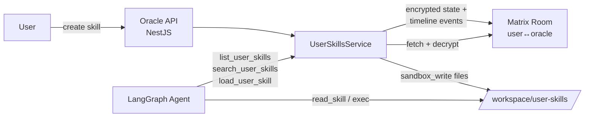

# Custom Skills — Design Plan

> **Status:** Draft — planning only, no code yet.
> **Scope:** Allow a user to create, store, and run their own **private** skills alongside the verified public skills, scoped to a single user ↔ oracle room.

---

## 1. Problem & Constraints

Today the agent consumes skills from one source only:

- Public registry at `SKILLS_CAPSULES_BASE_URL` (defaults to `https://capsules.skills.ixo.earth`).
- The sandbox service materialises them into `/workspace/skills/<slug>/` on demand via `load_skill(cid)`.
- `/workspace/skills/` is **read-only** and is reconstructed by the sandbox on every session. Writing there is forbidden (`prompt.ts:269`, `prompt.ts:207`).

Requirements for custom skills:

1. **Private & isolated** — a custom skill belongs to **one user ↔ one oracle** pair. No cross-leak.
2. **Persistent across sandbox restarts** — the sandbox workspace is ephemeral, so storage must live outside the sandbox.
3. **Indistinguishable to the agent at call time** — from the LLM's point of view, a custom skill should feel like any other skill: discoverable, loadable, readable, executable.
4. **Priority over public skills** — the existing prompt already promises this (`prompt.ts:169`: "User-uploaded skills have the highest priority"). We need to actually deliver it.
5. **Safe** — user-supplied code runs in the per-user sandbox only; no escalation beyond what public skills already enjoy.

---

## 2. Recommendation (Decision)

**Do NOT create a new "Custom Skill Agent".** Extend the **main agent** with four new LangChain tools and one storage-service module. Reasoning:

- Custom skills are a *source* of skills, not a new *capability*. Splitting them into a sub-agent would duplicate the `load → read → exec → output` workflow the main agent already knows (`prompt.ts:200-226`). Two code paths, two prompts to keep in sync, no upside.
- The existing prompt already has a slot for "user-uploaded skills"; the easiest win is to make `list_skills` / `search_skills` actually return them.
- The work breaks down cleanly into **storage + materialisation + discovery**, all horizontal additions to the existing pipeline — no graph-topology change.

---

## 3. Architecture



**Three moving parts:**

1. **Storage layer** — Matrix room state + timeline events (re-use the `SecretsService` pattern almost verbatim).
2. **Materialisation layer** — on-demand "install" of a stored skill into the sandbox at `/workspace/user-skills/<slug>/`.
3. **Discovery layer** — new LangChain tools that merge user skills into the agent's view of the skill world, with user skills first.

---

## 4. Storage: re-use the `SecretsService` pattern

The existing `SecretsService` (`apps/app/src/secrets/secrets.service.ts`) already solves exactly this shape of problem: per-room, encrypted, indexed, lazily fetched, cached. We mirror it.

### Matrix event schema

| Event type                     | Purpose                       | `state_key` | Content                                                                                                                                  |
| ------------------------------ | ----------------------------- | ----------- | ---------------------------------------------------------------------------------------------------------------------------------------- |
| `ixo.room.user_skill.index`    | One per skill — index entry   | `<slug>`    | `{ manifestEventId, archiveEventId, version, publicKeyId, updatedAt }`                                                                   |
| `ixo.room.user_skill.manifest` | Timeline event — skill meta   | —           | JWE-encrypted: `{ name, slug, description, triggers: string[], version, entrypoint, files: Array<{ path, sha256, size, eventId }> }` |
| `ixo.room.user_skill.file`     | Timeline event — one per file | —           | JWE-encrypted payload: either inline (`{ content: "<base64>" }`) or MXC reference (`{ mxcUri }`) for files > 64 KB                    |

**Why split index / manifest / files:**

- Listing (`list_user_skills`) needs the index only → cheap (one `getRoomState` call, same as secrets today).
- Reading a SKILL.md needs the manifest + one file → two timeline lookups, cached.
- Full install only happens on `load_user_skill` — we don't pull all files unless invoked.

**Deletion:** write an empty-content state event at the same `state_key` — matches how `SecretsService.getSecretIndex` filters deleted entries (`secrets.service.ts:65`).

### New service

Create `apps/app/src/user-skills/user-skills.service.ts` — copy the shape of `SecretsService`:

- `getSkillIndex(roomId): Promise<UserSkillIndexEntry[]>`
- `getSkillManifest(roomId, slug): Promise<UserSkillManifest>`
- `getSkillFile(roomId, slug, path): Promise<Buffer>`
- `putSkill(roomId, manifest, files): Promise<void>` (single high-level create/update)
- `deleteSkill(roomId, slug): Promise<void>`

Reuse the same JWE encryption key the `SecretsService` holds (`SecretsService.setEncryptionKey`), so we do not introduce new key-management surface. Key rotation TODO already tracked there; this feature inherits it.

---

## 5. Materialisation: getting the skill into the sandbox

The constraint from the brief — "the skills folder gets recreated on each sandbox start" — means we cannot rely on the sandbox's own `load_skill(cid)` (which is wired to the public capsule registry). We need a parallel path that writes to a **different** directory.

### Sandbox layout (new)

```
/workspace/
  uploads/       # read-only, existing
  skills/        # read-only, existing (public skills, via load_skill cid)
  user-skills/   # NEW — read-only conceptually, populated by us per-session
  data/output/   # existing
```

### How it gets populated

On **first** `load_user_skill(slug)` call in a session:

1. `UserSkillsService.getSkillManifest(roomId, slug)` → manifest (cached after first hit).
2. For each file in `manifest.files`, call `sandbox_write('/workspace/user-skills/<slug>/<path>', content)` via the existing sandbox MCP client.
3. If `manifest.entrypoint` has `requirements.txt` / `package.json`, invoke `exec` with the same auto-install convention the public skills already use (the prompt at `prompt.ts:171` documents this is handled automatically — verify with the sandbox team; if not, the skill's SKILL.md can instruct a manual install).
4. Cache "already materialised in this session" in-memory per-`threadId` to avoid re-writing on every tool call.

Note: the sandbox never learns about "custom skills" as a first-class concept — we just write files to a known path using tools it already exposes. This keeps the change fully in `apps/app` and avoids a dependency on the `ai-sandbox` repo.

### Why not pre-materialise at sandbox startup?

Two reasons:

- Sandbox startup currently happens inside `createMainAgent` (`main-agent.ts:234-246`) and adding a potentially-large synchronous copy there would slow every conversation — even ones that don't use skills.
- Lazy materialisation matches the existing `load_skill(cid)` contract for public skills, so agent behaviour stays symmetric.

---

## 6. Discovery: how the agent sees user skills

Add four LangChain tools next to `listSkillsTool` / `searchSkillsTool` in `apps/app/src/graph/nodes/tools-node/skills-tools.ts`. Keep them as separate tools rather than merging — clearer intent for the LLM, easier to audit which calls hit which storage.

| Tool                | Purpose                                                                                        |
| ------------------- | ---------------------------------------------------------------------------------------------- |
| `list_user_skills`  | Returns `[{ slug, description, triggers, path: '/workspace/user-skills/<slug>', source: 'user' }]` from the index only. No manifest fetch. |
| `search_user_skills`| Substring match on name/description/triggers inside the index. Purely local — no Matrix roundtrip beyond `getSkillIndex`. |
| `load_user_skill`   | Takes `slug` (not CID — CIDs are a public-registry concept). Materialises files under `/workspace/user-skills/<slug>/`.          |
| `delete_user_skill` | Lets the agent remove a skill on the user's request (writes tombstone state event).             |

**Creation tool — design choice:** three options here, with a clear preference.

- **A. Tool-driven (`create_user_skill`).** The LLM authors SKILL.md + files and calls the tool. Pro: conversational UX. Con: LLM-written skills are usually mediocre; blast radius is an entire new tool on the main agent.
- **B. REST/SSE endpoint on the oracle API + a CLI/Portal flow.** Pro: skills get authored by humans (or by the Skill Builder sub-agent in `qiforge-cli`). Con: no in-chat creation.
- **C. Both — creation endpoint + an optional tool that wraps it.**

**Recommended: B first, add A later.** Rationale: rushing A means shipping a tool that lets the LLM mint code in the user's sandbox based on fuzzy intent. A REST endpoint with a typed payload (tested, reviewable, auditable) is the right v1. The agent still *lists, loads, and runs* in chat — only *authoring* moves out.

### Agent prompt changes

In `apps/app/src/graph/nodes/chat-node/prompt.ts`:

- Update the skills section (~line 160) to spell out the two-tier system: "First try `list_user_skills` / `search_user_skills`; fall back to `list_skills` / `search_skills`."
- Update the canonical workflow (line 200) to branch on source: `load_skill(cid)` for public, `load_user_skill(slug)` for user.
- Tighten the existing promise at line 169 ("User-uploaded skills have the highest priority") by making it a hard rule: *if a user skill matches the request, the agent must prefer it, even when a public skill also matches.*

---

## 7. API surface (NestJS)

One new controller under `apps/app/src/user-skills/`:

```
POST   /user-skills                 # create or update
GET    /user-skills                 # list (index only)
GET    /user-skills/:slug           # full manifest + file list
GET    /user-skills/:slug/files/*   # single file download
DELETE /user-skills/:slug
```

**Auth:** reuse the existing Matrix access-token + DID middleware (already gates `/messages`, `/sessions`). No new auth primitive.

**Upload format:** `multipart/form-data` with one `manifest.json` field + N file parts; or a single `.zip` that the server unpacks. Zip keeps the UX aligned with how public capsules ship today.

**Validation rules** (server-side, non-negotiable):

- Slug: `[a-z0-9][a-z0-9-]{0,62}` — not already in use in this room.
- Total archive size: configurable cap (default 5 MB) — keeps Matrix events healthy.
- File count cap (default 50) — prevents pathological layouts.
- SKILL.md **required**; must be ≤ 64 KB (so it fits inline in one timeline event).
- File extension allowlist or an explicit denylist (`.exe`, `.so`, …) — TBD, lean denylist since the sandbox itself is the security boundary.

---

## 8. Implementation plan (ordered, no work begins until approved)

| # | Step                                                                                  | Files touched                                                                                            |
| - | ------------------------------------------------------------------------------------- | -------------------------------------------------------------------------------------------------------- |
| 1 | **Storage service** — `UserSkillsService` with `getSkillIndex`/`get*`/`put`/`delete`  | `apps/app/src/user-skills/user-skills.service.ts` (new), `apps/app/src/app.module.ts`                    |
| 2 | **Materialiser** — helper that writes manifest files into the sandbox                 | `apps/app/src/user-skills/user-skill-materialiser.ts` (new)                                              |
| 3 | **LangChain tools** — `list_user_skills`, `search_user_skills`, `load_user_skill`, `delete_user_skill` | `apps/app/src/graph/nodes/tools-node/skills-tools.ts`                                   |
| 4 | **Wire tools into main agent**                                                        | `apps/app/src/graph/agents/main-agent.ts` (tool list around line 792)                                    |
| 5 | **Prompt updates** — two-tier discovery, priority rule, branch on source              | `apps/app/src/graph/nodes/chat-node/prompt.ts` (lines 160-226, 268-280)                                  |
| 6 | **REST controller + DTOs**                                                            | `apps/app/src/user-skills/user-skills.controller.ts` (new)                                               |
| 7 | **Tests** — storage round-trip (mock Matrix), tool invocation snapshot, materialiser integration | `apps/app/src/user-skills/*.spec.ts`, `apps/app/src/graph/nodes/tools-node/skills-tools.spec.ts` |
| 8 | **Docs** — new `docs/playbook/04a-custom-skills.md`, update `04-working-with-skills.md`, update `specs/playbook-progress.md` | docs only |
| 9 | **(Deferred)** Tool-driven creation (option A above) — only once B has shipped and we understand the failure modes | same files as step 3 |

Ship 1–5 as one PR (engine changes), 6–8 as a second PR (API + docs), 9 as a later follow-up.

---

## 9. Open questions (flag before build)

1. **Sandbox cooperation.** Does the sandbox reset `/workspace/user-skills/` between sessions the same way it does `/workspace/skills/`? If yes, lazy materialisation is fine. If it *doesn't* reset, we need a cache-invalidation step on manifest `version` change. Confirm with the ai-sandbox team.
2. **Dependency auto-install.** The prompt at `prompt.ts:171` claims deps install automatically when a skill is loaded. That claim almost certainly only holds for skills loaded via `load_skill(cid)` (the sandbox knows the capsule shape). For `user-skills/` files we wrote manually, the agent likely needs to `exec pip install -r requirements.txt` itself. Worth verifying before updating the prompt, or we lie to the LLM.
3. **Size ceiling.** 5 MB / 50 files is a finger-in-the-air default. Gut-check with how big real-world skills in the public registry get (a quick `du -sh` per skill in `ai-skills` would tell us).
4. **Skill Builder sub-agent overlap.** `qiforge-cli` is scoped to contain a "Skill Builder" flow (per `CLAUDE.md`). Creation endpoint (§7) should be the thing the CLI calls — avoid shipping two authoring paths.
5. **Secret injection.** Should user skills get access to the same `x-os-*` oracle secrets that public skills do (`main-agent.ts:553-562`), or should they be sandboxed from them? Default: **no secrets for user skills** unless the user explicitly grants per-skill. Prevents a custom skill from exfiltrating oracle-operator credentials.

---

## 10. Non-goals (v1)

- No public sharing of user skills — nothing is published to `capsules.skills.ixo.earth`. If a user wants to share, they go through the public registry's PR flow manually.
- No skill versioning beyond "the latest manifest wins." Old versions are retained as timeline events but not surfaced.
- No skill-to-skill dependencies (user skill requires another user skill). Flat namespace per room.
- No UI. API-only; the Portal team handles the front-end separately.
