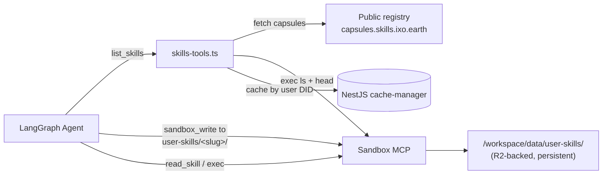

# Custom Skills — Design Plan

> **Status:** Draft v3 — planning only, no code yet.
> **Scope:** Allow a user (and the agent acting on their behalf) to create their own **private** skills alongside the verified public skills, scoped per-user.
> **Change vs v2:** corrected the persistence assumption after reading the `ai-sandbox` source. Only `/workspace/data/**` survives a sandbox restart (R2-backed FUSE mount); every other path under `/workspace/` is ephemeral container FS. User skills move to `/workspace/data/user-skills/<slug>/`. Plan shape is otherwise unchanged.

---

## 1. The Insight That Simplifies Everything

The sandbox has exactly one durable area: **`/workspace/data/`**, which is an R2 bucket mounted at the container via FUSE (`sandbox.ts:724` — `MOUNT_PATH = '/workspace/data'`). Everything else under `/workspace/` lives in the container filesystem and vanishes when the sandbox sleeps or restarts — including `/workspace/skills/`, which the sandbox re-downloads on demand from the public capsule registry.

Conveniently, **every MCP exec path lands with `cwd = /workspace/data`** (`sandbox.ts:905`, `sandbox.ts:507`). So if we put custom skills at `/workspace/data/user-skills/<slug>/`:

- They persist across restarts (R2 mount).
- The agent reaches them with the short relative path `user-skills/<slug>/SKILL.md`, which is what a human author would naturally write.
- Anything the agent writes via `sandbox_run` / `sandbox_write` defaults into the persistent mount — no chance of silently creating a non-persistent sibling.

So **the sandbox itself is the store**. No Matrix events, no encryption layer, no REST endpoint, no materialiser. The R2 mount handles per-user persistence and isolation already (each user has their own bucket prefix).

This collapses the whole feature down to three small changes:

1. Teach `list_skills` to also `ls /workspace/data/user-skills/` and merge the result.
2. Make `load_skill` a no-op for user skills (they're already on disk).
3. Tell the agent in the prompt: "to create a skill for the user, write files into `user-skills/<slug>/` (relative to its working directory) — equivalently `/workspace/data/user-skills/<slug>/`."

That's it. **No new tools** for create/delete — the agent already has `sandbox_write` and `exec` from the sandbox MCP, and it already knows what a skill looks like (SKILL.md + supporting files).

> ⚠️ **Hard rule:** custom skills must **NOT** live under `/workspace/skills/`. After every public-skill load, `makeReadonly` (`sandbox.ts:352`) does a recursive `chown root:root` + `chmod 644/755` across the entire `/workspace/skills/` tree. Anything we put there gets clobbered.

---

## 2. Recommendation (Decision)

**Extend the main agent. No new sub-agent. No new authoring tool. Wrap the existing `list_skills` / `search_skills`.**

- Custom skills are a *source* of skills, not a new *capability*. The main agent already runs the `find → load → read → exec → output` workflow (`prompt.ts:200-226`) — splitting it would just duplicate that.
- The existing prompt already has a slot for "user-uploaded skills, highest priority" (`prompt.ts:169`). We just have to make the discovery tools actually return them.
- Authoring belongs to the agent: it has the sandbox tools, and a SKILL.md is just a markdown file.

---

## 3. Architecture



**Two moving parts only:**

1. **Discovery** — `list_skills` / `search_skills` get extended to query the sandbox folder in parallel with the public registry, then merge with a `source` discriminator. Sandbox-side results are cached per-user.
2. **Convention** — `/workspace/data/user-skills/<slug>/` is the agreed location. Documented in the prompt; the agent treats it as a write target for new skills and a read source for existing ones.

---

## 4. Storage: just one folder under the R2 mount

```
/workspace/
  skills/                 # ephemeral, repopulated by the sandbox from the public registry
  data/                   # R2 mount — only persistent area
    user-skills/          # NEW
      <slug>/
        SKILL.md          # required
        ...scripts, templates, examples
    output/               # existing (symlink to /workspace/output)
```

Properties we get for free:

- **Per-user isolation** — the R2 mount uses the per-sandbox prefix `/{sandboxId}/`, and each user ↔ oracle pair has its own sandbox.
- **Persistence** — survives sandbox sleep/restart by virtue of being R2-backed.
- **No new keys / encryption surface** — whatever encryption-at-rest R2 / the sandbox provides for `/workspace/data/output/` is the same posture user skills inherit.
- **Natural path** — agent's exec cwd is already `/workspace/data`, so it can write `user-skills/foo/SKILL.md` and reach the persistent location without ever typing `/workspace/data/`. Server-side code uses absolute paths to avoid any cwd ambiguity.

The agent reads, writes, and deletes through the same sandbox MCP tools it already has access to (`sandbox_write`, `sandbox_run` / `exec`, `read_skill`).

---

## 5. Discovery: extend `list_skills` and `search_skills`

These two tools live in `apps/app/src/graph/nodes/tools-node/skills-tools.ts`. Today they're standalone async functions wrapped in `tool(...)`. We need them to:

1. Continue calling the public capsule registry (existing behaviour).
2. **Also** query the per-user sandbox for `/workspace/user-skills/*`.
3. Merge results, with user skills first.
4. Cache the sandbox query per user so repeated calls don't hammer the sandbox.

### Tool factory change

The tools currently have no access to the sandbox MCP client or cache manager. We convert them to factories built inside `createMainAgent`, where both are already in scope:

```ts
// skills-tools.ts
export function createListSkillsTool(deps: {
  sandboxMCP?: MCPClient;
  cache: Cache;
  userDid: string;
}) { return tool(async (params) => { /* merged listing */ }, { name: 'list_skills', ... }); }

export function createSearchSkillsTool(deps: { /* same */ }) { ... }
```

`main-agent.ts` (around lines 230–246 where `sandboxMCP` is built, and 792 where tools are added) constructs them once per agent invocation.

### Sandbox-side listing

The sandbox MCP's `exec` (`sandbox_run`) tool gives us shell access — fresh `bash -c` per call, cwd already `/workspace/data`, runs as root, 3 min timeout (lite tier). One call is enough:

```bash
# Run from cwd /workspace/data; absolute paths used for clarity.
mkdir -p /workspace/data/user-skills && \
for d in /workspace/data/user-skills/*/; do
  [ -f "$d/SKILL.md" ] || continue
  slug=$(basename "$d")
  echo "::SLUG::$slug"
  head -n 20 "$d/SKILL.md"
  echo "::END::"
done 2>/dev/null
```

Parse the output server-side, derive `{ slug, description, path }` per entry. The `mkdir -p` upfront makes first-time use idempotent — if no skills exist yet, the loop produces nothing and we return an empty list.

**Caveat — secret scrubbing:** `execSafe` runs `scrubSecrets` on stdout/stderr before returning. If a SKILL.md description happens to contain a substring that matches a configured secret value, it'll be replaced in the listing output. Low-probability but worth noting; if it bites in practice, we move the listing to a path-bypass channel (e.g., `read_skill` per file) instead of `exec`.

### Cache

Use the existing NestJS `cache-manager` instance (already wired for `SecretsService`).

- **Key:** `user-skills:list:<userDid>`
- **TTL:** 5 minutes — short enough to feel fresh, long enough to absorb tight `list_skills` loops.
- **Invalidation:**
  - Explicit `refresh: boolean` parameter on `list_skills` / `search_skills` — the agent passes `refresh: true` immediately after creating or deleting a user skill (taught via prompt).
  - On TTL expiry. We don't try to detect agent-side `sandbox_write` calls; the prompt rule is simpler and more reliable.

### Return shape

Existing shape, with one new field:

```ts
type SkillEntry = {
  title: string;          // existing
  description: string;    // existing
  path: string;           // existing — for user skills: /workspace/user-skills/<slug>
  cid?: string;           // optional — only set for public skills
  source: 'user' | 'public'; // NEW
  createdAt?: string;     // existing
};
```

Public skills always have `cid`; user skills never do. The prompt teaches the agent that user skills are loaded by path, not CID.

### Ordering

User skills come first in the merged array. Combined with the prompt's "user skills have highest priority" rule (`prompt.ts:169`), this gives the agent a strong default without us having to add ranking logic.

---

## 6. Loading: `load_skill` becomes a no-op for user skills

`load_skill` is a sandbox MCP tool with input schema `{ cid: string }` — no path, no slug. It only ever extracts to the `SKILLS_FOLDER` constant (`'/workspace/skills'`, hard-coded at `skills.service.ts:8`), so it physically cannot touch our `/workspace/data/user-skills/`. Confirmed by reading `skills.tool.ts:300-393` and `sandbox.ts:293-353`.

That means we don't need to wrap or intercept it. We just teach the agent in the prompt:

> Skills with `source: 'user'` are already on disk. Skip `load_skill` and go straight to `read_skill`.

Two consequences worth knowing about:

- `load_skill` is idempotent **per live container only**. Because `/workspace/skills/` is ephemeral, the cached `.tar.gz` "is it loaded?" check disappears on every restart. Every cold start re-downloads + re-extracts public skills. This is fine for our purposes — we never call it for user skills — but it's a useful mental model.
- After `load_skill` runs, `makeReadonly` chowns and chmods the **entire** `/workspace/skills/` tree (`sandbox.ts:352`). This is the structural reason the plan keeps user skills under `/workspace/data/`, not under `/workspace/skills/`.

---

## 7. Creation & deletion: no new tools

### Creating a skill

The agent already has, via the sandbox MCP:

- `sandbox_write(path, content)` — write any file
- `sandbox_run(command)` — run shell commands (mkdir, chmod, etc.) at cwd `/workspace/data`

A skill is a folder with a SKILL.md and optional supporting files. The agent can author all of that with the tools above. We add prompt instructions:

> **Creating a skill for the user**
>
> When the user asks to create a new skill (or you decide one would help future tasks):
> 1. Pick a slug: lowercase, hyphenated, unique under `user-skills/`. Check with `list_skills` first.
> 2. `sandbox_write` to `user-skills/<slug>/SKILL.md` (resolves to `/workspace/data/user-skills/<slug>/SKILL.md`) — required. Follow the same SKILL.md format as public skills.
> 3. Add supporting files (scripts, templates) under the same folder as needed.
> 4. Call `list_skills` with `refresh: true` so the new skill shows up in subsequent listings.
> 5. Confirm to the user with the slug + a one-line summary.

### Deleting a skill

Agent uses `sandbox_run('rm -rf user-skills/<slug>')`, then `list_skills` with `refresh: true`. Documented in the same prompt section.

### Updating

Same as creating — overwrite SKILL.md or replace files via `sandbox_write`. No version tracking in v1.

### Why no `create_user_skill` tool

- Zero new server code to maintain.
- The agent already has the right primitives, and the SKILL.md format is markdown the LLM is good at.
- A typed `create` tool would either (a) duplicate `sandbox_write` (pointless) or (b) try to be opinionated about structure, which constrains what kinds of skills users can build.

---

## 8. Agent prompt changes

In `apps/app/src/graph/nodes/chat-node/prompt.ts`:

1. **Skills section (~line 160–198):**
   - Replace the description of skills as "from the registry" with a two-source model: public (from registry, materialised in `/workspace/skills/`) and user (authored in chat, persisted in `/workspace/data/user-skills/`).
   - Spell out that `list_skills` / `search_skills` returns both, with `source: 'user' | 'public'`, and that user skills come first.
   - Make line 169's "highest priority" promise concrete: "If a user skill matches the request, prefer it over a public skill, even if both apply."

2. **Canonical workflow (lines 200–226):**
   - Branch step 2 (Load): for `source: 'public'`, call `load_skill(cid)`. For `source: 'user'`, skip — the skill is already on disk.
   - Step 3 (Read): same `read_skill` call works for both, just use the path from the listing.

3. **Sandbox file system (lines 265–280):**
   - Add `/workspace/data/user-skills/` to the list. Mark it as **read/write and persistent** (contrast with `/workspace/skills/`, which is read-only and ephemeral).
   - Note: "User skills persist across sandbox restarts because they live under the R2-backed `/workspace/data/` mount. Anything you create here stays for next time."

4. **New "Creating skills" subsection** as described in §7. Encourage the relative path form (`user-skills/<slug>/...`) so the model doesn't have to memorise the mount point.

5. **Cache hygiene rule:** "After `sandbox_write` or `sandbox_run rm` under `user-skills/`, your next `list_skills` call must include `refresh: true`."

---

## 9. Implementation plan (ordered, no work begins until approved)

| # | Step | Files touched |
| - | ---- | ------------- |
| 1 | Convert `listSkillsTool` / `searchSkillsTool` to factories that take `{ sandboxMCP, cache, userDid }`. Keep the public-registry path identical. | `apps/app/src/graph/nodes/tools-node/skills-tools.ts` |
| 2 | Add sandbox-side listing helper (single `exec` call, parser, error-tolerant when `/workspace/user-skills/` is missing). | same file |
| 3 | Add cache read/write keyed on user DID; add `refresh` param to both tools. | same file |
| 4 | Wire factories into `createMainAgent` — pass `sandboxMCP`, the existing `cacheManager`, and `configurable.configs.user.did`. | `apps/app/src/graph/agents/main-agent.ts` (around tool list ~line 792) |
| 5 | Update agent prompt: two-source model, branch on `source`, `/workspace/user-skills/` in filesystem section, new "Creating skills" subsection, refresh-after-write rule. | `apps/app/src/graph/nodes/chat-node/prompt.ts` (lines 160–280) |
| 6 | Tests: tool returns merged result, cache hits/misses, `refresh: true` busts cache, missing folder yields empty. Mock the sandbox MCP `exec` response. | `apps/app/src/graph/nodes/tools-node/skills-tools.spec.ts` |
| 7 | Docs: update `docs/playbook/04-working-with-skills.md` "Building Your First Skill" section to describe the in-chat flow. Update `specs/playbook-progress.md`. | docs only |

All of this ships as one small PR. No new module, no new service, no new controller, no DB migration.

---

## 10. Open questions (flag before build)

1. ~~Sandbox-folder persistence — confirm.~~ **Resolved.** Only `/workspace/data/**` persists (R2 FUSE mount, `sandbox.ts:724`). Plan now uses `/workspace/data/user-skills/`.
2. **FUSE quirks.** `/workspace/data/` is s3fs-FUSE in deployed environments. Concurrent writes, file locking, and atomic rename semantics are weaker than a real FS. For our workload (write a few small files, ls a directory, head a SKILL.md) this should be fine, but if we ever add concurrent-write paths (e.g. server-side and agent-side both writing to the same skill), revisit.
3. **Cold-start latency.** First `list_skills` after a sandbox wakes from sleep pays for one `exec` round-trip plus FUSE warm-up. Acceptable for v1; if it's noticeable, the per-DID cache absorbs subsequent calls.
4. **Secret scrubbing in listings.** `execSafe` regex-replaces secret values in stdout. If a user's SKILL.md description contains a literal that matches a configured secret, the listing shows scrubbed text. Edge case; document as a known issue.
5. **Sandbox-side listing performance.** A `for d in user-skills/*/` loop is fine for tens of skills. If a user accumulates hundreds, parsing becomes the bottleneck — but they won't.
6. **Cross-oracle sharing.** A user with two different oracles has two different sandboxes (different R2 prefixes), so user skills don't cross. Probably fine (each oracle is its own context); flag if product wants a cross-oracle "skill library."
7. **Validation.** The agent is the only writer, so SKILL.md schema, slug uniqueness, and file-size limits aren't enforced anywhere. v1 trusts the LLM. If garbage skills accumulate, add a `list_skills`-time validator that hides malformed entries.
8. **Public-vs-user collisions.** If a user creates `pptx` and a public `pptx` also exists, the merged list shows both with `source` flags and the agent prefers the user one per the priority rule. No extra logic needed.

---

## 11. Non-goals (v1)

- No publishing user skills back to the public registry.
- No versioning — overwrite-in-place semantics.
- No cross-oracle/cross-user sharing.
- No UI in the Portal for managing skills (Portal team handles separately if desired).
- No server-side authoring API. The agent does it in chat.
