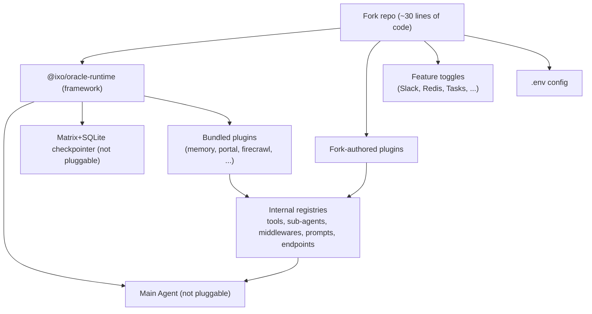
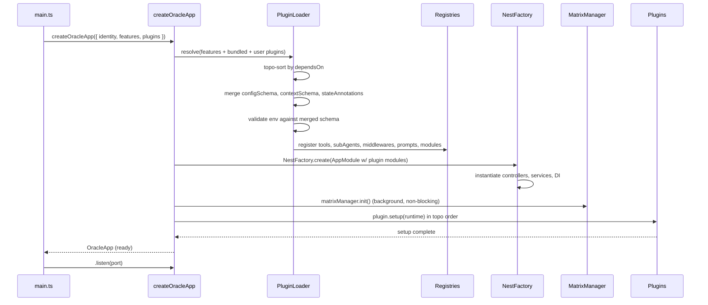

# QiForge Oracle Runtime Extensibility — Technical Specification

**Version:** 1.0
**Author:** Yousef / QiForge
**Date:** 2026-04-23
**Stack:** NestJS · LangGraph/LangChain 1.x · Matrix · Zod · TypeScript
**Related:** Builds on prior exploration in chat (see "Framework as runtime package" thread)

---

## Table of Contents

1. [Executive Summary](#1-executive-summary)
2. [Problem Statement](#2-problem-statement)
3. [Design Principles](#3-design-principles)
4. [Core Concepts](#4-core-concepts)
5. [Feature Classification](#5-feature-classification)
6. [Complete Feature Inventory](#6-complete-feature-inventory)
7. [RuntimeContext — the plugin's world](#7-runtimecontext)
8. [Plugin API — `defineOraclePlugin`](#8-plugin-api)
9. [Feature Toggles — opt-in/out bundled features](#9-feature-toggles)
10. [Internal Registries](#10-internal-registries)
11. [LangGraph/LangChain Composition](#11-langgraph-composition)
12. [Boot Sequence & Plugin Lifecycle](#12-boot-sequence)
13. [Extension Points — exhaustive list](#13-extension-points)
14. [Non-Goals — what plugins cannot do](#14-non-goals)
15. [Runtime Package Layout](#15-runtime-package-layout)
16. [The Starter App — what forks own](#16-starter-app)
17. [Migration Plan](#17-migration-plan)
18. [Worked Examples](#18-worked-examples)
19. [Open Decisions](#19-open-decisions)
20. [Appendix: audit references](#20-appendix-audit-refs)

---

## 1. Executive Summary

Today every fork of this repo clones the entire codebase — framework internals and fork-specific logic share one working tree. Syncing upstream changes is painful (merge conflicts on files forks were never supposed to edit), and there is no defined extension surface — every "customization" means editing core files like `main-agent.ts` (904 lines), `app.module.ts`, or the system prompt.

This spec defines the refactor that fixes that:

1. Extract the entire runtime (bootstrap, graph, agents, controllers, Matrix wiring, sub-agents, system prompt, middlewares, checkpointer) into a published package: **`@ixo/oracle-runtime`**.
2. Reduce `apps/app/` in a fork to a ~30-line starter that calls `createOracleApp({ identity, features, plugins })`.
3. Expose a single **additive** plugin API — `defineOraclePlugin` — that lets forks add tools, sub-agents, prompt sections, middlewares, HTTP controllers, NestJS modules, state fields, and env-var schemas. Plugins never replace framework internals.
4. Expose a typed **feature-toggle** config for the bundled framework features that genuinely vary per deployment (Slack, Redis, Tasks, Credits, Composio, Firecrawl, etc.) — promoting today's ad-hoc env-var checks to a first-class API.
5. Preserve every feature that ships today, unchanged in behavior. The Matrix-backed SQLite checkpointer remains the default and is not a plugin.

Forks sync framework updates by bumping `@ixo/oracle-runtime`. Forks customize by writing plugins in their own repo. There is no in-between.

---

## 2. Problem Statement

### 2.1 What hurts today

| Pain                                                                                                                                                                                                                                       | Evidence                                                                       |
| ------------------------------------------------------------------------------------------------------------------------------------------------------------------------------------------------------------------------------------------ | ------------------------------------------------------------------------------ |
| Framework code and fork code share the same repo; `git clone`-style forking requires merging changes by hand on every sync                                                                                                                 | Reported pain in prior chats                                                   |
| `main-agent.ts` is a 904-line monolith where tools, sub-agents, middlewares, checkpointer, and prompt assembly are inlined                                                                                                                 | `apps/app/src/graph/agents/main-agent.ts:817-873`                              |
| Feature opt-in/out is scattered across `isRedisEnabled()` calls, `DISABLE_CREDITS` flag checks, `if (!process.env.X)` branches, and silent no-ops inside services                                                                          | `config.ts:127`, `token-limiter-middleware.ts:19-23`, `slack.service.ts:29-48` |
| Graph code reaches into static singletons (`SecretsService.getInstance()`, `MatrixManager.getInstance()`, `UserSkillsService.getInstance()`, `UserMatrixSqliteSyncService.getInstance()`) because NestJS DI is not threaded into the graph | `main-agent.ts:217,622,870`; `skills-tools.ts:77`                              |
| A fork that wants to add one tool, one endpoint, or one system-prompt line has to edit framework files                                                                                                                                     | No extension surface exists                                                    |
| A fork that wants to disable Slack, Firecrawl, Composio, or the Tasks module has to either unset env vars (fragile) or edit the module list                                                                                                | `app.module.ts`, `messages.module.ts:21`                                       |
| Sub-agents (portal, memory, firecrawl, domain-indexer, editor, task-manager, ag-ui) are all hardcoded into `createMainAgent` with no way to disable the ones a fork doesn't need                                                           | `main-agent.ts:494-547,760-797`                                                |

### 2.2 What we will not solve here

- Replacing the LangGraph/LangChain executor (staying on `createAgent` from LangChain 1.x).
- Replacing the Matrix-backed SQLite checkpointer (`UserMatrixSqliteSyncService` + `SqliteSaver`) — this stays as the default and is not pluggable.
- Replacing the memory engine MCP or the main system prompt structure — plugins can append sections, not rewrite them.
- Cross-oracle plugin discovery/registry (no marketplace; plugins are code dependencies in the fork's `package.json`).

---

## 3. Design Principles

### 3.1 Plugins are additive, never replacements

A plugin can only **add** to what the framework already does — add tools, add sub-agents, add middleware, add routes, add env vars, add state fields, append prompt sections. A plugin cannot swap the main agent, cannot replace the checkpointer, cannot disable memory or Matrix sync. Anything a fork wants to turn off uses the feature-toggle system (Section 9), not the plugin API.

**Why this constraint is load-bearing:** it is the only way framework versions can evolve without breaking forks. The set of things a plugin depends on is small, stable, and additive; internals remain free to change.

### 3.2 LangGraph-native, no parallel abstractions

The plugin API composes into `createAgent({ tools, middleware, prompt, stateSchema, contextSchema, checkpointer })` and nothing else. No custom hook bus, no custom event system for graph concerns — LangChain's `AgentMiddleware` is the hook bus. If a plugin needs to react to a tool call, it writes a middleware with `afterTool`. If a plugin needs to enrich messages, it writes `modifyModelRequest`. The public plugin types are aliases of LangChain types where possible.

### 3.3 Framework features eat their own dog food

Slack, Composio, Firecrawl, and the Tasks module are internally **built as plugins** against the same API that forks use. If Slack doesn't fit cleanly as a plugin, the API is wrong and we fix the API, not Slack. This is the only way the plugin API stays honest.

### 3.4 RuntimeContext replaces singletons

Every tool handler, middleware, and plugin-contributed controller receives a typed `RuntimeContext` object. This replaces `SecretsService.getInstance()`, `MatrixManager.getInstance()`, `getProviderChatModel(...)`, `new Logger(...)`, `GraphEventEmitter.*` direct reaches. Singletons continue to exist under the hood, but plugins do not touch them — they consume `ctx.secrets`, `ctx.matrix`, `ctx.llm`, `ctx.logger`, `ctx.emit`.

### 3.5 Matrix-backed checkpointing stays invisible

The fork never configures persistence. SQLite + Matrix sync is the default and the only option. It ships inside the runtime, it is not a plugin, it is not exposed as a swap point. This removes an entire category of footguns.

### 3.6 Boot-time composition, per-request graph rebuild

Plugins register once at app boot. Tools, sub-agents, middlewares, and prompt sections are collected into internal registries at that moment. The graph continues to be rebuilt per-request (matching today's behavior in `graph/index.ts:130,238,280`), so per-request state (like `spaceId`, `editorRoomId`, operational mode) can still vary. No plugin code runs on the hot path beyond what it registers.

### 3.7 Typed composition

Env vars, runtime context, and state fields are all Zod-composed at boot with precise type inference. A plugin that declares `configSchema: z.object({ CLIMATE_API_KEY: z.string() })` gets `ctx.config.CLIMATE_API_KEY` typed inside its own handlers. Cross-plugin reads are allowed but untyped by default (documented, not enforced).

---

## 4. Core Concepts

Three distinct levers are needed; mixing them has caused most of the design confusion in prior discussions.

### 4.1 The three levers

| Lever              | Owner          | Purpose                                                      | Shape                                             |
| ------------------ | -------------- | ------------------------------------------------------------ | ------------------------------------------------- |
| **Feature toggle** | Fork operator  | Turn bundled framework features on/off per deployment        | `features: { slack: true, composio: false, ... }` |
| **Plugin**         | Fork developer | Add new behavior on top of the framework                     | `plugins: [climatePlugin, webhookPlugin]`         |
| **Config**         | Fork operator  | Standard 12-factor env vars, merged from framework + plugins | `.env` file + Zod schema                          |

These are orthogonal. A fork turning Slack on does not require a plugin. A fork adding a custom tool does not require flipping a feature. A plugin that ships a new MCP server just adds a config schema entry that the fork populates in `.env`.

### 4.2 Mental model diagram



---

## 5. Feature Classification

Every feature currently in the framework falls into exactly one of these tiers. This classification is binding — it decides what becomes a plugin, what becomes a feature toggle, and what is frozen.

### 5.1 Tier 0 — Core runtime (not pluggable, not toggleable)

Required for the framework to be the framework. Removing or swapping these breaks the contract with every fork.

- Plugin loader + dependency resolver
- NestJS DI container + bootstrap (`main.ts`)
- Zod config composer
- `RuntimeContext` shape
- `createAgent` invocation (the reduce-over-registries at the heart of `main-agent.ts`)
- Base `Annotation.Root` (messages, config, client, userContext)
- Base system prompt template (`AI_ASSISTANT_PROMPT`)
- Matrix-backed SQLite checkpointer (`UserMatrixSqliteSyncService` + `SqliteSaver`)
- Matrix client / `MatrixManager`
- Auth header middleware (DID extraction, OpenID token validation, UCAN)
- Session management (`SessionsModule`, `SessionsService`)
- Messages controller (core oracle interaction endpoints)
- WebSocket gateway (`WsModule`)
- Throttler guard
- Cache module

### 5.2 Tier 1 — Bundled plugins (ship with runtime, toggle-able)

Features the framework ships with, that a fork may want to disable per deployment but never rewrite. Implemented internally using the public plugin API.

| Plugin                  | What it provides                                                                     | Current env gate                                                                  |
| ----------------------- | ------------------------------------------------------------------------------------ | --------------------------------------------------------------------------------- |
| `memoryPlugin`          | Memory-agent sub-agent, userContext enrichment, Memory Engine MCP wiring             | Hard-required today (`MEMORY_MCP_URL`, `MEMORY_ENGINE_URL`) — becomes overridable |
| `portalPlugin`          | Portal-agent sub-agent (portal/web oracle use)                                       | Always-on                                                                         |
| `firecrawlPlugin`       | Firecrawl sub-agent, firecrawl tools, MCP wiring                                     | Hard-required today — should be opt-out                                           |
| `domainIndexerPlugin`   | Domain indexer sub-agent, `DOMAIN_INDEXER_URL` wiring                                | Hard-required today — should be opt-out                                           |
| `composioPlugin`        | Composio tool catalog integration                                                    | Opt-in via `COMPOSIO_API_KEY`                                                     |
| `sandboxPlugin`         | Sandbox MCP tools, user-skills (list/search/load)                                    | Hard-required today                                                               |
| `skillsPlugin`          | Public-capsule + user-skill discovery, `SKILLS_CAPSULES_BASE_URL`                    | Always-on, part of sandbox                                                        |
| `editorPlugin`          | BlockNote editor sub-agent, `standaloneEditorTool`, `applySandboxOutputToBlockTool`  | Conditional on `editorRoomId` today                                               |
| `aguiPlugin`            | AG-UI agent (Portal co-pilot)                                                        | Conditional today                                                                 |
| `slackPlugin`           | Slack transport, `SLACK_FORMATTING_CONSTRAINTS` prompt injection, reconnect handling | Opt-in via `SLACK_BOT_OAUTH_TOKEN`                                                |
| `tasksPlugin`           | `TasksModule`, BullMQ, task-manager sub-agent, scheduled task endpoints              | Opt-in via `REDIS_URL`                                                            |
| `creditsPlugin`         | Subscription middleware, token limiter, claim processing                             | Opt-in (ON by default; `DISABLE_CREDITS` to turn off)                             |
| `claimProcessingPlugin` | Claim signing, BullMQ claim worker                                                   | Depends on `creditsPlugin`                                                        |
| `langfusePlugin`        | Tracing/observability                                                                | Opt-in (auto-detected from env vars)                                              |
| `callsPlugin`           | `CallsController`, LiveKit call state sync, encryption keys                          | Always-on (but only used if fork exposes calls)                                   |

### 5.3 Tier 2 — Fork plugins

Whatever the fork writes. No ceiling, same API as Tier 1. Lives in the fork's repo, in its `plugins/` directory.

---

## 6. Complete Feature Inventory

Every item currently in the codebase, classified with its new home.

### 6.1 Always-on framework (Tier 0)

| Item                                                                                                                                             | Location                                 | Notes                                                                                                                          |
| ------------------------------------------------------------------------------------------------------------------------------------------------ | ---------------------------------------- | ------------------------------------------------------------------------------------------------------------------------------ |
| Bootstrap, ConfigModule, CacheModule, Throttler                                                                                                  | `main.ts`, `app.module.ts`               | Moves into `@ixo/oracle-runtime`                                                                                               |
| `AuthHeaderMiddleware`                                                                                                                           | `middleware/auth-header.middleware.ts`   | Always-on; populates `ctx.user`                                                                                                |
| `SessionsModule`, `SessionsService`                                                                                                              | `sessions/`                              | Session CRUD endpoints always available                                                                                        |
| `MessagesController`, `MessagesService`                                                                                                          | `messages/`                              | Core oracle send/stream/history                                                                                                |
| `WsModule` + Socket.io                                                                                                                           | `ws/`                                    | Real-time event gateway                                                                                                        |
| `MatrixManager` + matrix init                                                                                                                    | `main.ts:121-182`                        | Background init, non-blocking                                                                                                  |
| `UserMatrixSqliteSyncService`                                                                                                                    | `user-matrix-sqlite-sync-service/`       | Default checkpointer backing — never exposed                                                                                   |
| `SecretsService`                                                                                                                                 | `secrets/`                               | Becomes `ctx.secrets`; stays singleton internally                                                                              |
| `UcanService`                                                                                                                                    | `ucan/`                                  | Becomes `ctx.ucan`; stays singleton internally                                                                                 |
| Base `Annotation.Root` (messages, config, client, userContext, currentEntityDid, spaceId, editorRoomId, browserTools, agActions, mcpUcanContext) | `graph/state.ts:10-78`                   | Split: `{messages, config, client, userContext}` are core; rest move into their respective bundled plugins as state extensions |
| Base `AI_ASSISTANT_PROMPT`                                                                                                                       | `graph/nodes/chat-node/prompt.ts`        | Template stays; plugins append sections via `promptSection`                                                                    |
| `createMainAgent` reduce-over-registries                                                                                                         | `graph/agents/main-agent.ts` (rewritten) | Becomes ~100 lines in the runtime package                                                                                      |
| `createSubagentAsTool`                                                                                                                           | `graph/agents/subagent-as-tool.ts`       | Utility available to plugins via the runtime package                                                                           |
| `toolRetryMiddleware`, `createToolValidationMiddleware`, `createPageContextMiddleware`                                                           | `graph/middlewares/`                     | Always-on base middlewares                                                                                                     |
| `LLM provider factory` (`getProviderChatModel`)                                                                                                  | `graph/nodes/chat-node/llm-provider.ts`  | Becomes `ctx.llm.get(role)`                                                                                                    |

### 6.2 Bundled plugins with feature toggles (Tier 1)

| Plugin                  | Default                                   | Toggle                          | Effect when off                                                                |
| ----------------------- | ----------------------------------------- | ------------------------------- | ------------------------------------------------------------------------------ |
| `memoryPlugin`          | ON                                        | `features.memory: false`        | No memory sub-agent, no userContext enrichment, no memory MCP init             |
| `portalPlugin`          | ON                                        | `features.portal: false`        | No portal sub-agent exposed to main agent                                      |
| `firecrawlPlugin`       | ON                                        | `features.firecrawl: false`     | No firecrawl sub-agent, MCP skipped                                            |
| `domainIndexerPlugin`   | ON                                        | `features.domainIndexer: false` | Sub-agent skipped, MCP skipped                                                 |
| `composioPlugin`        | auto (ON iff `COMPOSIO_API_KEY` set)      | `features.composio: false`      | Composio tools skipped regardless of key                                       |
| `sandboxPlugin`         | ON                                        | `features.sandbox: false`       | No sandbox tools, no skills (also disables `skillsPlugin`)                     |
| `skillsPlugin`          | ON                                        | `features.skills: false`        | `list_skills`/`search_skills` tools removed                                    |
| `editorPlugin`          | ON                                        | `features.editor: false`        | `editorMode` operational mode disabled, editor sub-agent removed               |
| `aguiPlugin`            | ON                                        | `features.agui: false`          | AG-UI sub-agent removed                                                        |
| `slackPlugin`           | auto (ON iff `SLACK_BOT_OAUTH_TOKEN` set) | `features.slack: false`         | Slack service not initialized, Slack formatting prompt section omitted         |
| `tasksPlugin`           | auto (ON iff `REDIS_URL` set)             | `features.tasks: false`         | `TasksModule` not imported, task-manager sub-agent removed, BullMQ not started |
| `creditsPlugin`         | ON (unless `DISABLE_CREDITS=true`)        | `features.credits: false`       | Subscription middleware skipped, token limiter skipped, credit checks skipped  |
| `claimProcessingPlugin` | follows `creditsPlugin`                   | N/A                             | Claim processing disabled                                                      |
| `langfusePlugin`        | auto (ON iff all 3 Langfuse env vars set) | `features.langfuse: false`      | No tracing                                                                     |
| `callsPlugin`           | ON                                        | `features.calls: false`         | `/calls/*` endpoints not mounted                                               |

**Auto-detection rule:** for plugins whose presence is meaningless without a specific env var (e.g. `slackPlugin` without `SLACK_BOT_OAUTH_TOKEN`), the toggle defaults to `true` but the plugin's own `setup()` is a no-op when the required config is missing — matching today's graceful degradation in `slack.service.ts:29-48`. The fork never has to set `features.slack: true` **and** provide `SLACK_BOT_OAUTH_TOKEN` — one implies the other.

### 6.3 Environment variables by plugin

Every env var in `config.ts` gets reassigned to exactly one owner. The runtime's core schema shrinks to Tier 0 only; each bundled plugin ships its own `configSchema` that extends the merged env type.

| Plugin                                            | Env vars it owns                                                                                                                                                                                                                                                                                                                                |
| ------------------------------------------------- | ----------------------------------------------------------------------------------------------------------------------------------------------------------------------------------------------------------------------------------------------------------------------------------------------------------------------------------------------- |
| Tier 0 (core runtime)                             | `NODE_ENV`, `PORT`, `ORACLE_NAME`, `CORS_ORIGIN`, `NETWORK`, `MATRIX_*`, `SQLITE_DATABASE_PATH`, `BLOCKSYNC_GRAPHQL_URL`, `MATRIX_ACCOUNT_ROOM_ID`, `MATRIX_VALUE_PIN`, `ORACLE_ENTITY_DID`, `ORACLE_SECRETS`, `SECP_MNEMONIC`, `RPC_URL`, `LLM_PROVIDER`, `OPENAI_API_KEY`, `OPEN_ROUTER_API_KEY`, `NEBIUS_API_KEY`, `LIVE_AGENT_AUTH_API_KEY` |
| `composioPlugin`                                  | `COMPOSIO_BASE_URL`, `COMPOSIO_API_KEY`                                                                                                                                                                                                                                                                                                         |
| `langfusePlugin`                                  | `LANGFUSE_SECRET_KEY`, `LANGFUSE_PUBLIC_KEY`, `LANGFUSE_HOST`                                                                                                                                                                                                                                                                                   |
| `slackPlugin`                                     | `SLACK_BOT_OAUTH_TOKEN`, `SLACK_APP_TOKEN`, `SLACK_USE_SOCKET_MODE`, `SLACK_MAX_RECONNECT_ATTEMPTS`, `SLACK_RECONNECT_DELAY_MS`                                                                                                                                                                                                                 |
| `memoryPlugin`                                    | `MEMORY_MCP_URL`, `MEMORY_ENGINE_URL`                                                                                                                                                                                                                                                                                                           |
| `firecrawlPlugin`                                 | `FIRECRAWL_MCP_URL`                                                                                                                                                                                                                                                                                                                             |
| `domainIndexerPlugin`                             | `DOMAIN_INDEXER_URL`                                                                                                                                                                                                                                                                                                                            |
| `sandboxPlugin`                                   | `SANDBOX_MCP_URL`, `SKIP_LOGGING_CHAT_HISTORY_TO_MATRIX`                                                                                                                                                                                                                                                                                        |
| `skillsPlugin`                                    | `SKILLS_CAPSULES_BASE_URL`                                                                                                                                                                                                                                                                                                                      |
| `creditsPlugin`                                   | `DISABLE_CREDITS`, `SUBSCRIPTION_URL`, `SUBSCRIPTION_ORACLE_MCP_URL`                                                                                                                                                                                                                                                                            |
| `tasksPlugin` + `creditsPlugin` (both need Redis) | `REDIS_URL`                                                                                                                                                                                                                                                                                                                                     |

---

## 7. RuntimeContext

The typed object every plugin-contributed tool handler, middleware, and controller receives.

### 7.1 Shape

```typescript
// @ixo/oracle-runtime — public type

export interface RuntimeContext<TConfig = BaseConfig> {
  // Request-scoped identity (always populated for authenticated flows)
  user: {
    did: string;
    matrixRoomId: string;
    matrixOpenIdToken?: string;
    homeServer: string;
    ucanDelegation?: UcanDelegation;
    timezone?: string;
    currentTime?: string;
  };

  // Session (from SessionsService)
  session: {
    id: string;
    client: 'portal' | 'matrix' | 'slack';
    wsId?: string;
  };

  // Chat history wrapper — read-only view over state.messages
  history: {
    messages: readonly BaseMessage[];
    recent: (n: number) => BaseMessage[];
    userContext: UserContextData; // memory engine enrichment (when memoryPlugin on)
  };

  // Merged Zod-validated env (core + all plugin schemas)
  config: TConfig;

  // Secrets access (scoped to current user + room)
  secrets: {
    getIndex: () => Promise<SecretIndex>;
    getValues: (keys: string[]) => Promise<Record<string, string>>;
  };

  // Matrix client access (scoped operations; no raw client exposed)
  matrix: {
    postToRoom: (roomId: string, content: unknown) => Promise<string>;
    getRoomState: (roomId: string) => Promise<RoomStateSnapshot>;
    getEventById: (roomId: string, eventId: string) => Promise<MatrixEvent>;
  };

  // UCAN authorization helper
  ucan: {
    requireCapability: (resource: string, action: string) => void; // throws if missing
    hasCapability: (resource: string, action: string) => boolean;
  };

  // LLM provider (same roles as today)
  llm: {
    get: (role: ModelRole, params?: ChatOpenAIFields) => BaseChatModel;
  };

  // Structured event emission (no raw Socket.io)
  emit: {
    toolCall: (payload: ToolCallEventPayload) => void;
    renderComponent: (payload: RenderComponentEventPayload) => void;
    reasoning: (payload: ReasoningEventPayload) => void;
    // ...all AllEvents variants as typed methods
  };

  // Per-plugin scoped logger (prefix = plugin name)
  logger: Logger;

  // Abort signal (propagates from HTTP request / graph invocation)
  abortSignal: AbortSignal;
}
```

### 7.2 What it replaces

| Today (singleton reach)                                      | Tomorrow (ctx field)                                 |
| ------------------------------------------------------------ | ---------------------------------------------------- |
| `SecretsService.getInstance().getSecretIndex(roomId)`        | `ctx.secrets.getIndex()`                             |
| `SecretsService.getInstance().loadSecretValues(roomId, idx)` | `ctx.secrets.getValues(keys)`                        |
| `MatrixManager.getInstance().getClient()`                    | `ctx.matrix.*` (scoped methods)                      |
| `getProviderChatModel('main', {})`                           | `ctx.llm.get('main')`                                |
| `new Logger('MyTool')`                                       | `ctx.logger`                                         |
| `GraphEventEmitter.emit(...)`                                | `ctx.emit.toolCall(...)`                             |
| `getConfig().get('X')`                                       | `ctx.config.X` (typed)                               |
| `req.authData.did`                                           | `ctx.user.did`                                       |
| `state.userContext`                                          | `ctx.history.userContext`                            |
| `state.messages`                                             | `ctx.history.messages`                               |
| `state.messages.slice(-n)`                                   | `ctx.history.recent(n)`                              |
| `UserMatrixSqliteSyncService.getInstance()...`               | (not exposed — internal)                             |
| `UserSkillsService.getInstance()...`                         | (not exposed — internal; `skillsPlugin` consumes it) |

### 7.3 How it is threaded through LangGraph

`RuntimeContext` is a merged view built from three LangGraph inputs:

1. **`runtime.context`** — LangGraph v1 per-run context channel (`contextSchema`). Today it holds only `{ userDid }` (`graph/types.ts:9-11`). We widen it to hold `user`, `session`, and merged plugin context fields. Immutable for the duration of a run.
2. **`state`** — the `Annotation.Root` state, specifically `state.messages`, `state.userContext`, `state.client`. Read-only to plugins (plugins write state via middleware updates only).
3. **Ambient services** — `secrets`, `matrix`, `llm`, `emit`, `logger`, `ucan`, `config` come from a DI-resolved container captured at agent-build time.

Tool handlers today receive `(args, config)`; we keep that signature and reconstruct `RuntimeContext` inside a thin wrapper used by every plugin-contributed tool:

```typescript
// Inside the runtime, every plugin tool is wrapped:
tool(
  async (args, config) => {
    const ctx = buildRuntimeContext(config, ambient);
    return handler(args, ctx);
  },
  { name, description, schema },
);
```

Middlewares receive `(state, runtime)` natively from LangChain; the same `buildRuntimeContext` wraps the `runtime` into a `RuntimeContext` for plugin middlewares.

---

## 8. Plugin API

### 8.1 The `defineOraclePlugin` shape

```typescript
import type { StructuredTool } from '@langchain/core/tools';
import type { AgentMiddleware } from 'langchain';
import type { Annotation } from '@langchain/langgraph';
import type { z } from 'zod';

export interface OraclePlugin<TName extends string = string> {
  name: TName;
  version?: string;
  dependsOn?: string[];

  /** Merged into core env Zod schema at boot */
  configSchema?: z.ZodObject<any>;

  /** Merged into runtime.context schema (immutable per-run context) */
  contextSchema?: z.ZodObject<any>;

  /** Merged into Annotation.Root state */
  stateAnnotations?: Record<string, Annotation<any>>;

  /** Tools the main agent can call — built at agent-build time */
  tools?: (ctx: BuildContext) => Array<StructuredTool | ToolSpec>;

  /** Sub-agents wrapped via createSubagentAsTool */
  subAgents?: (ctx: BuildContext) => SubAgentSpec[];

  /** LangChain middlewares added to the main agent's middleware array */
  middlewares?: (ctx: BuildContext) => AgentMiddleware[];

  /** Appends one section to the system prompt (ordered by plugin name) */
  promptSection?: (ctx: BuildContext) => string | null;

  /** Enrich runtime.context at the start of every run (typed by contextSchema) */
  enrichRuntimeContext?: (
    headers: Record<string, string>,
    base: BaseRuntimeContext,
  ) => Promise<Record<string, unknown>>;

  /** NestJS escape hatch — full controllers + modules */
  nestModules?: Type[];
  controllers?: Type[];

  /** One-shot setup (DB migrations, MCP handshakes, listener registration) */
  setup?: (runtime: RuntimeRef) => Promise<void>;

  /** One-shot teardown (called on SIGTERM) */
  teardown?: (runtime: RuntimeRef) => Promise<void>;
}

export function defineOraclePlugin<T extends string>(
  plugin: OraclePlugin<T>,
): OraclePlugin<T> {
  return plugin;
}
```

### 8.2 Design notes

- **Single shape.** One function, one object, every extension type declared on the same plugin. No "add a tool plugin" vs "add an endpoint plugin" split.
- **Lazy builders.** `tools`, `subAgents`, `middlewares`, `promptSection` are **functions** that receive `BuildContext`, not static arrays. This matches how the current `main-agent.ts` builds tools per-request (`main-agent.ts:817-862`) — plugins can vary output based on `ctx.identity`, `ctx.config`, availability of other plugins, etc.
- **`BuildContext` is a subset of `RuntimeContext`.** At build time, there is no per-user/per-request identity. `BuildContext` contains `{ config, logger, runtime }` — no `user`, `session`, `history`. Those appear only at request time.
- **`dependsOn` is declarative.** The plugin loader topo-sorts plugins at boot and errors on cycles or missing deps. Used by e.g. `claimProcessingPlugin` declaring `dependsOn: ['credits']`.
- **`promptSection` is ordered by plugin name.** Determinism matters for LLM output stability. If two plugins want to mutually order their sections, they use `dependsOn` and the later plugin's section wins order-wise.
- **`enrichRuntimeContext` runs once per request.** Runs in plugin topological order after the base `user`/`session` is populated. Each plugin's output is merged into the context channel. Collision = boot error (detected at schema-merge time).
- **`setup`/`teardown` are application-lifecycle hooks**, not per-request. Use them for MCP handshakes, BullMQ worker startup, reconnect loops. Analogous to `onModuleInit` / `onApplicationShutdown` in NestJS.
- **`nestModules` and `controllers` are the escape hatch.** When a plugin needs full NestJS (e.g. tasks needs BullMQ workers + a controller for manual kicks + a service for DB migrations), it provides a NestJS module. That module gets `imports`-spread into `AppModule` at boot. Route prefixes are the plugin's responsibility — the runtime does not add a prefix.

### 8.3 Minimal plugin example

```typescript
// plugins/climate.ts
import { defineOraclePlugin } from '@ixo/oracle-runtime';
import { tool } from '@langchain/core/tools';
import { z } from 'zod';

export const climatePlugin = defineOraclePlugin({
  name: 'climate',

  configSchema: z.object({
    CLIMATE_API_KEY: z.string(),
    CLIMATE_API_BASE_URL: z.url().default('https://api.climatesvc.example'),
  }),

  tools: ({ config, logger }) => [
    tool(
      async ({ facilityId }, ctx) => {
        ctx.logger.info({ facilityId }, 'fetching emissions');
        const res = await fetch(
          `${config.CLIMATE_API_BASE_URL}/facilities/${facilityId}/emissions`,
          { headers: { Authorization: `Bearer ${config.CLIMATE_API_KEY}` } },
        );
        return res.json();
      },
      {
        name: 'get_emissions',
        description: 'Fetch emissions for a facility by ID',
        schema: z.object({ facilityId: z.string() }),
      },
    ),
  ],

  promptSection: () =>
    'You specialize in climate data. When asked about emissions, use the get_emissions tool.',
});
```

That's a complete plugin. Drop it in `plugins: [climatePlugin]` and the fork's `.env` needs `CLIMATE_API_KEY` — nothing else changes.

---

## 9. Feature Toggles

The typed, first-class replacement for today's scattered `isRedisEnabled()` / `DISABLE_CREDITS` / silent `if (!process.env.X)` checks.

### 9.1 The `features` config

```typescript
await createOracleApp({
  identity: { name: 'MyOracle', org: 'My DAO', description: '...' },

  features: {
    slack: true, // default: auto-detect from SLACK_BOT_OAUTH_TOKEN
    tasks: true, // default: auto-detect from REDIS_URL
    credits: true, // default: true unless DISABLE_CREDITS=true
    composio: false, // default: auto-detect from COMPOSIO_API_KEY
    firecrawl: true, // default: true
    domainIndexer: false, // default: true — fork can opt out
    langfuse: true, // default: auto-detect from LANGFUSE_* env
    portal: true,
    memory: true,
    sandbox: true,
    skills: true,
    editor: true,
    agui: true,
    calls: true,
  },

  plugins: [climatePlugin, myWebhookPlugin],
}).listen(3000);
```

### 9.2 Resolution rules

1. **Explicit false always wins.** `features.slack: false` skips the plugin even if `SLACK_BOT_OAUTH_TOKEN` is set.
2. **Explicit true requires preconditions.** `features.slack: true` with no `SLACK_BOT_OAUTH_TOKEN` is a boot-time error (today it silently logs a warning and becomes a no-op — we tighten this).
3. **Default: auto-detect.** If a feature's required env var is present, it's on. Otherwise it's off. Matches today's graceful-degradation behavior.
4. **Cascades via `dependsOn`.** Disabling `credits` auto-disables `claimProcessing`. Disabling `sandbox` auto-disables `skills`. Surfaced at boot as a single log line per cascade.
5. **Typed in one place.** `features` is a Zod-validated record; unknown keys are a boot error. Enables IDE autocomplete of valid toggles.

### 9.3 Why this replaces env-var gating

Today:

```typescript
// Scattered across the codebase:
if (!disableCredits && isRedisEnabled()) { middleware.push(...) }  // token-limiter-middleware.ts:19-23
if (isRedisEnabled()) { modules.push(TasksModule) }                // app.module.ts:64
if (SLACK_BOT_OAUTH_TOKEN) { initSlack() } else { logger.warn(...) } // slack.service.ts:29-48
```

Becomes:

```typescript
// Single resolution pass at boot:
const enabledPlugins = resolveFeatures(features, env); // returns plugin list
// Everything downstream just consumes that list.
```

The scattered `if (env.X)` checks go away entirely — each plugin's presence in the registry is the single source of truth.

---

## 10. Internal Registries

The reduce-over-collections that replaces inlined arrays in `main-agent.ts:817-873`.

### 10.1 Registries

| Registry                  | Collects from                               | Consumed by                                           |
| ------------------------- | ------------------------------------------- | ----------------------------------------------------- |
| `ToolRegistry`            | `plugin.tools(buildCtx)`                    | `createAgent({ tools })`                              |
| `SubAgentRegistry`        | `plugin.subAgents(buildCtx)`                | Wrapped via `createSubagentAsTool`, merged into tools |
| `MiddlewareRegistry`      | `plugin.middlewares(buildCtx)`              | `createAgent({ middleware })`                         |
| `PromptSectionRegistry`   | `plugin.promptSection(buildCtx)`            | Appended to `AI_ASSISTANT_PROMPT` in defined order    |
| `StateAnnotationRegistry` | `plugin.stateAnnotations`                   | Spread into `Annotation.Root({...base, ...plugins})`  |
| `ContextSchemaRegistry`   | `plugin.contextSchema`                      | Merged into `contextSchema` passed to `createAgent`   |
| `ConfigSchemaRegistry`    | `plugin.configSchema`                       | Merged into `EnvSchema` at boot                       |
| `EnricherRegistry`        | `plugin.enrichRuntimeContext`               | Called at every request in topo order                 |
| `NestModuleRegistry`      | `plugin.nestModules` + `plugin.controllers` | Spread into `AppModule.imports` at bootstrap          |
| `LifecycleRegistry`       | `plugin.setup` + `plugin.teardown`          | Called in `main.ts` bootstrap / SIGTERM handler       |

### 10.2 Collision rules

- **Tools:** flat namespace, collision = boot error. Tool names are part of the LLM's contract; prefixing hurts prompt clarity. If two plugins define `get_emissions`, one must rename.
- **Sub-agents:** same as tools (they become tools).
- **State annotations:** plugins must prefix their field names (convention: `<plugin-name>_*` or `<pluginName>Ctx`). Registry errors on collision.
- **Context schema:** same as state annotations.
- **Prompt sections:** additive, no collision possible; deterministic order by `name`.
- **Middlewares:** no names, order-based; plugins can influence order via `dependsOn`. Middleware ordering matters for LangChain (`beforeModel` from plugin A runs before plugin B if A is declared first in topo order).
- **Env schema:** Zod's `.extend()` merges keys; collision = later plugin's definition wins, but a warning is logged. Recommended convention: each plugin prefixes its env vars (`CLIMATE_*`, `SLACK_*`, etc.).

---

## 11. LangGraph Composition

How `createMainAgent` (today's 904-line function) becomes a pure reduce over registries.

### 11.1 The new `createMainAgent`

```typescript
// @ixo/oracle-runtime/src/graph/main-agent.ts

export async function createMainAgent({
  registries,
  identity,
  runtimeConfig,
  runtimeCtx, // per-request
  ambient,
}: MainAgentArgs): Promise<CompiledAgent> {
  const buildCtx: BuildContext = {
    config: runtimeConfig,
    identity,
    logger: ambient.logger.child({ component: 'main-agent' }),
    runtimeCtx,
  };

  const tools = [
    ...BASE_TOOLS,
    ...(await registries.tools.collect(buildCtx)),
    ...registries.subAgents.collect(buildCtx).map(createSubagentAsTool),
  ];

  const middleware = [
    createToolValidationMiddleware(),
    toolRetryMiddleware(),
    createPageContextMiddleware(),
    ...registries.middlewares.collect(buildCtx),
  ];

  const prompt = composePrompt({
    base: AI_ASSISTANT_PROMPT,
    oracleContext: buildOracleContext(identity),
    operationalMode: resolveOperationalMode(runtimeCtx),
    sections: registries.promptSections.collect(buildCtx),
    userContext: runtimeCtx.history.userContext,
    timeContext: formatTimeContext(
      runtimeCtx.user.timezone,
      runtimeCtx.user.currentTime,
    ),
  });

  const stateSchema = Annotation.Root({
    ...BASE_ANNOTATIONS,
    ...registries.stateAnnotations.collect(),
  });

  const contextSchema = BASE_CONTEXT_SCHEMA.merge(
    registries.contextSchemas.merged(),
  );

  return createAgent({
    stateSchema,
    contextSchema,
    tools,
    middleware,
    prompt,
    model: ambient.llm.get('main', {}),
    checkpointer: await ambient.checkpointerFactory.forUser(
      runtimeCtx.user.did,
    ),
  });
}
```

That is the whole thing. ~60 lines. No feature-specific branching. No sub-agent wiring. No inline tool construction. Each bundled plugin's registration lives in its own file under `src/plugins/bundled/<name>/`.

### 11.2 LangChain primitive mapping

| Plugin capability                        | LangChain primitive                            | How it plugs in                                                  |
| ---------------------------------------- | ---------------------------------------------- | ---------------------------------------------------------------- |
| `plugin.tools`                           | `StructuredTool[]`                             | `createAgent({ tools })`                                         |
| `plugin.subAgents`                       | Sub-agent spec → `createSubagentAsTool` → tool | Same array as `tools`                                            |
| `plugin.middlewares`                     | `AgentMiddleware[]`                            | `createAgent({ middleware })`                                    |
| `plugin.promptSection`                   | String concat on system prompt                 | `createAgent({ prompt })` or `modifyModelRequest` middleware     |
| `plugin.stateAnnotations`                | `Annotation<T>` with reducer                   | Spread into `Annotation.Root`                                    |
| `plugin.contextSchema`                   | Zod object                                     | Merged into `createAgent({ contextSchema })`                     |
| `plugin.enrichRuntimeContext`            | Returns partial context channel                | Written to `runtime.context` before graph invocation             |
| Message-history enrichment (e.g. memory) | `AgentMiddleware.modifyModelRequest`           | Plugin exposes a middleware, registered via `plugin.middlewares` |
| Tool observation / logging               | `AgentMiddleware.afterTool`                    | Same as above                                                    |
| Checkpointer                             | `BaseCheckpointSaver`                          | **Not exposed — always Matrix-backed SQLite**                    |

### 11.3 Sub-agent integration

Today `main-agent.ts:760-797` hardcodes each `callXAgentTool = createSubagentAsTool(...)`. With plugins, each sub-agent comes from a plugin:

```typescript
// inside memoryPlugin:
subAgents: ({ logger }) => [{
  name: 'call_memory_agent',
  description: 'Recall user memory (facts, relationships, history).',
  tools: memoryAgentTools,
  systemPrompt: MEMORY_AGENT_PROMPT,
  model: 'subagent',
  middleware: [createSummarizationMiddleware()],
}],
```

The runtime calls `createSubagentAsTool(spec, options)` on everything the registry returns. Forks writing plugins get the same ergonomics as bundled plugins.

---

## 12. Boot Sequence

Deterministic, observable, debuggable.



### 12.1 Phase detail

1. **Plugin resolution** — combine `features` toggles + bundled plugins + user plugins into a final list.
2. **Dependency sort** — topological order; errors on cycles or unmet `dependsOn`.
3. **Schema merge** — fold every plugin's `configSchema` into a single Zod object, same for `contextSchema` and `stateAnnotations`. Errors on collisions.
4. **Env validation** — parse `process.env` against the merged schema. Errors list the plugin owning each missing var.
5. **Registry population** — each plugin registers into tool/sub-agent/middleware/prompt/nest-module registries.
6. **NestJS bootstrap** — `AppModule` imports base modules + `registries.nestModules`. Controllers register. DI resolves.
7. **Matrix init** — non-blocking, existing behavior.
8. **Plugin setup** — in topo order, `plugin.setup(runtime)` runs. Long-running work (BullMQ worker startup, MCP handshakes) happens here.
9. **Listen** — HTTP server starts accepting requests.

### 12.2 Shutdown (SIGTERM)

1. Stop accepting new requests.
2. Drain in-flight graph invocations (abort signal propagated via `ctx.abortSignal`).
3. `plugin.teardown(runtime)` in reverse topo order.
4. Upload pending checkpoints to Matrix (existing behavior, `main.ts:220-239`).
5. Matrix disconnect.
6. Process exit.

---

## 13. Extension Points

Exhaustive list of where a plugin can hook in. Each maps to an exact LangChain/NestJS primitive.

| Capability                                             | Plugin field           | Primitive                                                |
| ------------------------------------------------------ | ---------------------- | -------------------------------------------------------- |
| Add a tool                                             | `tools`                | `StructuredTool` / `tool()` from `@langchain/core/tools` |
| Add a sub-agent                                        | `subAgents`            | Spec → `createSubagentAsTool`                            |
| Add middleware (before/after model, before/after tool) | `middlewares`          | `AgentMiddleware`                                        |
| Append to system prompt                                | `promptSection`        | String concat into `createAgent({ prompt })`             |
| Add state field                                        | `stateAnnotations`     | `Annotation<T>` with reducer                             |
| Add per-run context field                              | `contextSchema`        | Zod object merged into `contextSchema`                   |
| Enrich per-run context from headers/DID                | `enrichRuntimeContext` | Writes to `runtime.context`                              |
| Add env var                                            | `configSchema`         | Zod object merged into `EnvSchema`                       |
| Add HTTP endpoint                                      | `controllers`          | NestJS `@Controller`                                     |
| Add NestJS module (workers, services, DI bindings)     | `nestModules`          | Full NestJS module                                       |
| App lifecycle hook                                     | `setup` / `teardown`   | Runtime-scope promise                                    |
| Depend on another plugin                               | `dependsOn`            | Declarative array                                        |

### 13.1 What's deliberately missing

- **No `replaceAgent` hook.** The main agent is not pluggable.
- **No `replaceCheckpointer` hook.** Matrix+SQLite is the only checkpointer.
- **No `replacePrompt` hook.** The base template is stable; plugins append sections.
- **No `replaceTool` hook.** If a fork needs different behavior for a bundled tool, it disables the bundled plugin and writes its own.
- **No runtime/hot-load plugin API.** Plugins are code dependencies resolved at boot; there is no dynamic `import()` at runtime.

### 13.2 Escape hatches (with warnings)

Plugins can:

- Register a NestJS controller that overrides a built-in route by path collision. **This is a footgun;** the runtime logs a warning and the latest registration wins.
- Provide a NestJS module that replaces a built-in service via `useClass`. **This voids the upgrade contract;** the plugin owner is responsible for staying in sync with framework internals.

Neither escape hatch is documented in the fork-facing API. They exist for extreme edge cases, and using them means the fork owns the maintenance burden.

---

## 14. Non-Goals

Explicit list of things the plugin API does NOT do — so expectations are locked.

1. **Swap the main agent.** Forks that need a radically different agent build their own app, not a plugin.
2. **Swap the checkpointer.** Matrix+SQLite is the contract. Plugins can read history via `ctx.history`, they cannot persist it elsewhere or change how it's stored.
3. **Swap the LLM executor.** LangChain 1.x `createAgent`. Not LangGraph raw StateGraph, not LCEL, not any other framework.
4. **Rewrite the base system prompt.** Plugins append sections; the skeleton is fixed.
5. **Replace auth.** DID + Matrix OpenID token + UCAN is the contract. A plugin can add _additional_ auth (e.g. API-key guard for webhooks), but cannot replace the primary middleware.
6. **Disable core modules.** Sessions, Messages, WebSocket, Auth — these are always on. Forks that don't want them build a different app.
7. **Cross-oracle plugin sharing at runtime.** Plugins are npm packages in the fork's `package.json`. No dynamic registries, no marketplace, no plugin discovery endpoint.
8. **Replace Matrix sync.** The checkpointer syncs to Matrix on graceful shutdown. This is not configurable, not disableable, not delayed.

---

## 15. Runtime Package Layout

### 15.1 `@ixo/oracle-runtime` directory structure

```
packages/oracle-runtime/
├── src/
│   ├── index.ts                         # public exports: createOracleApp, defineOraclePlugin, all types
│   ├── bootstrap/
│   │   ├── create-oracle-app.ts         # the top-level factory
│   │   ├── plugin-loader.ts             # resolve + topo-sort
│   │   ├── schema-composer.ts           # Zod merge logic
│   │   └── lifecycle.ts                 # setup/teardown orchestration
│   ├── runtime-context/
│   │   ├── types.ts                     # RuntimeContext, BuildContext, etc.
│   │   ├── build.ts                     # buildRuntimeContext (per-request)
│   │   └── ambient.ts                   # DI-backed service adapters
│   ├── graph/
│   │   ├── main-agent.ts                # ~100 lines, reduce-over-registries
│   │   ├── subagent-as-tool.ts          # moved from apps/app
│   │   ├── state.ts                     # BASE_ANNOTATIONS
│   │   ├── prompt.ts                    # BASE PROMPT template + composer
│   │   └── middlewares/                 # always-on: tool-validation, page-context, tool-retry
│   ├── registries/
│   │   ├── tool-registry.ts
│   │   ├── sub-agent-registry.ts
│   │   ├── middleware-registry.ts
│   │   ├── prompt-registry.ts
│   │   ├── state-registry.ts
│   │   ├── context-registry.ts
│   │   ├── config-registry.ts
│   │   ├── enricher-registry.ts
│   │   ├── nest-module-registry.ts
│   │   └── lifecycle-registry.ts
│   ├── plugin-api/
│   │   ├── define-plugin.ts             # defineOraclePlugin (identity fn for types)
│   │   └── types.ts                     # OraclePlugin<T>, SubAgentSpec, ToolSpec
│   ├── plugins/                         # all bundled plugins live here
│   │   ├── memory/
│   │   ├── portal/
│   │   ├── firecrawl/
│   │   ├── domain-indexer/
│   │   ├── composio/
│   │   ├── sandbox/
│   │   ├── skills/
│   │   ├── editor/
│   │   ├── agui/
│   │   ├── slack/
│   │   ├── tasks/
│   │   ├── credits/
│   │   ├── claim-processing/
│   │   ├── langfuse/
│   │   └── calls/
│   ├── modules/                         # Tier 0 NestJS modules
│   │   ├── sessions/
│   │   ├── messages/
│   │   ├── ws/
│   │   ├── secrets/
│   │   ├── ucan/
│   │   └── auth/
│   ├── matrix/
│   │   └── checkpointer.ts              # UserMatrixSqliteSyncService wiring
│   └── config/
│       └── base-env-schema.ts           # Tier 0 env vars only
├── package.json
├── tsconfig.json
└── README.md
```

### 15.2 Public exports from `@ixo/oracle-runtime`

```typescript
// Main entry
export { createOracleApp } from './bootstrap/create-oracle-app';

// Plugin authoring
export { defineOraclePlugin } from './plugin-api/define-plugin';
export type {
  OraclePlugin,
  RuntimeContext,
  BuildContext,
  SubAgentSpec,
  ToolSpec,
  UserContextData,
} from './plugin-api/types';

// Utilities plugins commonly need
export { createSubagentAsTool } from './graph/subagent-as-tool';

// Re-exports for convenience (so plugin authors don't need to install these)
export { z } from 'zod';
export { tool } from '@langchain/core/tools';
export type { StructuredTool } from '@langchain/core/tools';
export type { AgentMiddleware } from 'langchain';
export { Annotation } from '@langchain/langgraph';
```

### 15.3 Bundled-plugin export style

Bundled plugins are exported as named imports so forks can compose explicitly:

```typescript
// If a fork wants to override bundled behavior finely, they can:
import { createOracleApp } from '@ixo/oracle-runtime';
import { memoryPlugin, slackPlugin } from '@ixo/oracle-runtime/plugins';

// Default path (most forks):
await createOracleApp({ identity, features: { slack: true } });
// → runtime auto-loads all bundled plugins per `features` toggles

// Advanced path (rare):
await createOracleApp({
  identity,
  features: { memory: false },  // disable default
  plugins: [memoryPlugin({ customConfig: ... })],  // bring back with custom params
});
```

This gives the fork the same API whether it's using a bundled plugin or its own plugin.

---

## 16. Starter App

What a fork's `apps/app/` looks like after migration.

### 16.1 Full fork structure

```
my-climate-oracle/
├── src/
│   ├── main.ts                          # ~30 lines
│   ├── plugins/
│   │   ├── climate.plugin.ts            # fork-specific
│   │   └── webhook.plugin.ts
│   ├── tools/
│   │   └── emissions.ts                 # helper code used by plugins
│   └── controllers/                     # if using nestModules escape hatch
├── .env
├── package.json                         # depends on @ixo/oracle-runtime + plugin deps
└── README.md
```

### 16.2 `main.ts` in full

```typescript
// my-climate-oracle/src/main.ts
import { createOracleApp } from '@ixo/oracle-runtime';
import { climatePlugin } from './plugins/climate.plugin';
import { webhookPlugin } from './plugins/webhook.plugin';

async function bootstrap() {
  const app = await createOracleApp({
    identity: {
      name: 'ClimateOracle',
      org: 'Carbon DAO',
      description:
        'Oracle that analyzes facility emissions and helps manage carbon credits.',
    },

    features: {
      slack: false, // fork doesn't use slack
      composio: false, // fork doesn't use composio
      domainIndexer: false, // fork doesn't need domain indexing
      // everything else: defaults (memory, portal, firecrawl, tasks, credits all on)
    },

    plugins: [climatePlugin, webhookPlugin],
  });

  await app.listen(parseInt(process.env.PORT ?? '3000', 10));
}

bootstrap().catch((err) => {
  console.error('Failed to start oracle:', err);
  process.exit(1);
});
```

### 16.3 What the fork never touches

- Agent construction
- Graph state (unless adding a field via `stateAnnotations`)
- System prompt skeleton
- Checkpointer config
- Matrix wiring
- Auth middleware
- Sessions / Messages / WebSocket controllers
- Bundled sub-agents (unless adding a new one via `subAgents`)

Framework syncing = `pnpm up @ixo/oracle-runtime`. Done.

---

## 17. Migration Plan

Four phases, each independently shippable and reversible. None of these phases break existing fork behavior until phase 4 explicitly renames the import.

### 17.1 Phase 1 — Internal registries, no public API yet

**Goal:** crack open `main-agent.ts` into a reduce-over-registries shape, internally.

**Scope:**

- Create `src/registries/` inside `apps/app/` (not yet its own package).
- Move tool/middleware/sub-agent/prompt collection out of `main-agent.ts` into registry classes.
- Keep behavior identical — every existing tool, sub-agent, middleware, prompt section lives in a "bundled" registration file that pushes into the same registry.
- `main-agent.ts` shrinks to ~100 lines (reduce call).
- All existing tests pass unchanged.

**Deliverable:** one PR that refactors the internal shape with zero behavior change.

**Commit granularity:** ~4-6 commits — one per registry type, one for the main-agent rewrite.

### 17.2 Phase 2 — Define `RuntimeContext`, migrate singletons

**Goal:** replace direct singleton reach with `ctx.*` access.

**Scope:**

- Define `RuntimeContext` type.
- Build `buildRuntimeContext(config, ambient)` that synthesizes the context.
- Wrap all tool handlers so they receive `(args, ctx)` instead of `(args, runConfig)`.
- Replace `SecretsService.getInstance()` with `ctx.secrets` in every caller in the graph folder.
- Replace `MatrixManager.getInstance()` with `ctx.matrix` in graph-folder callers only (NestJS-land keeps the singleton).
- Replace `getProviderChatModel(role)` with `ctx.llm.get(role)` in graph-folder callers.
- Replace `new Logger(...)` in graph-folder callers with `ctx.logger`.

**Deliverable:** PR per singleton migration (secrets, matrix, llm, logger). Each reviewable in isolation.

### 17.3 Phase 3 — Extract bundled plugins

**Goal:** rewrite every current framework feature as an internal plugin against the API.

**Scope:**

- Define `defineOraclePlugin` and `OraclePlugin` types.
- For each Tier 1 feature (Slack, Tasks, Credits, Memory, Portal, Firecrawl, Domain Indexer, Composio, Sandbox, Skills, Editor, AG-UI, Langfuse, Calls) — write a plugin file that pulls the current code into the new shape.
- Build the feature-toggle resolver.
- Replace scattered `isRedisEnabled()`/`DISABLE_CREDITS`/`if (env.X)` checks with plugin presence/absence in the registry.
- `apps/app/src/main.ts` becomes the first user of `createOracleApp` (eating our own dog food).

**Deliverable:** one PR per bundled plugin (Slack first — highest integration surface, best stress test). Each PR replaces ~N hundred lines of conditional wiring with a plugin file.

**Critical milestone:** after Slack is a plugin, the API is validated. Proceed or iterate on API design.

### 17.4 Phase 4 — Extract to `@ixo/oracle-runtime`

**Goal:** the runtime is a published package; `apps/app/` is a starter.

**Scope:**

- Move `apps/app/src/` (minus fork-specific code, which there isn't any yet) into `packages/oracle-runtime/src/`.
- `apps/app/` becomes the starter — `main.ts` + sample config + README.
- Publish `@ixo/oracle-runtime` to the same registry as other `@ixo/*` packages.
- Update `qiforge-cli` to scaffold from the new starter shape.
- Ship a codemod (or manual migration guide) for existing forks: delete everything under `apps/app/src/` except `main.ts`, install `@ixo/oracle-runtime`, move any custom code into `plugins/`.

**Deliverable:** published package + migrated fork + updated CLI. The moment this ships, forks stop hand-merging framework changes.

### 17.5 Timeline estimate

| Phase | Effort    | Risk                                                              |
| ----- | --------- | ----------------------------------------------------------------- |
| 1     | 1-2 weeks | Low — pure internal refactor                                      |
| 2     | 1-2 weeks | Medium — singleton migration touches many files                   |
| 3     | 3-4 weeks | Medium — each bundled plugin is a focused rewrite, parallelizable |
| 4     | 1 week    | Low — package extraction is mechanical once Phase 3 is done       |

**Total: ~6-9 weeks to full extraction**, with value delivered at the end of each phase (Phase 1 unblocks parallel plugin work, Phase 2 removes the singleton footgun, Phase 3 validates the API, Phase 4 ships).

---

## 18. Worked Examples

Three plugins of increasing complexity, showing the API in real scenarios.

### 18.1 Simple — a single tool

```typescript
// plugins/weather.plugin.ts
import { defineOraclePlugin } from '@ixo/oracle-runtime';
import { tool } from '@langchain/core/tools';
import { z } from 'zod';

export const weatherPlugin = defineOraclePlugin({
  name: 'weather',

  configSchema: z.object({
    OPEN_WEATHER_API_KEY: z.string(),
  }),

  tools: ({ config }) => [
    tool(
      async ({ city }, ctx) => {
        const url = `https://api.openweathermap.org/data/2.5/weather?q=${city}&appid=${config.OPEN_WEATHER_API_KEY}`;
        const res = await fetch(url, { signal: ctx.abortSignal });
        return res.json();
      },
      {
        name: 'get_weather',
        description: 'Get current weather by city name.',
        schema: z.object({ city: z.string() }),
      },
    ),
  ],

  promptSection: () => 'When the user asks about weather, use get_weather.',
});
```

### 18.2 Medium — sub-agent + state field + prompt section

```typescript
// plugins/compliance.plugin.ts
import { defineOraclePlugin } from '@ixo/oracle-runtime';
import { Annotation } from '@langchain/langgraph';
import { tool } from '@langchain/core/tools';
import { z } from 'zod';

type ComplianceStatus = { checked: boolean; flags: string[] };

export const compliancePlugin = defineOraclePlugin({
  name: 'compliance',

  configSchema: z.object({
    COMPLIANCE_API_URL: z.url(),
    COMPLIANCE_API_KEY: z.string(),
  }),

  stateAnnotations: {
    complianceStatus: Annotation<ComplianceStatus>({
      reducer: (cur, next) => next ?? cur,
      default: () => ({ checked: false, flags: [] }),
    }),
  },

  tools: ({ config }) => [
    tool(
      async ({ text }, ctx) => {
        const res = await fetch(`${config.COMPLIANCE_API_URL}/check`, {
          method: 'POST',
          headers: {
            Authorization: `Bearer ${config.COMPLIANCE_API_KEY}`,
            'Content-Type': 'application/json',
          },
          body: JSON.stringify({ text, did: ctx.user.did }),
          signal: ctx.abortSignal,
        });
        const result = await res.json();
        ctx.emit.toolCall({ name: 'compliance_check', result });
        return result;
      },
      {
        name: 'compliance_check',
        description: 'Check a text for compliance violations.',
        schema: z.object({ text: z.string() }),
      },
    ),
  ],

  subAgents: () => [
    {
      name: 'call_compliance_agent',
      description:
        'Review a document for compliance issues with detailed analysis.',
      tools: [
        /* ... */
      ],
      systemPrompt:
        'You are a compliance expert. Analyze for violations systematically.',
      model: 'subagent',
    },
  ],

  promptSection: () =>
    'You have a compliance_check tool and call_compliance_agent sub-agent. Use compliance_check for quick yes/no; delegate to the sub-agent for detailed review.',
});
```

### 18.3 Complex — full NestJS module with webhooks + BullMQ worker

```typescript
// plugins/erp-sync/index.plugin.ts
import { defineOraclePlugin } from '@ixo/oracle-runtime';
import { ErpSyncModule } from './erp-sync.module';
import { ErpWebhookController } from './erp-webhook.controller';
import { z } from 'zod';

export const erpSyncPlugin = defineOraclePlugin({
  name: 'erp-sync',
  dependsOn: ['tasks'], // needs BullMQ from tasksPlugin

  configSchema: z.object({
    ERP_BASE_URL: z.url(),
    ERP_WEBHOOK_SECRET: z.string(),
    ERP_POLL_INTERVAL_MS: z.coerce.number().default(60_000),
  }),

  nestModules: [ErpSyncModule],
  controllers: [ErpWebhookController],

  tools: ({ config, logger }) => [
    // Tools that let the agent query sync state
    // ...
  ],

  setup: async (runtime) => {
    // Kick off the BullMQ scheduler at boot
    await runtime.get(ErpSyncModule).startPoller();
  },

  teardown: async (runtime) => {
    await runtime.get(ErpSyncModule).stopPoller();
  },
});
```

The controller gets `RuntimeContext` via a decorator:

```typescript
// plugins/erp-sync/erp-webhook.controller.ts
import { Controller, Post, Body } from '@nestjs/common';
import { RuntimeCtx, type RuntimeContext } from '@ixo/oracle-runtime';

@Controller('erp/webhook')
export class ErpWebhookController {
  @Post()
  async handle(@Body() payload: ErpPayload, @RuntimeCtx() ctx: RuntimeContext) {
    ctx.logger.info({ payload }, 'ERP webhook received');
    ctx.emit.toolCall({ name: 'erp_webhook', payload });
    // Optionally invoke a sub-agent programmatically
    return { ok: true };
  }
}
```

---

## 19. Open Decisions

Calls that still need a decision before implementation. My vote noted where applicable.

### 19.1 Should state field namespacing be enforced or conventional?

- **Option A (convention):** plugins SHOULD prefix their state fields (`compliance_status`), registry logs a warning on non-prefixed.
- **Option B (enforced):** registry errors if a plugin adds a field without the plugin-name prefix.

**Vote:** A. Enforcement costs readability inside the plugin, and collisions are rare enough to resolve at boot with a clear error message.

### 19.2 Can plugins read each other's state/context fields?

- **Option A (encouraged, untyped):** any plugin can read `state.other_plugin_field`; no types cross plugin boundaries.
- **Option B (declarative):** plugin declares `reads: ['memory', 'compliance']` and gets typed access.

**Vote:** A, with documentation that cross-plugin reads are at your own risk. Option B adds heavy type machinery for a rare need.

### 19.3 How is plugin order decided when no `dependsOn` is declared?

- **Option A (stable, by `name`):** alphabetic by `plugin.name`.
- **Option B (registration order):** order of `plugins: []` array.

**Vote:** A. Alphabetic is deterministic across refactors; registration order is easily shuffled when a fork reorganizes imports.

### 19.4 Should plugins be async to import (dynamic `import()`)?

- **Option A (sync):** `plugins: [x, y, z]` — plain array of imported modules.
- **Option B (async supported):** `plugins: [x, () => import('./heavy')]` — some plugins deferred.

**Vote:** A. All plugins resolve at boot anyway; dynamic import only helps if there's a real cold-start win, which is unlikely given NestJS's own module-resolution cost.

### 19.5 Do controllers added by plugins get a route prefix?

- **Option A (no prefix):** plugin owns its path; collisions with built-in routes are the plugin's problem.
- **Option B (auto-prefix):** `POST /erp/webhook` becomes `POST /plugins/erp-sync/webhook`.

**Vote:** A. Forks often need specific public paths (OAuth callbacks, webhook URLs third parties are configured to hit); auto-prefix breaks those.

### 19.6 Memory-agent shape: stay as sub-agent, or move to middleware?

Context: memory is today a sub-agent invoked via a tool (`call_memory_agent`). The LangGraph-idiomatic shape is a `modifyModelRequest` middleware that silently enriches the model's view.

- **Option A (keep sub-agent):** agent decides when to recall; current behavior, no regression risk.
- **Option B (move to middleware):** every model call is enriched; removes a decision from the LLM, more predictable.

**Vote:** A for migration safety. Reconsider in a later pass once the plugin API is stable — would be a one-line change on the memory plugin.

### 19.7 How does a plugin opt out of being auto-loaded when its env is present?

Relevant for plugins like `composioPlugin`: the fork may have `COMPOSIO_API_KEY` in env for another reason and not want Composio tools exposed.

- **Option A:** `features.composio: false` — explicit opt-out wins over env detection. (Already in Section 9.2 rule 1.)
- **Option B:** auto-detect ignores unrelated env vars; fork must `features.composio: true`.

**Vote:** A. Matches today's behavior, minimizes surprises.

### 19.8 Cross-plugin tool dependencies

If `plugin-b` wants to call a tool defined by `plugin-a`, how?

- **Option A (no special mechanism):** plugins can import each other's tool factories as TS imports.
- **Option B (runtime tool lookup):** `ctx.tools.get('get_emissions').invoke({...})`.

**Vote:** A. Option B introduces an indirection that's rarely useful and hides the dependency from TS.

---

## 20. Appendix — audit references

### 20.1 Monolith hotspots

- `apps/app/src/graph/agents/main-agent.ts:817-873` — tools + middleware + prompt + checkpointer inlined
- `apps/app/src/graph/agents/main-agent.ts:494-547` — sub-agent construction
- `apps/app/src/graph/agents/main-agent.ts:748-797` — sub-agent-as-tool wrappers
- `apps/app/src/graph/agents/main-agent.ts:563-584` — system prompt variable binding

### 20.2 Singleton reach sites

- `apps/app/src/graph/agents/main-agent.ts:217,622` — `SecretsService.getInstance()`
- `apps/app/src/graph/agents/main-agent.ts:870` — `UserMatrixSqliteSyncService.getInstance()`
- `apps/app/src/graph/middlewares/page-context-middleware.ts:8` — `MatrixManager.getInstance()`
- `apps/app/src/graph/nodes/tools-node/skills-tools.ts:77` — `UserSkillsService.getInstance()`
- `apps/app/src/graph/nodes/chat-node/llm-provider.ts:74` — `getProviderChatModel` factory

### 20.3 Feature gating sites (to be replaced)

- `apps/app/src/config.ts:127` — `isRedisEnabled()`
- `apps/app/src/config.ts:68-72` — `DISABLE_CREDITS` transform
- `apps/app/src/app.module.ts:64` — TasksModule conditional import on Redis
- `apps/app/src/app.module.ts:117-144` — SubscriptionMiddleware conditional registration
- `apps/app/src/slack/slack.service.ts:29-48` — silent Slack no-op
- `apps/app/src/graph/middlewares/token-limiter-middelware.ts:19-23` — token limiter gate
- `apps/app/src/graph/nodes/tools-node/tools.ts:121-128` — composio gate

### 20.4 Agent rebuild per-request call sites

- `apps/app/src/graph/index.ts:130` — `sendMessage`
- `apps/app/src/graph/index.ts:238` — `streamMessage`
- `apps/app/src/graph/index.ts:280` — `getGraphState`

### 20.5 Runtime context field sources

- `apps/app/src/middleware/auth-header.middleware.ts:26-37` — `req.authData` population
- `packages/matrix/src/checkpointer/types.ts:14-35` — `IRunnableConfigWithRequiredFields`
- `apps/app/src/graph/state.ts:10-78` — base state shape
- `apps/app/src/graph/types.ts:9-11` — existing `contextSchema`

---

**End of specification.**
